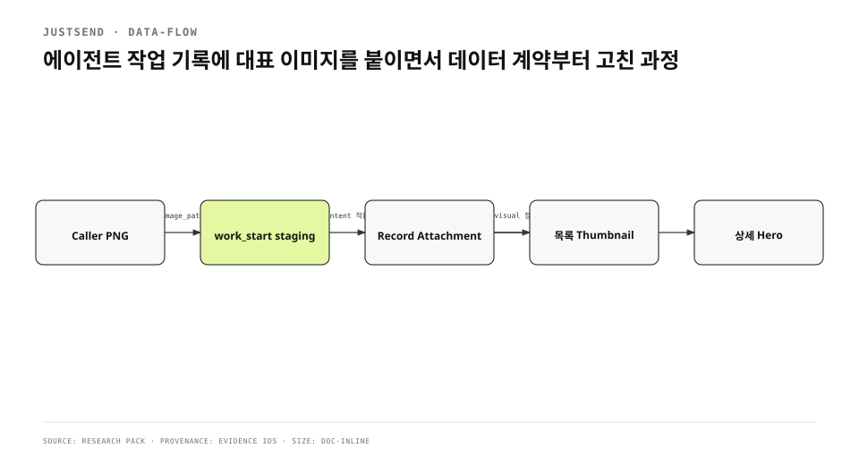

에이전트 작업 기록은 기능적으로는 완전했지만 목록에서 모두 긴 텍스트 카드처럼 보였다. 제목만으로는 작업을 구분하기 어려웠고, 완료 결과는 진행 노트 아래에 묻혔다. 대표 이미지 한 장을 붙이는 일처럼 보였지만 실제 변경은 tool input, process 간 staging, attachment 저장, list projection, detail rendering을 모두 건드렸다.
<!-- evidence: JS-E001 -->

기존 글은 결과를 1348자에 요약했다. corpus 깊이 기준에 못 미쳤고, 왜 renderer가 그림 내용을 결정하면 안 되는지와 `jsattach` 중복이 어떻게 생겼는지, running helper를 교체하다 연결을 끊은 실패가 빠졌다. 여기서는 image를 장식이 아닌 기록 데이터의 한 종류로 다룬다.
<!-- evidence: JS-E007 -->

## 먼저 “누가 무엇을 그리는가”를 나눴습니다

| 책임 | 호출자 | renderer | MCP server | 앱 |
|---|---|---|---|---|
| 내용 | 작업의 핵심 관계 선택 | 관여하지 않음 | 관여하지 않음 | 관여하지 않음 |
| 표현 | type·label·수치 제공 | theme·font·size·export | 파일 검증·staging | 첨부 표시 |
| 수명 | 생성 전에 파일 준비 | PNG/JPEG 생성 | intent와 함께 보존 | attachment로 영구화 |

무엇을 그릴지는 작업 문맥을 아는 호출자가 결정한다. renderer가 “전/후”, “단계”, “수치” 같은 template에 제품 문구를 박으면 모든 기록이 같은 그림이 된다. renderer는 언어, theme, font, export를 책임지고 내용은 입력으로 받는다.
<!-- evidence: JS-E001 JS-E002 -->

MCP tool은 name, description, JSON `inputSchema`로 계약을 노출한다. `image_path`도 prompt 관습이 아니라 `work_start`의 명시적 input이다. caller가 파일을 먼저 만들고 server가 검증해 record creation intent에 결합한다.
<!-- evidence: JS-E001 JS-E004 -->



## 파일을 먼저 만들고 work_start와 함께 넘깁니다

대표 이미지는 record가 생성될 때만 붙인다. 작업 기록 helper는 첫 `work_start`에서 `image_path`를 받고, 이미 존재하는 task_key의 재개 호출에서는 이미지를 바꾸지 않는다. 이 계약은 “언젠가 완료할 때 그림을 추가”하는 방식보다 단순하다. list thumbnail이 작업 시작부터 정체성을 가지기 때문이다.
<!-- evidence: JS-E001 JS-E002 -->

```json
{
  "task_key": "agent-hero-image-v3",
  "title": "feature: 에이전트 기록에 대표 이미지",
  "body": "## 목표
목록과 상세가 같은 첨부를 읽는다.",
  "project": "mac-prod",
  "image_path": "/tmp/agent-hero.png"
}
```

### staging은 process 경계입니다

helper와 app은 다른 process다. helper가 `/tmp` file path만 queue에 적고 caller가 정리하면 app이 읽을 때 file이 사라질 수 있다. `workStart`는 image format과 크기를 검증한 뒤 app group staging directory에 atomic write한다. attachment id, filename, staged path를 anchor intent에 함께 넣어 item 생성과 image import가 같은 의도에 매달리게 한다.
<!-- evidence: JS-E002 -->

queue insert가 실패하면 staged file을 즉시 지운다. 같은 idempotency key가 기존 intent를 반환하면 방금 만든 orphan file도 지운다. intent가 영구 실패하면 retry되지 않으므로 staged file을 남기지 않는다. `queued`나 `retrying`은 app이 나중에 읽어야 하므로 file을 보존한다. 파일 정리 정책도 intent state machine의 일부다.
<!-- evidence: JS-E002 -->

### executor가 path trust를 다시 확인합니다

helper의 validation만으로는 충분하지 않다. 공격자가 sidecar row를 직접 쓰면 `image_path` gate를 건너뛸 수 있다. app executor는 staged path가 canonical staging root 아래인지, symlink가 밖을 가리키지 않는지 다시 확인한다. file import와 delete가 같은 path를 사용하므로 이 검사는 data exfiltration과 arbitrary delete를 동시에 막는다.
<!-- evidence: JS-E002 -->

## 대표 이미지는 본문이 아니라 첨부입니다

초기 구현은 attachment를 저장하면서 body 첫 줄에 ``도 주입했다. detail screen은 attachment가 있으면 이미 상단 hero를 그렸다. 결과적으로 같은 한 장이 상단과 body 안에 두 번 보였다. source of truth를 두 군데 만든 것이 원인이었다.
<!-- evidence: JS-E003 -->

수정 뒤 대표 이미지는 attachment 그 자체다. body에는 Markdown image reference를 넣지 않는다. 일반 사용자가 문서 안 원하는 위치에 넣은 image는 `jsattach` reference를 계속 쓰지만, record hero는 layout surface가 소유한다. 같은 attachment system을 쓰되 표현 목적에 따라 reference contract를 나눈다.
<!-- evidence: JS-E003 JS-E004 -->

| 이미지 종류 | 저장 | body reference | 표시 위치 |
|---|---|---|---|
| record hero | attachment | 없음 | list thumbnail + detail top |
| inline document image | attachment | `jsattach://id` | body의 작성 위치 |
| link-derived hero | derived attachment | 없음 | card/detail policy |

## 목록과 상세가 같은 첨부를 읽습니다

`HomeViewModel`은 item별 `leadingThumbPath`를 만들고 photo 또는 video attachment 중 첫 local path를 선택한다. 첨부가 없으면 path도 없다. 따라서 list row는 thumbnail이 있을 때만 56pt 지면을 만들고, 없는 행은 빈 자리를 예약하지 않는다. 모든 행에 placeholder column을 두면 text-only record까지 좁아진다.
<!-- evidence: JS-E005 JS-E006 -->

상세는 같은 attachment를 hero로 보여 준다. 별도 `heroImageID` field를 schema에 추가하지 않은 이유는 sync·migration·cleanup contract를 중복시키지 않기 위해서다. attachment가 이미 identity, mime, local path와 lifecycle을 소유한다. 대표성은 “첫 visual attachment”라는 presentation policy로 해석한다.
<!-- evidence: JS-E004 JS-E005 -->

## 완료 본문과 진행 노트의 역할도 분리했습니다

대표 이미지만 붙여도 main body가 실행 log 한 줄이면 사용자가 읽는 card가 되지 않는다. 시작 시 body는 목표·범위·성공 기준을 담은 brief다. 진행 note는 시간순 이력으로 쌓인다. 완료 시에는 결과와 검증을 main body에 반영하고 audit note를 남긴다. 목록에서는 title과 hero로 구분하고, 상세 첫 화면에서는 현재 결론을 먼저 읽는다.
<!-- evidence: JS-E001 -->

이 구조에서 work record와 CI log의 역할이 갈린다. log는 실행 순서가 중심이지만 record는 사용자가 나중에 결과를 찾는 문서다. 실패와 dead end는 note에 남겨 다음 agent가 반복하지 않게 하고, main body는 최신 결론을 보여 준다.
<!-- evidence: JS-E001 -->

## 구현 중 실패가 process 수명을 드러냈습니다

실행 중인 installed helper binary를 교체하다 MCP connection이 `EPIPE`로 끊겼다. universal packaging script를 건너뛰고 Catalyst 산출물을 그대로 넣은 binary는 `SIGKILL`로 종료됐다. 원본을 되돌려도 이미 죽은 process와 client connection은 살아나지 않았다. file을 복구하는 것과 session을 복구하는 것은 다른 일이다.
<!-- evidence: JS-E001 -->

이 실패 뒤에는 세 규칙이 남았다.

1. running helper를 제자리 교체하지 않는다.
2. `package-helper.sh`를 건너뛴 산출물을 설치본으로 쓰지 않는다.
3. binary update 뒤에는 client session을 새로 시작하고 protocol initialize를 다시 확인한다.

대표 이미지 기능과 직접 관련 없어 보이지만 실제 delivery path에서 발생한 실패다. source change만 설명하면 사용자가 왜 helper update 절차까지 필요했는지 알 수 없다.
<!-- evidence: JS-E001 -->

## 실앱에서 byte와 surface를 함께 확인했습니다

정식 서명 설치본과 실제 account에서 attachment byte가 저장됐는지 확인했다. 같은 record가 list에서 56pt thumbnail을 보이고 detail top에서 hero를 보이는지 확인했다. attachment가 없는 row에는 빈 image column이 생기지 않는지도 함께 봤다. 이 관측은 source에 modifier가 존재한다는 사실보다 강하다.
<!-- evidence: JS-E006 -->

runtime 검증표는 다음 네 surface를 묶었다.

| 관측 | 기대 |
|---|---|
| sidecar intent | attachment id·filename·staged path |
| library attachment | 원본 byte와 item relation |
| list | thumbnail 1개, 없는 row는 여백 0 |
| detail | hero 1개, body inline 중복 0 |

교차 기기에서 app을 열기 전에 thumbnail byte를 미리 받는 문제는 이 작업 범위 밖에 남았다. 현재 Mac에서 보인다는 사실을 모든 device sync 완료로 확대하지 않았다.
<!-- evidence: JS-E006 -->

## 재사용 가능한 계약은 작게 남겼습니다

대표 이미지 feature를 위해 전용 hero database나 renderer DSL을 만들지 않았다. `image_path` input, staging metadata, 기존 attachment, list/detail presentation만 연결했다. 호출자가 그린다는 원칙은 유지하되 파일 수명과 보안은 server와 app이 책임진다.
<!-- evidence: JS-E001 JS-E002 JS-E004 -->

결과적으로 그림 한 장은 네 계약을 검증했다. MCP schema가 caller intent를 표현하는지, sidecar가 byte 수명을 보존하는지, app attachment가 sync 가능한 정본인지, UI가 같은 source를 중복 없이 읽는지다. user-facing polish가 data architecture를 건드릴 때는 화면부터 그리기보다 source of truth와 process boundary부터 정해야 한다.
<!-- evidence: JS-E002 JS-E004 JS-E006 -->
