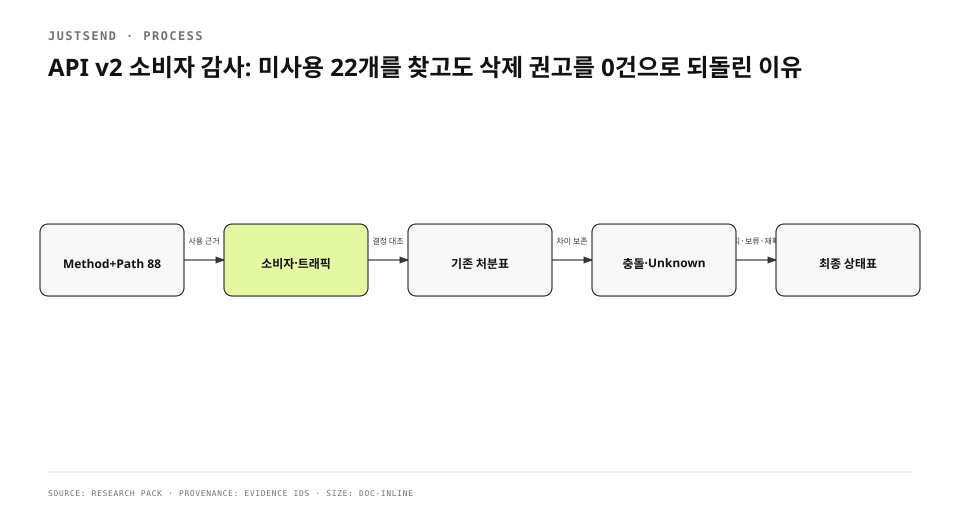

백엔드의 등록 route를 세어 보니 method와 path 조합 88개였다. mobile app, Mac app, share web, console, 외부 webhook과 실트래픽을 대조하자 66개는 사용 근거가 있었고 22개는 관측 기간에 호출되지 않았다. 처음에는 그중 6개를 고아로 분류해 삭제를 권고했다. 결론은 틀렸다. 기존 처분 문서가 이미 선반영·유지·의도적 제거를 구분했고, 새 감사가 그 결정을 읽지 않았다.
<!-- evidence: JS-E001 JS-E002 JS-E003 -->

기존 글은 이 반전을 1371자에 요약했다. corpus 깊이 기준에 못 미쳤고 route inventory가 왜 OpenAPI가 아니라 실행 등록 코드에서 출발했는지, “트래픽 0”이 왜 삭제 proof가 아닌지, prior decision을 어떤 순서로 합쳐야 하는지가 빠졌다.
<!-- evidence: JS-E007 -->

## route inventory는 실행 코드에서 만들었습니다

문서 endpoint 목록은 오래될 수 있고 OpenAPI가 실제 router와 drift할 수 있다. 감사 정본은 `internal/api`에서 등록하는 method와 path다. 같은 path라도 GET과 POST는 별도 contract로 센다. RFC 9110이 method semantics와 target resource를 함께 정의하기 때문이다.
<!-- evidence: JS-E001 JS-E006 -->

```go
func registerShares(g *group) {
    g.POST("/shares/drafts", handleShareDraftCreate)
    g.GET("/shares", handleShareList)
    g.GET("/shares/{id}", handleShareGet)
    g.PATCH("/shares/{id}/policy", handleSharePolicyUpdate)
    g.DELETE("/shares/{id}", handleShareCancel)
}
```

`/shares/{id}`라는 문자열 하나로 뭉치면 조회, policy 변경, 삭제를 같은 기능으로 오판한다. 인증 middleware, consent gate, plan gate도 route metadata에 붙여 누가 어떤 상태에서 호출할 수 있는지 함께 본다.
<!-- evidence: JS-E006 -->



## 소비자를 네 층으로 찾았습니다

| 층 | source evidence | 놓치기 쉬운 호출 |
|---|---|---|
| mobile | iOS·Mac request code | 조건부 feature·background sync |
| web | share-web·landing | public token route |
| operations | console·cron·webhook | 사람이 드물게 실행하는 복구 |
| runtime | access log·traffic sample | source에 없는 동적 URL |

source search는 client가 호출할 수 있음을 말하고 traffic은 관측 기간에 호출됐음을 말한다. 둘은 서로 대체하지 않는다. feature flag 뒤 path는 source에 있지만 traffic이 없을 수 있고, Apple webhook은 client source에 없지만 production caller가 있다. audit matrix는 route마다 source consumer, runtime consumer, owner, disposition을 따로 기록했다.
<!-- evidence: JS-E002 -->

### 문자열 검색만으로 consumer를 확정하지 않았습니다

endpoint fragment가 test fixture, comment, docs에만 있어도 검색에는 잡힌다. 반대로 base URL과 relative path를 나눠 조합하거나 generated client를 쓰면 literal이 없다. request construction과 call path를 읽고 test directory를 분리했다. console은 `/api/admin` base와 상대 path를 합쳐서 계산했다.
<!-- evidence: JS-E001 JS-E002 -->

### traffic 0은 관측 결과입니다

호출이 0건이라는 말에는 기간, log coverage, sampling, deployment version이 필요하다. 낮은 빈도의 운영 복구 endpoint는 평상시 0이 정상이다. 출시 전 client를 위해 server가 먼저 선반영한 route도 0이 정상이다. 그래서 22개를 “unused in observation window”로 부르고 “dead”라고 부르지 않았다.
<!-- evidence: JS-E002 -->

## 미사용 22개를 한 종류로 묶은 것이 첫 실패였습니다

초기 분류는 호출 evidence가 없다는 이유로 `GET /api/auth/verify`, consent marketing patch, feed catalog, sync state, state docs 등을 고아 후보로 올렸다. 그러나 producer가 mail link인 route, client 출시를 기다리는 route, 운영자가 드물게 쓰는 route, 과거 compatibility를 위해 남긴 route는 제거 조건이 다르다.
<!-- evidence: JS-E003 -->

미사용 상태표에는 최소 네 분류가 필요했다.

1. 유지: product decision이 있고 client 연결이 예정됨.
2. 보류: server-first contract로 의도적으로 선반영됨.
3. 재확인: producer·owner·expiry 조건이 불명확함.
4. 삭제 가능: producer, consumer, product decision, 복구 가치가 모두 없음.

삭제 가능은 단순히 네 번째 이름을 붙인다고 생기지 않는다. 기존 decision과 owner 확인이 끝나야 한다.
<!-- evidence: JS-E003 JS-E004 -->

## 기존 처분표가 결론을 뒤집었습니다

`docs/platform/backend-surface-audit.md`는 2026-08-08 기준으로 호출자가 없는 surface의 처분을 이미 적었다. `sync/state`, `state/docs`, `feed/catalog`, 공유 관리 route는 선반영 보류였다. `account/profile`과 `account/avatar`는 server 저장을 유지하고 iOS가 붙는 것으로 확정됐다. `account/consents`는 조회만 유지하고 write contract를 단일화했다.
<!-- evidence: JS-E004 -->

새 code search가 더 최신이라는 이유로 이 문서를 무효화할 수는 없다. 먼저 문서의 전제와 현재 source가 달라졌는지 확인해야 한다. 실제로 profile/avatar를 “구 client 잔재”로 본 초기 판정은 과거 sync 제거 commit만 보고 이후 server storage decision을 놓친 결과였다.
<!-- evidence: JS-E003 JS-E004 -->

| 최종 상태 | 개수 | 행동 |
|---|---:|---|
| 유지 | 11 | owner와 planned consumer 보존 |
| 보류 | 8 | activation condition 기록 |
| 재확인 | 3 | producer·expiry 조사 |
| 삭제 권고 | 0 | 별도 change 없음 |

이 최종 분류는 “아무것도 지우지 않았다”는 소극적 결과가 아니다. 근거 없는 삭제 6건을 철회하고 다음 판단 조건을 route별로 남겼다.
<!-- evidence: JS-E005 -->

## 삭제는 별도 변경으로 수행해야 합니다

감사 결과와 code deletion을 한 commit에 묶으면 조사 중 잘못된 분류가 즉시 파괴적 변경이 된다. 감사 단계는 inventory와 evidence를 고정한다. 삭제 단계는 producer 제거, client release, traffic window, migration, observability와 rollback을 별도 contract로 검증한다.
<!-- evidence: JS-E005 -->

예를 들어 server-first route는 client가 출시될 때까지 contract test와 authorization gate를 유지해야 한다. 반대로 의도적으로 제거한 OCR route는 router에서 사라졌고 live 404와 workload cleanup을 따로 확인했다. “unused”라는 같은 표지 아래 있어도 lifecycle은 반대다.
<!-- evidence: JS-E004 JS-E005 -->

## 문서·source·runtime 충돌을 숨기지 않았습니다

감사 중 세 source가 다른 답을 줄 수 있다.

| 충돌 | 예 | 처리 |
|---|---|---|
| docs says keep, source consumer 없음 | profile/avatar | activation decision 확인 |
| source consumer 있음, traffic 0 | feature flag | release 상태 확인 |
| traffic 있음, source consumer 없음 | webhook/dynamic call | producer 식별 |
| docs says removed, router 있음 | stale cleanup | 실제 registration 우선, 문서 수정 |

충돌은 최신 timestamp 하나로 자동 해결하지 않는다. source가 실행 사실을, docs가 decision을, runtime이 관측을 말하기 때문이다. 서로 다른 질문에 답하는 evidence를 한 줄의 “사용/미사용” boolean으로 접으면 정보가 사라진다.
<!-- evidence: JS-E002 JS-E004 -->

## 88·66·22라는 숫자의 범위를 고정했습니다

88은 특정 revision의 application route registration 수다. PocketBase 기본 endpoint와 cluster ingress는 별도로 셌다. 66은 source 또는 runtime consumer 근거가 있는 route 수고, 22는 정해진 관측 범위에서 근거가 없던 route 수다. 이 숫자는 미래 release의 영구 상수가 아니다.
<!-- evidence: JS-E001 JS-E002 -->

새 route가 추가되거나 client가 붙으면 matrix를 다시 생성해야 한다. 그래서 report에는 count뿐 아니라 extraction rule, repository revision, excluded surface를 남긴다. 숫자를 headline으로 쓸 때 scope를 함께 쓰지 않으면 다음 독자가 22개를 “현재도 dead”라고 오해한다.
<!-- evidence: JS-E001 -->

## 다음 감사의 순서를 바꿨습니다

이번 실패 뒤에는 prior decision을 consumer search보다 먼저 읽는다.

1. 실행 router에서 method+path inventory를 만든다.
2. 기존 disposition과 owner를 route에 붙인다.
3. source consumer를 mobile·web·ops에서 찾는다.
4. runtime traffic으로 동적·희귀 consumer를 보완한다.
5. conflict와 unknown을 분리한다.
6. 삭제 후보는 producer·consumer·decision·rollback 조건을 모두 확인한 뒤 만든다.

그렇다고 code search의 가치가 낮아지는 것은 아니다. 검색 결과가 “처음 보는 결정”처럼 과거 맥락을 덮어쓰지 않게 한다.
<!-- evidence: JS-E003 JS-E004 JS-E005 -->

## 감사 결과는 삭제 목록이 아니라 상태표입니다

좋은 endpoint audit은 가장 많은 route를 지우는 작업이 아니다. 각 contract가 왜 존재하고 누가 호출하며 어떤 조건에서 retire되는지를 설명하는 작업이다. 호출이 없는 route는 부채일 수 있지만 planned compatibility, incident recovery, server-first rollout일 수도 있다.
<!-- evidence: JS-E004 JS-E005 -->

최종 결과는 88개 중 66개 사용 근거, 22개 관측 미사용, 삭제 권고 0건이었다. 가장 중요한 산출물은 숫자가 아니라 잘못된 6건을 철회한 근거다. 기술 부채 정리는 code를 지우는 속도보다 살아 있는 product decision을 훼손하지 않는 정확도가 먼저다.
<!-- evidence: JS-E002 JS-E005 -->
