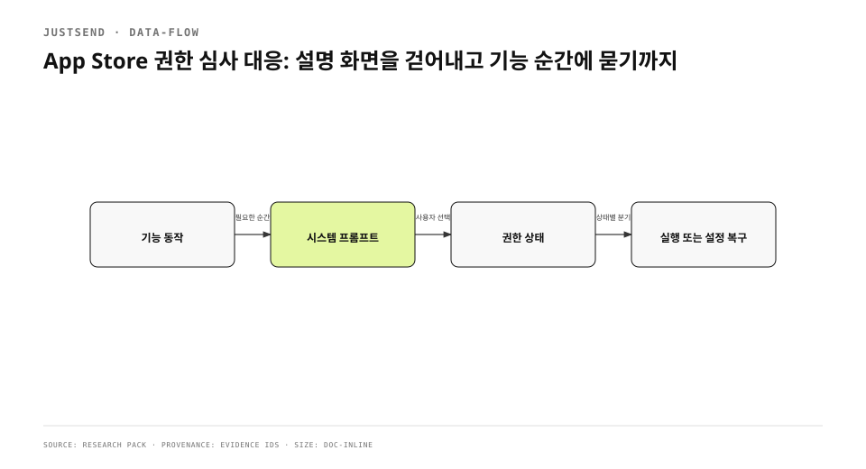

첫 실행 화면에 캘린더·마이크·카메라 토글을 둔 의도는 친절이었다. 사용자가 갑자기 시스템 프롬프트를 만나지 않도록 이유를 먼저 설명하고 싶었다. 그러나 App Store 5.1.1(iv) 심사는 그 화면을 설명서가 아니라 우회 가능한 관문으로 읽었다. 안내를 본 뒤에도 시스템 프롬프트로 항상 이어지지 않았고, 사용자는 권한 요청을 건너뛴 채 다음 화면으로 갈 수 있었다. 핵심은 “pre-prompt는 언제나 나쁘다”는 결론이 아니다. 앱이 만든 설명과 운영체제가 소유한 동의가 서로 다른 생명주기를 가지면, 설명이 실제 동의를 대신하는 것처럼 보일 수 있다는 점이다.
<!-- evidence: JS-E001 -->

기존 배포 글은 이 결론을 1478자 안에 요약했다. 같은 한국어 기술 글 corpus 중앙값 8203자의 60%에도 못 미쳤고, 어느 API를 확인했는지와 거부 뒤 복구가 왜 설정 앱이어야 하는지가 빠졌다. 반려 메일을 다시 풀어 쓰지 않고 작업 기록을 seed로 삼고 실제 화면·상태 모델·Apple 공식 계약·실기 관측을 한 흐름에 묶었다.
<!-- evidence: JS-E007 -->

## 먼저 네 가지를 분리했습니다

| 층 | 소유자 | 앱이 할 일 | 앱이 하면 안 되는 일 |
|---|---|---|---|
| 기능 맥락 | 제품 화면 | 왜 지금 필요한지 기능으로 보여 주기 | 아직 쓰지 않을 권한을 묶어서 요구하기 |
| 동의 | iOS 시스템 프롬프트 | 정확한 purpose string 제공 | 허용처럼 보이는 커스텀 상태 만들기 |
| 상태 | 권한 API | `notDetermined`·`granted`·`blocked` 구분 | 거부된 상태를 다시 요청 가능하다고 표시하기 |
| 복구 | 설정 앱 | 중립적인 설명과 설정 열기 제공 | 앱 안에서 권한을 되돌린 척하기 |

Apple의 UIKit 문서는 민감 데이터가 실제로 필요한 시점에 접근을 요청하고, 사용자가 허용하지 않을 때 합리적인 fallback을 제공하라고 안내한다. 이 기준은 “프롬프트 직전에 한 문장 더 보여라”가 아니라 요청 시점과 실패 경로를 제품 기능에 붙이라는 뜻으로 읽었다.
<!-- evidence: JS-E002 JS-E004 -->

## 권한 API부터 전수 조사했습니다

심사 회신에 등장한 화면만 고치면 같은 패턴이 다른 기능에서 다시 나타난다. 작업 기록의 API inventory에는 앱이 직접 소유한 요청이 네 종류로 정리돼 있었다. 마이크는 녹음, 카메라는 촬영, 캘린더는 회상, 생체 인증은 앱 잠금의 문이다. 사진 선택기와 파일 선택기는 시스템 UI가 선택 범위를 소유하므로 같은 “선행 권한 토글” 목록에 넣지 않았다. 요청 API가 없다는 사실과 데이터 접근이 없다는 사실도 구분했다. `fileImporter`가 부여하는 security-scoped 접근처럼 권한 프롬프트 밖의 계약이 있기 때문이다.
<!-- evidence: JS-E005 -->

```swift
switch SetupPermission.microphone() {
case .notDetermined:
  // 녹음을 시작하려는 바로 이 자리에서 시스템 요청
case .granted:
  // 녹음 시작
case .blocked:
  // 설명 + openSystemSettings()
}
```

이 세 갈래는 UI 문구가 아니라 제어 흐름이다. `notDetermined`에서만 시스템이 첫 동의를 받을 수 있고, `blocked`에서는 앱이 다시 허용시킬 수 없다. 그래서 감사표는 “설명 화면 존재 여부”와 함께 요청 API의 호출 위치, 현재 상태를 읽는 코드, 거부 뒤 다음 동작을 나란히 적었다.
<!-- evidence: JS-E004 JS-E005 -->

## 첫 실행 화면에서 권한을 완전히 뺐습니다

수정 전 구조는 첫 실행 화면이 권한 설명, 토글, 완료를 함께 소유했다. 토글은 제품 내부 상태처럼 보였지만 실제 권한은 iOS가 소유했다. 두 상태가 엇갈리면 화면은 켜져 있는데 권한은 없거나, 안내만 읽고 실제 요청은 미룰 수 있다. 수정 뒤 `SetupScreen`은 기기 설정과 준비 자산만 다루며 footer에는 `setup.finish.done` 한 동작만 남는다.
<!-- evidence: JS-E002 JS-E003 -->



### “설명하지 않는다”가 아니라 “기능으로 설명한다”

마이크가 필요한 이유는 녹음 화면이 가장 잘 설명한다. 카메라가 필요한 이유는 촬영 버튼과 미리보기가 보여 준다. 캘린더가 필요한 이유는 관련 기록 회상 기능이 드러낸다. 권한 요청을 기능 순간으로 옮기면 별도 pre-prompt 문구를 늘리지 않아도 사용자는 방금 누른 동작과 시스템 프롬프트를 연결할 수 있다. 첫 실행에서 세 권한을 한꺼번에 판단하게 하는 인지 비용도 사라진다.
<!-- evidence: JS-E002 JS-E003 -->

### 화면의 문은 하나만 남겼습니다

현재 footer는 `setup.finish.done`을 표시하고 `setup.finish` 식별자를 유지한다. 식별자는 스토어 촬영과 자동화가 같은 문을 찾게 하지만 권한 요청을 실행하지 않는다. 화면의 완료와 시스템 동의를 분리했기 때문에 “완료를 눌렀으니 권한도 처리됐다”는 잘못된 상태가 생기지 않는다.
<!-- evidence: JS-E003 -->

## 요청 소유권을 기능 코드로 돌려보냈습니다

`SetupPermission`은 요청 wrapper를 들고 있지 않다. 캘린더·마이크·카메라 상태를 `notDetermined`, `granted`, `blocked`로 정규화하고 설정 앱으로 나가는 한 문만 제공한다. 실제 요청은 녹음·촬영·회상 기능이 자신에게 필요한 순간에 수행한다. 이 분리는 새 권한이 추가될 때의 review 단위도 바꾼다. 설정 화면에 토글을 하나 더 넣는 것이 아니라 기능 화면의 요청·허용·거부 세 갈래를 함께 검토해야 한다.
<!-- evidence: JS-E004 -->

| 상태 | 사용자에게 보이는 것 | 가능한 동작 |
|---|---|---|
| `notDetermined` | 기능을 시작하려는 맥락 | 시스템 프롬프트 요청 |
| `granted` | 기능의 정상 표면 | 요청 없이 실행 |
| `blocked` | 기능을 쓸 수 없는 이유 | 설정 열기 또는 취소 |

## 거부 뒤에는 설정 경로만 제공합니다

거부 상태는 오류가 아니라 사용자의 저장된 선택이다. 앱은 중립적인 설명과 `openSystemSettings()`를 제공하고, 사용자가 돌아오면 현재 상태를 다시 읽는다. 특정 설정 항목으로 직접 들어가는 것처럼 약속하지 않는다. iOS가 앱별 설정 화면까지만 열어 주기 때문이다. 제한된 기기나 카메라가 없는 환경에서는 설정을 열어도 해결되지 않을 수 있으므로 기능 취소 경로도 남긴다.
<!-- evidence: JS-E004 -->

이 원칙은 허용률을 높이는 최적화와 다르다. 목표는 시스템 프롬프트를 더 자주 띄우는 것이 아니라, 사용자가 실제 기능을 선택했을 때만 정확한 동의 문을 세우는 것이다. 거부 뒤 재촉을 반복하면 요청 시점을 고쳤더라도 사용자 선택을 존중한다는 계약은 깨진다.
<!-- evidence: JS-E004 -->

## 심사 문구와 코드도 같은 사실을 말하게 했습니다

Review Notes에는 심사관이 누를 실제 버튼과 권한 프롬프트가 나타나는 기능 경로를 적어야 한다. 과거 Setup 화면을 가리키거나 모든 권한을 첫 실행에서 묻는다고 쓰면 수정된 빌드와 메타데이터가 다른 제품을 설명한다. purpose string도 “기기 안에서만 처리” 같은 안심 문구를 먼저 쓰기보다 어떤 기능이 어떤 데이터를 왜 쓰는지 현재 데이터 흐름에 맞춰야 한다.
<!-- evidence: JS-E001 JS-E002 -->

재심사 체크리스트는 다음처럼 짧아졌다.

1. 첫 실행을 완료해도 권한 프롬프트가 자동으로 뜨지 않는다.
2. 녹음·카메라·캘린더 기능을 처음 사용할 때 해당 시스템 프롬프트가 뜬다.
3. 거부 뒤 같은 기능을 다시 열면 설정 경로와 취소가 보인다.
4. 앱을 재실행하거나 설정에서 상태를 바꾸면 화면이 현재 상태를 다시 읽는다.
5. Review Notes와 purpose string이 위 입력 순서를 그대로 설명한다.

## 수정 뒤에는 실제 입력 순서를 관측했습니다

수정 전 baseline은 setup 화면에 calendar, microphone, camera 행이 있는 상태로 남겼다. 수정 뒤에는 권한 섹션 없이 완료 동작으로 나가 홈에 도달하는 흐름을 확인했고, 실제 기기에 설치해 실행까지 관측했다. 빌드 성공만으로 심사 경로가 바뀌었다고 말하지 않은 이유다. 이 검증은 첫 실행이 더 이상 권한 관문이 아니라는 결과만 증명한다. 각 시스템 프롬프트의 허용·거부 표면은 기능별 검증으로 계속 남는다.
<!-- evidence: JS-E006 -->

## 남은 경계와 재발 방지

새 권한을 도입할 때는 Info.plist 문구만 추가하면 끝나지 않는다. 요청 호출부, `notDetermined` 분기, 거부 뒤 복구, 제한 기기 fallback, Review Notes를 한 change set에서 검사한다. PhotosPicker처럼 시스템 선택기가 범위를 소유하는 경로와 앱이 직접 요청하는 API를 구분한다. “권한이 없다”와 “선택한 파일에만 접근한다”도 같은 문장으로 뭉개지 않는다.
<!-- evidence: JS-E004 JS-E005 -->

이번 대응의 핵심은 안내 문구를 삭제한 것이 아니다. 설명, 동의, 상태, 복구의 소유자를 다시 나눴다. 첫 실행은 제품 진입을, 기능 화면은 요청 맥락을, iOS는 동의를, 설정 앱은 거부 뒤 변경을 맡는다. 이 경계를 지키면 심사 대응이 임시 문구 수정으로 끝나지 않고 다음 권한에도 재사용할 수 있는 제어 흐름이 된다.
<!-- evidence: JS-E002 JS-E003 JS-E006 -->
