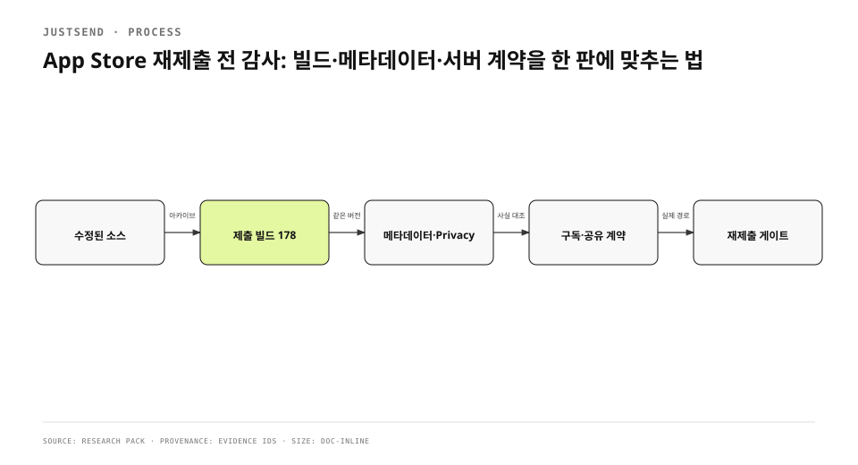

심사 반려를 고친 새 빌드가 준비되면 재제출 버튼을 누르기 쉽다. 그러나 심사관이 받는 제품은 바이너리 하나가 아니다. App Store Connect가 연결한 build, Notes for Review, 개인정보 공개, 권한 purpose string, 구독 상품, 서버 기능과 실제 입력 순서가 합쳐져 한 제품이 된다. 하나라도 다른 시점을 가리키면 “코드는 고쳤는데 심사관은 옛 화면을 재현하는” 상태가 생긴다.
<!-- evidence: JS-E001 -->

기존 배포 글은 이 판단을 1415자에 압축했다. corpus 깊이 기준에 못 미쳤고, App Store 규정과 서버 신고 계약, 검증 harness가 만든 거짓 실패를 구분한 과정이 빠졌다. 감사는 체크리스트 항목 수보다 각 표면의 정본과 관측 방법을 연결하는 데 초점을 맞췄다.
<!-- evidence: JS-E007 -->

## 재제출 단위를 먼저 정의했습니다

| 표면 | 정본 | 실패 모양 |
|---|---|---|
| 바이너리 | 제출 버전에 연결된 build | 로컬 최신과 ASC 연결 build가 다름 |
| 심사 경로 | Notes for Review | 삭제된 화면·옛 버튼을 안내함 |
| 개인정보 | App Privacy + privacy policy | 실제 저장·동기화와 공개 문구가 다름 |
| 권한 | purpose string + 호출부 | 안심 문구가 실제 데이터 흐름보다 넓음 |
| 결제 | 구독 상품 + 앱 entitlement | 상품은 제출되지 않았거나 앱이 다른 상태를 읽음 |
| 공개 공유 | 앱·backend·운영 정책 | 신고 문서는 있지만 실행 경로가 없음 |

Apple의 Accurate Metadata 규정은 설명·스크린샷뿐 아니라 privacy information과 preview가 핵심 경험을 정확히 반영하고 새 버전에 맞게 갱신되도록 요구한다. Notes for Review에는 새 기능과 변경을 구체적으로 설명하고 심사관이 접근할 수 있어야 한다. 따라서 “build가 올라갔다”는 감사 시작 조건일 뿐 완료 조건이 아니다.
<!-- evidence: JS-E003 -->

## 심사관이 받을 build를 기준으로 잠갔습니다

로컬 archive 이름이나 Git HEAD를 제출 build로 간주하지 않았다. 제출 버전에 연결된 번호, 같은 source revision, 권한 문구가 들어간 Info.plist, 구독 2종의 제출 상태를 한 표에서 묶었다. Review Notes의 단계는 새 simulator에서 실제로 누를 수 있는 식별자와 화면 이름으로 다시 썼다. 개발 계정에 남은 세션이나 과거 권한 상태는 재현을 쉽게 만들 뿐, 심사관 환경을 대표하지 않는다.
<!-- evidence: JS-E001 JS-E006 -->

```text
Version 1.0.0
  ├─ Build 178
  ├─ Notes for Review → 새 설치 입력 순서
  ├─ Privacy → 게시된 데이터 유형과 목적
  ├─ IAP → monthly + yearly + subscription group
  └─ Public share → report endpoint + retire behavior
```



### 테스트 계정은 접근 수단이지 우회 수단이 아닙니다

심사 노트는 계정 정보만 제공해서는 부족하다. 로그인 뒤 어디로 이동하는지, 권한을 어느 기능에서 만나는지, 구독 없이 확인할 수 있는 범위가 무엇인지 적는다. 반대로 심사 전용 숨은 동작이나 production에서 쓸 수 없는 경로를 만들지 않는다. 메타데이터가 실제 사용자 경험을 반영해야 한다는 규정은 심사관에게만 다른 제품을 보여 주는 방식도 막는다.
<!-- evidence: JS-E003 -->

### 자동화 입력이 제품 결함을 만들 수도 있습니다

빌드 176을 같은 기기 조건에서 검증할 때 HID key event를 여러 번 보내는 방식은 UIKit 입력뷰 해제 경로에서 크래시를 만들었다. 같은 바이너리에서 paste 한 번으로 입력하면 재현되지 않았다. 이 A/B는 “자동화에서 크래시가 났다”를 곧바로 제품 결함으로 올리지 않고 입력 방식까지 실험 변수로 다뤄야 한다는 근거가 됐다. 제출 build를 보호하려면 거짓 green뿐 아니라 거짓 red도 찾아야 한다.
<!-- evidence: JS-E006 -->

## 권한 문구를 데이터 흐름과 대조했습니다

purpose string은 짧지만 법적·제품적 약속이다. `project.yml`은 카메라·마이크·캘린더·생체 인증·로컬 네트워크 문구를 배포 설정에 넣는다. 코드 review만 하면 이 문자열이 놓치기 쉽다. “기기 안에서만 처리”, “저장하거나 전송하지 않는다” 같은 문장은 실제 저장소·동기화·서버 호출과 한 단어라도 어긋나면 안심 문구가 아니라 잘못된 메타데이터가 된다.
<!-- evidence: JS-E002 -->

감사표에는 각 문구마다 네 칸을 뒀다.

| 질문 | 확인 위치 |
|---|---|
| 무엇을 읽는가 | 권한 API와 기능 호출부 |
| 어디에 저장하는가 | local repository와 attachment path |
| 언제 backend로 보내는가 | sync queue와 endpoint |
| 사용자가 끌 수 있는가 | iOS Settings와 앱 설정 |

privacy policy를 더 길게 쓴다고 이 문제가 풀리지는 않는다. 공개 문장을 실제 데이터 흐름에서 역으로 생성해야 한다. 코드를 고치지 않고 문구만 줄이거나, 문구를 고치지 않고 저장 경로만 바꾸면 다음 제출에서 다시 갈라진다.
<!-- evidence: JS-E001 JS-E002 -->

## 공개 공유는 문서가 아니라 실행 계약으로 봤습니다

Apple의 사용자 생성 콘텐츠 규정은 부적절한 자료를 거를 방법, 신고 mechanism, 우려에 대한 적시 대응, abusive user 차단과 연락 수단을 요구한다. JustSend의 공개 공유는 링크를 가진 사람이 내용을 보는 표면이므로 “공유 기능” 설명만으로 충분하지 않았다.
<!-- evidence: JS-E003 JS-E004 -->

서버의 `share_report_test.go`는 신고가 같은 요청을 반복해도 멱등인지와 신고된 public link가 retire되는지를 함께 검사한다. 이 테스트가 중요한 이유는 정책 문서가 아니라 실제 endpoint의 결과를 증명하기 때문이다. 신고 버튼이 있어도 링크가 계속 살아 있거나 같은 신고가 상태를 계속 뒤집으면 심사 계약은 닫히지 않는다.
<!-- evidence: JS-E004 -->

## 무료 한도와 구독도 한 숫자 체계로 묶었습니다

무료 공유 한도는 마케팅 문구 하나가 아니다. 앱의 gate, 서버 quota, App Store 설명, 구독 전후 entitlement가 같은 정본을 읽어야 한다. 감사에서는 숫자를 억지로 한 파일에 모으기보다 각 consumer가 어느 contract를 읽는지 추적했다. 공유 확장처럼 본 앱 밖에서 시작하는 입력도 같은 서버 gate를 지나야 한다. 그렇지 않으면 앱에서는 막혔지만 extension에서는 통과하는 별도 제품이 된다.
<!-- evidence: JS-E005 -->

| 상태 | 앱 | backend | 스토어 |
|---|---|---|---|
| 무료 | 제한과 복구 설명 | quota enforcement | 무료 범위 설명 |
| 구독 중 | entitlement 반영 | plan capability | 상품·가격·기간 |
| 만료·취소 | 읽기/복구 경계 | grace 또는 제한 | 관리 경로 |

구독 상품은 앱 build와 따로 제출 상태를 가진다. 빌드 178 제출에는 monthly, yearly, subscription group을 함께 묶었다. 앱이 해당 product identifier를 읽는다는 사실과 ASC에서 상품이 심사 대기라는 사실을 둘 다 확인해야 결제 표면이 실제로 재현된다.
<!-- evidence: JS-E006 -->

## App Privacy는 통과 여부로 추론하지 않았습니다

제출 요청이 차단되지 않았다는 사실은 App Privacy가 정확하다는 증거가 아니다. 감사 기록은 App Store Connect 화면의 게시 상태와 데이터 유형을 직접 읽고, privacy policy URL과 실제 수집·연결 목적을 대조했다. “제출됐으니 완료”라는 앞선 추론을 철회하고 화면 관측으로 바꿨다. 이 정정으로 릴리스 감사 규칙 하나가 분명해졌다. 상위 단계가 성공해도 그 단계가 모든 하위 계약을 검증했다고 확대하지 않는다.
<!-- evidence: JS-E001 JS-E006 -->

## 실패를 판정하는 실험도 감사 대상입니다

심사자 경로는 simulator를 깨끗하게 만들고 권한·keychain·설치 상태를 초기화해 반복했다. 하지만 harness가 실제 사용자의 입력보다 훨씬 많은 key event를 보내면 결과가 달라질 수 있었다. 그래서 crash 여부만 기록하지 않고 binary, device, OS, 입력 방식, 시행 수를 함께 남겼다. 같은 입력을 반복하는 것과 변수를 하나씩 바꾸는 A/B는 목적이 다르다.
<!-- evidence: JS-E006 -->

재제출 감사의 evidence ladder는 다음 순서를 따른다.

1. source와 metadata의 정본 위치를 확인한다.
2. 제출 build가 그 source를 담는지 확인한다.
3. 새 설치에서 Notes for Review의 실제 입력을 수행한다.
4. 실패하면 harness와 제품 입력을 분리하는 A/B를 한다.
5. App Store Connect 상태를 직접 읽는다.
6. backend 계약은 endpoint test 또는 관측으로 확인한다.

## 재제출 게이트를 문서로 고정했습니다

최종 게이트는 “모든 test green”이 아니라 제출 단위의 모든 표면이 같은 사실을 말하는지에 답한다. build 번호, Review Notes, App Privacy, purpose string, 구독, 공개 공유를 각 owner와 evidence locator에 연결한다. 한 칸이 unknown이면 재제출을 멈춘다. 문서가 있다는 이유로 PASS를 주지 않고 실제 build와 endpoint에 도달하는지를 본다.
<!-- evidence: JS-E005 JS-E006 -->

이 과정을 거쳐 검증 harness가 만든 거짓 crash를 분리했고, build 178과 구독 2종을 함께 제출했다. 그 결과는 WAITING_FOR_REVIEW이지 승인 완료가 아니다. 감사가 증명한 것은 심사관에게 전달될 제품 계약이 내부에서 모순되지 않는다는 범위까지다.
<!-- evidence: JS-E006 -->

## 다음 릴리스에도 남길 규칙

권한·개인정보·결제·공유는 코드 owner가 다르지만 App Store에서는 한 제품이다. release branch가 열릴 때마다 정본 위치와 관측 명령을 같은 audit matrix에서 갱신한다. 자동화는 숫자·문자열·endpoint 존재를 확인하고, 사람은 Notes for Review의 경로와 privacy 문장의 의미를 확인한다. 어느 한쪽만으로 대체하지 않는다.
<!-- evidence: JS-E002 JS-E003 JS-E004 -->

빌드를 올리는 일은 배포 pipeline의 한 단계다. 재제출은 바이너리와 메타데이터와 서버가 같은 시점의 제품을 설명한다는 선언이다. 이 차이를 release gate에 남겨야 “코드는 고쳤는데 다시 반려됐다”를 빌드 문제로만 좁히는 실수를 피할 수 있다.
<!-- evidence: JS-E001 JS-E005 JS-E006 -->
