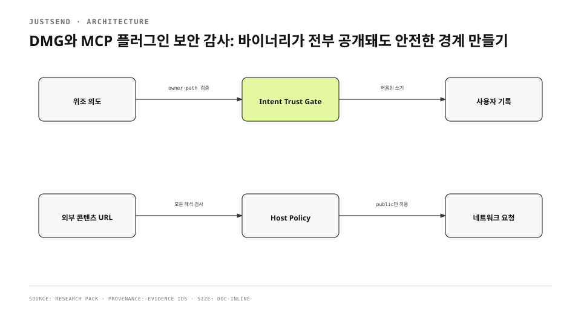

공개 DMG는 누구나 내려받아 mount할 수 있다. Mach-O, framework, resource, plist, entitlement, 문자열과 MCP protocol을 모두 분석할 수 있다. 그래서 감사 기준을 “공격자가 구현을 모른다”에 두지 않았다. 내부 구조와 파일 위치와 tool schema를 전부 알아도 사용자 데이터·계정·쓰기 권한이 보호돼야 한다.
<!-- evidence: JS-E001 -->

기존 글은 이 위협 모델을 1423자에 요약했지만 의도 큐가 왜 원격 쓰기 경계인지, `0177.0.0.1`이 왜 parser discrepancy를 만드는지, 수정 뒤 산출물을 왜 다시 구워야 하는지가 빠졌다. corpus 깊이를 채우기 위해 설명을 늘린 것이 아니라 발견→원인→수정→검증의 source artifact를 복원했다.
<!-- evidence: JS-E007 -->

## 공개 구현 위협 모델을 먼저 고정했습니다

| 자산 | 공격자가 아는 것 | 보호 경계 |
|---|---|---|
| 사용자 기록 | DB schema·tool name·queue format | 계정 소유권·인가·E2EE |
| MCP 쓰기 | inputSchema·sidecar path | allowAppend·intent trust·idempotency |
| 배포 파일 | 서명 구조·bundle layout | Developer ID·notarization·checksum |
| 네트워크 | URL consumer·parser | scheme·host policy·backend 인가 |
| 로컬 파일 | staging convention | canonical root·symlink 해소·삭제 범위 |

MCP security guidance도 protocol을 안다는 사실을 authority로 취급하지 말라고 요구한다. confused deputy가 생기는 지점은 component가 가진 권한을 요청자의 권한처럼 빌려줄 때다. JustSend에서는 helper가 queue 행을 쓸 수 있다는 사실과 앱이 사용자 기록을 변경할 권한을 갖는다는 사실을 분리해야 했다.
<!-- evidence: JS-E001 JS-E002 -->



## 가장 큰 결함은 로컬 queue의 인가였습니다

sidecar intent는 로컬 SQLite 행이지만 “단순 캐시”가 아니다. 앱 executor가 그 행을 읽어 실제 item repository의 create, note, status, retract를 호출한다. 따라서 queue에 위조 행을 넣을 수 있으면 앱의 정상 삭제 경로를 통해 사용자 기록을 지우고 sync로 다른 기기에 전파할 수 있다. 공격자는 DB 파일을 직접 수정했지만 결과는 제품의 정식 쓰기였다.
<!-- evidence: JS-E002 -->

### 파일 경로는 읽기와 삭제 두 권한을 함께 가집니다

대표 이미지 intent의 `attachmentStagedPath`는 executor에게 두 가지 권한을 준다. 바이트를 읽어 기록 첨부로 가져오고, 적용 뒤 staged file을 삭제한다. helper의 `image_path` validation만 믿으면 공격자가 sidecar DB에 직접 넣은 행은 그 검사를 건너뛴다. executor가 canonical staging root와 symlink resolution을 다시 확인해야 한다.
<!-- evidence: JS-E003 -->

```swift
let outsider = temporaryDirectory.appendingPathComponent("secret.png")
try store.enqueue(AgentIntent(
  taskKey: "TRUST-STAGED",
  kind: .anchor,
  attachmentStagedPath: outsider.path
))
// 기대: outsider는 읽히지도 삭제되지도 않고 item도 생기지 않는다.
```

`AgentIntentTrustTests`는 PNG magic byte로 시작하는 외부 파일을 넣어 superficial file-type check를 통과시킨다. 그래도 file은 남아 있고 item count는 0이어야 한다. staging 내부에 놓인 symlink가 외부를 가리키는 경우도 같은 문에서 거절한다. 이 test는 “잘못된 파일이라 실패”가 아니라 “읽고 삭제할 권한이 없는 경로라 실패”를 증명한다.
<!-- evidence: JS-E003 -->

### 계정과 동작 종류도 executor에서 다시 확인합니다

queue writer가 `task_key`와 actor label을 적었다고 해서 owner가 되지 않는다. anchor가 agent가 만든 record인지, 현재 account scope와 일치하는지, intent kind가 허용된 쓰기인지, 같은 idempotency key가 replay됐는지를 적용 직전에 검사한다. 설정의 append toggle은 UI 표시가 아니라 queue processing gate여야 한다.
<!-- evidence: JS-E002 -->

## 두 번째 결함은 내용이 정한 URL이었습니다

공유받은 기록, 붙여 넣은 HTML, 공개 share content는 사용자가 직접 작성하지 않은 URL을 포함할 수 있다. 링크 preview, hero image, favicon, JavaScript render, Markdown image가 그 URL을 열면 피해자의 Mac이 자기 loopback이나 private network에 요청을 보낸다. response를 공격자가 읽지 못해도 state-changing endpoint에는 부작용이 생길 수 있다.
<!-- evidence: JS-E004 -->

`ContentFetchHostPolicy`는 앱이 사용자가 설정한 backend URL과 content가 정한 URL을 구분한다. 자가호스팅 backend는 local network를 쓸 수 있어야 한다. 반면 content fetch는 `http`·`https` scheme과 public host만 허용한다. 둘을 한 정책에 묶으면 SSRF를 막으려다 제품의 self-hosting 경로를 죽인다.
<!-- evidence: JS-E004 -->

| consumer | 정책 전 | 정책 후 |
|---|---|---|
| link HTML | URL 직접 fetch | host policy 통과 후 fetch |
| hero image | image URL 직접 fetch | 동일 policy |
| favicon | host 조합 후 fetch | 동일 policy |
| JS render | page load + script 실행 | 동일 policy, 가장 강한 경계 |
| Markdown image | provider가 즉시 fetch | policy-aware provider |

## IP 문자열을 한 parser로만 읽으면 안 됐습니다

처음 구현은 Foundation/Network의 주소 해석 결과만 검사했다. 그러나 `0177.0.0.1`은 `IPv4Address`에서 `177.0.0.1`처럼 보이고 실제 연결에 쓰이는 `inet_aton`에서는 `127.0.0.1`이 된다. 검사한 주소와 연결한 주소가 다르면 public 판정 뒤 loopback으로 연결하는 우회가 생긴다.
<!-- evidence: JS-E005 -->

정책은 가능한 해석을 모두 수집하고 하나라도 loopback, link-local, multicast, RFC1918 private, CGNAT, IPv4-mapped IPv6, unspecified 또는 reserved면 거절한다. URL parser를 새로 발명한 것이 아니라 실제 network stack이 수용하는 legacy 해석을 추가로 본다.
<!-- evidence: JS-E005 -->

```text
input       Network parser     inet_aton       decision
0177.0.0.1  177.0.0.1          127.0.0.1       BLOCK
127.0.0.1   127.0.0.1          127.0.0.1       BLOCK
8.8.8.8     8.8.8.8            8.8.8.8         ALLOW
```

### DNS rebinding은 남은 경계입니다

host가 처음 public IP로 resolve된 뒤 socket 연결 시 private IP로 바뀌는 DNS rebinding은 URL 문자열 판정만으로 막지 못한다. `URLSession` 위에서 실제 peer address를 확인하는 경계가 없기 때문이다. 이 한계를 숨기지 않고 정책 범위를 “직접 지목된 private·loopback과 literal 변형”으로 적었다.
<!-- evidence: JS-E004 -->

## 클라이언트 secret을 보안 경계로 세지 않았습니다

bundle 안에 장기 API key를 넣거나 queue format을 숨기는 방식은 threat model에서 즉시 탈락한다. code signing은 누가 만들었고 이후 바뀌었는지를 확인하지만 내부 문자열을 비밀로 만들지 않는다. user data access는 account credential, server authorization, encryption key를 통과해야 한다. helper의 tool name과 schema가 공개돼도 write permission이 생기지 않아야 한다.
<!-- evidence: JS-E001 JS-E002 -->

`.gitignore`의 credential pattern과 signing key 외부 보관은 우발적 commit을 줄이지만 그것만으로 secret scanning이 끝나지 않는다. built app의 string table, plist, embedded resource를 검사하고, public repo에 들어간 값은 즉시 폐기 가능한 configuration이어야 한다. 난독화는 audit 결과에 포함하지 않았다.
<!-- evidence: JS-E001 -->

## source 수정 뒤 DMG를 다시 구웠습니다

보안 수정이 source branch에 있다는 사실은 이미 배포된 DMG를 바꾸지 않는다. intent trust gate와 host policy를 담은 build를 새로 만들고 signing·notarization·stapling·checksum을 다시 수행했다. 그 산출물에 같은 공격 input을 적용해 test와 runtime 경계를 재감사했다.
<!-- evidence: JS-E006 -->

검증은 failing-first로 남겼다.

1. 위조 intent가 사용자 기록 삭제에 도달하는 RED.
2. staging 밖 파일과 symlink가 읽기·삭제되는 RED.
3. octal IPv4가 public으로 오판되는 RED.
4. executor trust gate와 host policy 적용.
5. `AgentIntentTrustTests`와 `ContentFetchHostPolicyTests` GREEN.
6. 수정 build DMG 재공증과 Gatekeeper·helper runtime 확인.

테스트 결과만 복사해 기존 DMG에 PASS 라벨을 붙이지 않았다. binary hash가 바뀌었고 감사 대상도 새 hash로 교체됐다.
<!-- evidence: JS-E006 -->

## 열린 위험을 등급과 조건으로 남겼습니다

감사 결과는 “안전함” 한 단어가 아니다. P0과 P1은 닫혔고, DNS rebinding처럼 현재 architecture에서 완전히 막지 못한 항목은 열린 P2로 남았다. 새 URL consumer가 생기면 `ContentFetchHostPolicy`를 거치는지 test한다. 새 intent kind가 생기면 owner·access·replay·staging 경계를 기존 trust suite에 추가한다.
<!-- evidence: JS-E002 JS-E004 -->

이 위협 모델은 코드 공개 여부에 기대지 않는다. 공격자가 tool schema와 queue row를 안다는 가정에서 test를 쓰면 문서의 “내부용” 표지가 authorization을 대신하지 못한다. 배포 산출물은 공개되고 protocol은 관측된다. 남아야 하는 것은 검증 가능한 identity와 최소 권한이다.
<!-- evidence: JS-E001 JS-E002 JS-E006 -->

결론적으로 보안 감사는 DMG를 한 번 scan한 작업이 아니었다. 공개 artifact에서 시작해 MCP 쓰기, local queue, app repository, network consumer까지 trust가 이동하는 경로를 따라갔다. 발견한 결함은 source, test, 새 binary에서 모두 닫힐 때만 해결된 것으로 셌다.
<!-- evidence: JS-E002 JS-E004 JS-E006 -->
