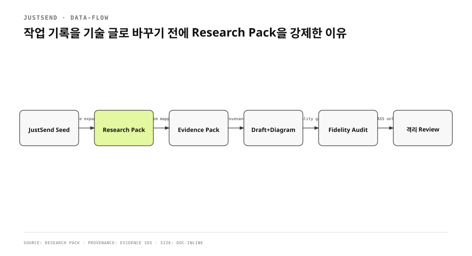

작업 기록에는 결정과 실패와 검증 시간이 남는다. 그래서 좋은 기술 글의 재료처럼 보인다. 그러나 기록만 요약하면 풍부한 글이 되지 않았다. 사건의 시간축은 있지만 실제 code, test, config, 공식 platform contract와 runtime observation이 빠졌다. 결과는 사실을 틀리지는 않지만 독자가 원인과 trade-off를 재구성할 수 없는 얕은 글이었다.
<!-- evidence: JS-E001 -->

기존 pipeline 글도 1804자였다. 같은 한국어 corpus 중앙값 8203자의 60%에 못 미쳤다. “Evidence Pack을 만든다”는 단계는 설명했지만 Evidence가 어디서 오는지, JustSend 기록 밖의 source를 어떻게 확보하는지, 사용한 claim만 quality gate에 세는지가 없었다. 문장 스타일보다 research 단계의 부재가 문제였다.
<!-- evidence: JS-E001 JS-E008 -->

## SoloMD가 풍부한 글을 만드는 위치부터 다시 봤습니다

SoloMD의 auto-blog는 웹을 조사해 주는 기능이 아니다. 이미 만들어진 `research/*.md` source dossier와 writing Skill을 model에 주고, 두 번째 pass에서 source-only review를 한다. 풍부했던 작업은 그 앞의 panel agent가 Plane과 실제 app을 read-only tool로 조사해 dossier를 만든 경우였다. 즉 writer prompt가 아니라 writer 전에 확보한 source density가 차이를 만들었다.
<!-- evidence: JS-E001 -->

JustSend MCP 기록은 그 dossier가 아니다. record는 “무슨 일이 있었나”를 찾는 seed다. implementation claim은 repository로, 외부 API claim은 official docs로, result claim은 runtime으로 확장해야 한다. 이 결론을 pipeline 순서에 넣어 `research-pack.yml`을 Evidence보다 먼저 만들도록 바꿨다.
<!-- evidence: JS-E002 -->



## Research Pack을 첫 번째 검증 계약으로 만들었습니다

각 source는 provider label만 갖지 않는다. 정확한 locator, 20자 이상 excerpt, claim key, retrieval time, content hash, sensitivity와 선택 이유를 갖는다. selected source가 repository인지 official docs인지 runtime인지 kind/provider pair도 검사한다. secret은 pack에 들어가기 전에 redaction한다.
<!-- evidence: JS-E003 -->

```yaml
id: RS-004
kind: official-doc
provider: official-docs
source_id: apple-notarizing-macos
locator: https://developer.apple.com/documentation/security/...
selected: true
artifact_kind: standard
excerpt: "Apple notarization is an automated system..."
claim_keys: [notarization-contract]
```

이 schema가 막는 실패는 세 가지다. URL만 붙이고 읽지 않은 source, 제목만 있고 어느 claim을 지지하는지 모르는 source, source 수를 채우기 위해 글에서 쓰지 않는 research다.
<!-- evidence: JS-E003 JS-E004 -->

### provider 수가 아니라 독립성을 봅니다

같은 JustSend record를 여러 Evidence ID로 나누어도 독립 source가 되지 않는다. repository implementation과 regression test는 서로 다른 source가 될 수 있다. official guide와 runtime result는 같은 claim의 규범과 관측을 각각 지지한다. corroborated는 `provider:source_id`가 다른 둘 이상이 같은 값을 말할 때만 쓴다.
<!-- evidence: JS-E002 JS-E004 -->

### source 종류마다 답하는 질문이 다릅니다

| provider | 답하는 질문 | 대체할 수 없는 것 |
|---|---|---|
| JustSend | 어떤 사건·결정·실패가 있었나 | 현재 code truth |
| repository | 실제 구현·test·config는 무엇인가 | 외부 platform 보장 |
| official docs | platform이 무엇을 요구하나 | 우리 app의 실제 결과 |
| runtime | 특정 build와 input에서 무엇을 봤나 | 일반 규범 |
| corpus | 독자가 이미 읽은 범위와 깊이는 무엇인가 | 새 claim evidence |

한 source가 다른 질문까지 답한다고 확대하지 않는다. build success를 UI success로, 제출 성공을 App Privacy 정확성으로, 작업 note를 현재 code로 바꾸지 않는다.
<!-- evidence: JS-E002 -->

## Evidence Pack은 source와 claim 사이를 좁힙니다

Research Pack이 source inventory라면 Evidence Pack은 공개 가능한 사실 단위다. 각 Evidence는 type, statement, occurred_at, claim_keys와 `sources[]`를 갖는다. inference, conflict, unknown은 별도 배열로 분리한다. article paragraph와 diagram node/edge는 Evidence ID를 참조한다.
<!-- evidence: JS-E004 -->

```json
{
  "id": "JS-E004",
  "type": "fact",
  "statement": "quality audit는 사용 Evidence의 source만 센다.",
  "claim_keys": ["evidence-mapping", "quality-gate"],
  "sources": [{"research_source_id": "RS-003", "provider": "repository"}],
  "confidence": "direct"
}
```

이 구조는 blanket citation을 줄인다. section 끝에 record 하나를 붙이고 모든 문장을 지지한다고 간주하지 않는다. 실제 claim key가 source excerpt와 연결되고, article에서 Evidence ID를 사용해야 source coverage에 포함된다.
<!-- evidence: JS-E004 -->

## 글이 실제로 사용한 research만 quality에 셉니다

production 기본값은 selected source 5개, source kind 3개, repository 2개, official primary 1개, runtime 1개, claim key 5개다. 그러나 pack에 넣었다는 이유로 수를 올리지 않는다. final Markdown이 참조한 direct/corroborated Evidence를 찾고, 그 Evidence의 `sources[]`만 coverage에 포함한다.
<!-- evidence: JS-E005 -->

`quality.js`는 사용 Evidence의 claim key가 linked research claim key에 없으면 `research_claim_mapping` blocker를 만든다. official URL 10개를 넣고 article이 하나도 쓰지 않거나, repository source가 엉뚱한 claim key를 가지면 PASS하지 못한다.
<!-- evidence: JS-E004 JS-E005 -->

| blocker | 뜻 |
|---|---|
| `research_source_depth` | 실제 사용 source가 5개 미만 |
| `repository_research` | implementation 근거 2개 미만 |
| `external_primary_research` | official primary 없음 |
| `runtime_research` | result observation 없음 |
| `research_claim_mapping` | Evidence claim이 source claim에 연결되지 않음 |

## Writing은 coverage map을 소비합니다

outline section은 purpose, Evidence IDs, visual candidate를 가진다. 초안은 “기록 요약” 순서가 아니라 관측 사건→실패·철회→source artifact→외부 계약→결정→검증→결과→제약의 coverage를 배치한다. 같은 Evidence를 여러 문단에 반복해 글자 수를 늘리지 않는다.
<!-- evidence: JS-E002 JS-E004 -->

문서 유형도 독자 질문으로 고른다. incident review는 영향·timeline·원인·대응·재발 방지, architecture decision은 문제·기준·대안·결정·결과를 따른다. 한 글에 모든 유형을 섞으면 section이 사건과 시스템 흐름과 의사결정을 동시에 말한다.
<!-- evidence: JS-E004 -->

## 다이어그램에도 source ledger를 붙입니다

architecture, sequence, data flow, state transition, deployment, trust boundary가 section 핵심이면 diagram은 필수다. visual plan의 node와 edge 각각에 Evidence ID가 있어야 한다. rendered SVG에는 `data-node-id`, `data-from`, `data-to`, `data-evidence-ids`를 남겨 audit가 plan과 artifact를 대조한다.
<!-- evidence: JS-E004 JS-E005 -->

그림이 있다는 사실만으로 통과하지 않는다. visual candidate를 false로 낮추거나 omit하면 blocker다. 한 diagram이 여러 section을 덮으면 `covers_section_ids`를 명시한다. 본문에 없는 actor나 direction을 예쁘게 보이려고 추가하지 않는다.
<!-- evidence: JS-E004 -->

## Humanize는 기술 구조 뒤에만 실행합니다

한국어 윤문은 source 조사와 outline을 대신하지 않는다. draft, diagram caption, Evidence comment를 고정한 뒤 번역투·수동태·메타 문장을 줄인다. 숫자, 날짜, URL, path, code, API name, direct quote, 부정과 인과는 protected token으로 대조한다.
<!-- evidence: JS-E001 -->

change rate가 50% 이상이거나 의미가 달라지면 윤문본을 버린다. 문장을 더 자연스럽게 만들면서 새로운 성공 효과를 넣지 않는다. research가 얕은 초안을 humanize하면 얕은 문장이 매끄러워질 뿐이다.
<!-- evidence: JS-E001 JS-E004 -->

## Fidelity Audit가 publish를 막습니다

마지막 audit는 technical draft와 humanized text의 protected token을 비교하고, factual paragraph의 Evidence ID, research source coverage, quality threshold, diagram provenance를 함께 검사한다. 어느 하나라도 FAIL이면 `final.md`와 READY_FOR_REVIEW를 만들지 않는다.
<!-- evidence: JS-E004 JS-E005 -->

content depth도 자동 gate다. 장문 기본값은 4500자, H2 5개, H3 2개, artifact block 3개, code block 1개, direct Evidence 3개, Evidence coverage 65%다. 기존 corpus가 있으면 중앙값 60%도 넘겨야 한다. 글자 수를 채우는 반복 문단은 별도 blocker다.
<!-- evidence: JS-E005 -->

## Git worktree가 원 작업공간을 보호합니다

Git 공식 문서의 worktree는 한 repository에 여러 working tree를 연결한다. pipeline은 새 branch와 run 전용 path를 만들어 generated artifact를 원 workspace의 WIP와 분리한다. 원 workspace를 stash·reset·clean하지 않고 run path만 명시적으로 stage한다.
<!-- evidence: JS-E006 -->

이번 8편 재작성에서도 0.2.0 run을 rebase하지 않았다. 이전 draft·outline·Evidence는 source dossier가 없으므로 invalidated했고, 0.3.1 base에서 post별 research pack과 새 Evidence ID를 다시 만들었다. 같은 slug를 유지하는 것과 옛 evidence를 재사용하는 것은 다른 일이다.
<!-- evidence: JS-E002 JS-E006 -->

## 실패하는 fixture와 통과하는 fixture를 함께 남겼습니다

JustSend-only article은 repository, official, runtime blocker로 실패한다. enriched fixture는 JustSend seed에 repository 2개, official 1개, runtime 1개를 붙이고 claim mapping을 통과한다. unit, integration, end-to-end test와 package validation, plugin doctor가 이 계약을 지킨다.
<!-- evidence: JS-E007 -->

이 test는 좋은 글을 자동으로 쓰지 않는다. 얕은 input을 풍부한 글처럼 포장하는 것을 막는다. 최종 prose의 정확성과 독자 가치는 Main의 source selection과 writing review가 책임진다.
<!-- evidence: JS-E004 JS-E007 -->

## 파이프라인의 새 불변식

변경 뒤 순서는 `REQUESTED → RESEARCHING → EVIDENCE_READY → OUTLINED → DRAFTED → VISUAL_PLANNED → VISUAL_RENDERED → HUMANIZED → AUDITED → READY_FOR_REVIEW`다. Research와 Evidence를 건너뛰지 않고, audit result를 수동 PASS로 바꾸지 않는다. 사용자 승인 전 merge·publish·JustSend write-back도 하지 않는다.
<!-- evidence: JS-E002 JS-E004 JS-E006 -->

교훈은 도구 수가 아니라 순서에 있다. 작업 기록을 source of truth로 과대평가하지 않고, claim마다 적합한 source를 확보한 뒤 글을 쓰도록 순서를 바꿨다. 풍부한 기술 글은 긴 prompt보다 조사 가능한 artifact, 명확한 provenance, 실패를 허용하는 gate에서 나온다.
<!-- evidence: JS-E001 JS-E002 JS-E005 JS-E007 -->
