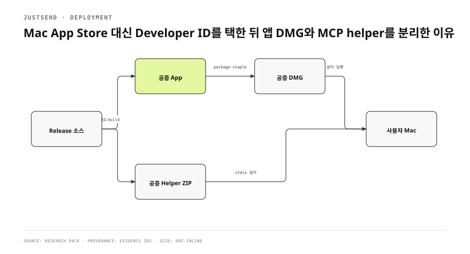

Mac 앱의 MCP 기능은 별도 실행 파일을 필요로 했다. 초기 판단은 helper를 앱 번들에 넣은 채 App Store와 직접 배포를 모두 만족시키는 것이었다. 실제 서명과 업로드를 해 보니 TestFlight 자격과 helper 실행 자격이 충돌했다. 신원 key가 없으면 container가 서지 않았고, 필요한 자격을 넣으면 bare executable이 provisioning profile을 담을 수 없어 업로드 계약에서 막혔다.
<!-- evidence: JS-E001 -->

먼저 사실관계를 바로잡는다. 기존 1343자 글은 “helper를 앱에 포함한 공증 DMG”를 최종 결정처럼 썼다. 현재 정본은 다르다. 앱은 공증 DMG로 배포하고, helper는 번들 밖 `/usr/local/bin/justsend-mcp`에 설치하는 별도 universal ZIP으로 배포한다. 시간축을 지우고 옛 결론을 현재형으로 쓰면 배포 문서가 다시 틀린다.
<!-- evidence: JS-E002 JS-E007 -->

## 채널 선택 기준을 기능보다 먼저 세웠습니다

| 기준 | App Store | Developer ID 직접 배포 |
|---|---|---|
| 앱 발견·업데이트 | 스토어가 제공 | 웹과 앱이 제공해야 함 |
| 결제 | StoreKit 표면 | iOS 구매 중심으로 경계 조정 |
| native Apple sign-in | App Store profile 지원 | Developer ID profile에서 entitlement 없음 |
| helper | 번들 bare executable 제약 | 별도 공증 ZIP 배포 가능 |
| 설치 신뢰 | App Review + Store | code signing + notarization + Gatekeeper |

선택 기준은 “어느 채널이 더 쉽나”가 아니었다. 앱 데이터와 계정에 접근하는 helper를 사용자가 버전과 경로까지 직접 맞추지 않게 하면서, Apple이 허용하는 서명 계약 안에 놓을 수 있는지를 봤다. 직접 배포는 App Store의 업데이트·결제 표면을 잃지만 helper를 독립적인 Developer ID executable로 배포할 수 있다.
<!-- evidence: JS-E001 JS-E002 -->



## 앱과 helper를 같은 산출물로 묶지 않았습니다

현재 `PLAN-DIRECT-DISTRIBUTION.md`는 앱 번들을 실행 파일 하나로 제한한다. MCP helper는 universal arm64+x86_64 ZIP으로 따로 서명·공증하고 홈페이지 정적 경로에서 제공한다. 앱 DMG와 helper ZIP은 버전·체크섬·설치 위치가 각각 있다. 설치 단계는 하나 늘지만 App Store로 되돌아갈 수 있는 앱 번들 구조는 남는다.
<!-- evidence: JS-E002 -->

### 왜 helper를 옵션 기능으로 지우지 않았나

MCP helper는 에이전트가 작업 기록을 읽고 쓰는 제품 경계다. 제거하면 Mac 앱 자체는 배포할 수 있지만 외부 도구가 같은 계정 범위의 기록을 다루는 기능이 사라진다. 별도 ZIP은 기능을 유지하면서 서명 단위를 갈라낸 절충이다. helper는 앱의 private API를 호출하지 않고 App Group sidecar와 protocol contract를 통해 통신한다.
<!-- evidence: JS-E001 JS-E002 -->

### 왜 앱 안에서 helper를 다운로드하지 않았나

샌드박스 앱이 임의 executable을 내려받아 설치하는 흐름은 권한·업데이트·신뢰 경계를 더 복잡하게 만든다. 지금 단계에서는 웹사이트가 notarized ZIP과 `.sha256`, `latest.json`을 제공하고 사용자가 명시적으로 설치한다. 자동 업데이트는 별도 설계 문제로 남겼다. 앱 배포를 단순화하려고 helper installer를 숨겨 넣지 않았다.
<!-- evidence: JS-E002 -->

## Developer ID가 로그인 경계도 바꿨습니다

Developer ID profile은 native Sign in with Apple entitlement를 제공하지 않았다. 개발 profile에서 되던 버튼이 직접 배포 archive에서 그대로 될 것이라 가정하면 export 단계에서 막힌다. 해결은 Apple 계정을 포기하는 것이 아니라 Services ID 기반 web OAuth를 기존 backend identity 경로에 연결하는 것이었다.
<!-- evidence: JS-E003 -->

```text
Mac app
  → ASWebAuthenticationSession
  → Apple Services ID authorize
  → api-v2 web callback
  → justsend://apple-signin
  → existing authWithApple verification
```

web flow는 browser가 Apple OAuth server를 방문하므로 native `applesignin` entitlement를 요구하지 않는다. callback은 code와 id_token을 기존 서버 검증에 넘긴다. 이 방식은 계정 identity를 새로 만드는 것이 아니라 배포 채널 때문에 달라진 credential acquisition만 교체한다.
<!-- evidence: JS-E003 -->

## 포장 script를 release contract로 만들었습니다

`scripts/package-dmg.sh`는 사람이 Finder에서 만든 DMG를 정본으로 두지 않는다. archive, Developer ID export, app notarization, app staple, Gatekeeper 판정, identity 확인, DMG 생성, DMG signing, DMG notarization, DMG staple, checksum을 순서대로 수행한다. 중간 검증이 실패하면 다음 단계로 가지 않는다.
<!-- evidence: JS-E004 -->

```bash
# 핵심 게이트의 순서
xcrun stapler validate "$APP"
codesign -dv --verbose=4 "$APP"
hdiutil create -format UDZO "$DMG"
codesign --sign "$IDENTITY" --timestamp "$DMG"
xcrun notarytool submit "$DMG" --wait
xcrun stapler staple "$DMG"
shasum -a 256 "$DMG"
```

### “공증됨”과 “우리 앱임”을 구분합니다

Gatekeeper가 `Notarized Developer ID`라고 말해도 그것이 JustSend인지, 어느 team인지, hardened runtime인지, 기대한 build인지까지 증명하지 않는다. script는 TeamIdentifier, bundle identifier, runtime flag, CFBundleVersion을 별도로 확인한다. `JS_APP`으로 이미 만든 app을 넣을 수 있으므로 이 신원 검사가 없으면 공증된 다른 앱도 JustSend 이름의 DMG에 들어갈 수 있다.
<!-- evidence: JS-E004 -->

### 앱과 DMG를 둘 다 staple합니다

Apple notarization은 악성 요소와 code-signing 문제를 자동 검사하고 성공하면 ticket을 만든다. ticket은 online에서 Gatekeeper가 찾거나 software에 staple할 수 있다. 직접 배포 script는 app과 DMG를 각각 notarize·staple한다. 오프라인 첫 실행에서도 ticket을 확인할 수 있게 하려는 선택이다.
<!-- evidence: JS-E005 -->

## 검증은 서명 뒤 제품 동작까지 이어졌습니다

runtime 검증은 `notarytool`의 Accepted에서 멈추지 않았다. DMG Gatekeeper 판정, mount, Applications 설치, app launch를 확인했다. helper는 별도 설치 경로에서 `initialize`와 `justsend_me`를 호출해 protocol이 응답하는지 봤다. code signing은 바이트와 identity를 증명하지만 앱의 database와 helper protocol이 동작한다는 사실은 증명하지 않는다.
<!-- evidence: JS-E006 -->

| 게이트 | 증명하는 것 | 증명하지 않는 것 |
|---|---|---|
| `codesign --verify` | 서명 구조와 변경 여부 | 실제 로그인·MCP 동작 |
| `notarytool Accepted` | Apple 자동 검사 통과 | 설치 후 실행 |
| `stapler validate` | ticket 부착 | bundle identity 일치 |
| `spctl` | Gatekeeper 수용 | app 내부 기능 |
| `initialize` | helper protocol 응답 | 모든 쓰기 권한 |

## 실패에서 포장 script의 세부 규칙이 생겼습니다

`notarytool --wait`가 Accepted를 반환한 직후 ticket 전파가 늦어 첫 staple이 실패할 수 있었다. 그래서 staple은 bounded retry를 한다. `spctl | grep -q`는 `grep`이 먼저 끝나 `spctl`을 SIGPIPE로 죽이고 `pipefail`이 거짓 실패를 만들 수 있어 판정문을 변수로 받은 뒤 검사한다. 기존 `/Applications/JustSend.app` 위에 `ditto`로 덮으면 옛 sealed resource가 남을 수 있어 옛 bundle을 치우고 새로 복사한다.
<!-- evidence: JS-E004 JS-E006 -->

이 세 가지는 cosmetic script 개선이 아니다. Accepted인데 release가 실패하거나, 새 app인데 옛 resource가 섞이는 문제는 같은 source에서 만든 build를 재현할 수 없게 한다. release automation은 성공 path뿐 아니라 도구의 출력·종료 semantics까지 계약으로 가져야 한다.
<!-- evidence: JS-E004 -->

## 직접 배포가 만든 운영 비용을 남겼습니다

앱 DMG와 helper ZIP이 분리되면서 최신 버전을 판단할 metadata도 둘이 됐다. 웹사이트는 helper의 version, URL, sha256, minimumOS를 담은 `latest.json`을 제공한다. 앱 자동 업데이트는 Sparkle 같은 별도 trust chain을 검토해야 한다. App Store의 자동 업데이트와 구매 표면을 잃은 대가를 “추후” 한 줄로 숨기지 않고 배포 설계의 비용으로 남겼다.
<!-- evidence: JS-E002 -->

Apple login은 web OAuth로 옮겼지만 실제 계정의 logout/login은 로컬 기록 복원과 연결되므로 별도 사용자 검증이 필요했다. 공증과 callback route가 green이어도 실제 Apple 계정 round trip을 대신하지 않는다. 직접 배포로 바뀐 capability matrix를 feature test matrix와 함께 관리해야 한다.
<!-- evidence: JS-E003 JS-E006 -->

## 결정의 현재형을 문서와 산출물에서 맞춥니다

이 작업에서 가장 위험한 문장은 “helper를 앱에 포함했다”였다. 한 시점에는 시도했지만 현재 release contract는 app DMG와 helper ZIP 분리다. 기술 글이 작업 기록의 중간 결론을 그대로 가져오면 독자는 지금 설치 구조를 틀리게 이해한다. 그래서 Evidence는 사건 시점과 현재 repository 정본이 충돌할 때 conflict를 숨기지 않고 현재 경계를 명시한다.
<!-- evidence: JS-E001 JS-E002 -->

Developer ID 선택의 결론도 “App Store를 버렸다”로 끝나지 않는다. 앱과 helper의 신뢰 단위를 분리하고, native login을 web OAuth로 옮기고, notarization ticket과 product runtime을 따로 검증하는 운영 체계를 선택했다. 채널을 바꾸는 일은 배포 파일 확장자를 바꾸는 일이 아니라 capability와 trust boundary를 다시 그리는 일이다.
<!-- evidence: JS-E002 JS-E003 JS-E004 JS-E006 -->
