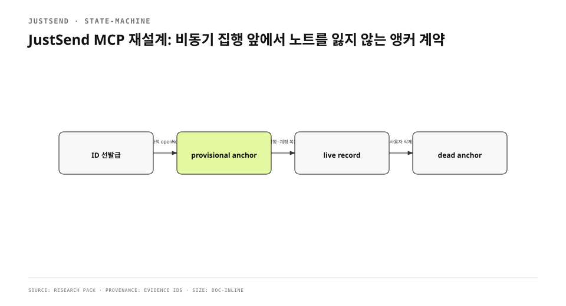

`work_start`가 성공을 돌려준 직후 `work_note`를 호출했는데 본문이 사라졌다. 실패는 네트워크 timeout도 중복 retry도 아니었다. helper는 시작 의도를 받았지만 실제 기록과 item ID는 앱의 비동기 집행기가 나중에 만들었다. 그 사이 도착한 노트는 연결할 anchor가 없어서 큐에 들어가지도 못했다. 한 조사에서 이런 유실이 67건 확인됐다.
<!-- evidence: JS-E001 -->

기존 글은 “비동기 앵커 위의 동기 계약”이라는 결론을 1320자에 담았지만 ID를 언제 발급하는지, provisional 상태를 어떻게 복구하는지, MCP ToolSpec이 어느 경계를 지키는지가 없었다. 여기서는 외부의 동기 도구 계약과 내부의 비동기 intent executor 사이를 데이터 수명으로 설명한다.
<!-- evidence: JS-E007 -->

## 문제는 queue가 아니라 ID 수명이었습니다

| 시점 | 이전 구현 | 호출자가 믿은 것 |
|---|---|---|
| `work_start` 반환 | 생성 intent 수락 | 기록과 ID가 생김 |
| 즉시 `work_note` | anchor 조회 실패 | 시작한 기록에 붙음 |
| 앱 executor 실행 | 나중에 item 생성 | 이미 보낸 노트도 처리됨 |

비동기 queue 자체는 잘못이 아니다. 문제는 외부 계약이 “기록을 시작했다”고 말했는데 후속 쓰기에 필요한 identity가 아직 존재하지 않았다는 점이다. 성공 응답과 materialization을 같은 사건으로 취급한 순간, 250ms의 창도 데이터 유실 창이 된다.
<!-- evidence: JS-E001 JS-E002 -->



## Plane의 순서를 그대로 베끼지 않고 원리를 가져왔습니다

조사한 work item 시스템은 issue row와 sequence를 동기 transaction으로 만들고 activity log만 비동기로 미룬다. JustSend는 기록 자체를 queue에 넣는 구조라 똑같이 포팅할 수 없었다. 대신 후속 쓰기가 의존하는 최소 identity만 동기로 만들고, 사용자 library materialization은 계속 비동기로 남겼다. 즉 “무거운 기록 생성”이 아니라 “도착지를 식별하는 anchor”가 동기 경계가 됐다.
<!-- evidence: JS-E002 JS-E003 -->

### ID는 executor가 아니라 helper가 발급합니다

현재 `workStart`는 UUID를 먼저 만들고 `item_id`로 즉시 반환한다. 호출자는 `materialized: false`를 받아도 그 ID에 note를 보낼 수 있다. 응답의 의미도 둘로 갈린다.
<!-- evidence: JS-E002 -->

```json
{
  "item_id": "issued-before-apply",
  "state": "queued",
  "materialized": false,
  "message": "The record id is issued and notes can be attached now"
}
```

`queued`는 실패가 아니다. intent가 보존됐고 앱이 나중에 적용한다는 상태다. 반대로 `failed`는 재시도되지 않는 영구 실패다. 클라이언트는 이 둘을 같은 error로 접지 않아야 한다.
<!-- evidence: JS-E002 JS-E004 -->

### 앵커와 시작 의도는 한 transaction에 섭니다

ID를 먼저 발급하는 것만으로는 충분하지 않다. anchor row를 쓴 뒤 start intent를 넣기 전에 프로세스가 죽으면 provisional anchor만 남고, 다음 `work_start`는 이미 존재한다고 판단해 intent를 다시 만들지 않을 수 있다. `openWork`는 provisional anchor와 `.anchor` intent를 같은 SQLite transaction에 저장해 이 중간 상태를 닫는다.
<!-- evidence: JS-E003 -->

```swift
let intent = try sidecar.openWork(
  anchor: AgentTaskAnchor(taskKey: taskKey, itemID: itemID, state: .provisional),
  intent: AgentIntent(taskKey: taskKey, kind: .anchor, itemID: itemID)
)
```

## 상태를 materialization과 분리했습니다

anchor에는 `provisional`, `live`, `dead`가 있다. `provisional`은 ID와 시작 의도가 있지만 library item이 아직 없다는 뜻이다. `live`는 item이 materialize됐다는 뜻이고, `dead`는 사용자가 기록을 지워 새 기록이 필요하다는 뜻이다. 예전의 존재/부재 boolean으로는 “집행 중”, “집행 뒤 상태 표지만 뒤처짐”, “실제 기록 삭제”를 구분할 수 없었다.
<!-- evidence: JS-E002 JS-E003 -->

| anchor state | item 존재 | 다음 행동 |
|---|---|---|
| provisional | 없음 | 기존 intent를 기다림 |
| provisional | 있음 | state를 live로 복구 |
| live | 있음 | 같은 anchor 재사용 |
| live | 없음 | dead로 전환 후 새 ID 발급 |
| dead | 없음 | 같은 task_key로 새 기록 생성 |

이 복구 규칙은 retry의 멱등성과도 연결된다. 같은 `idempotency_key`가 오면 새 intent를 만들지 않고 기존 행을 돌려준다. 앱이 느리다고 호출자가 재시도해도 같은 노트가 두 번 생기지 않는다.
<!-- evidence: JS-E003 -->

## 계정 복원 전 owner mismatch를 영구 실패로 보지 않았습니다

helper와 앱은 같은 sidecar를 보지만 로그인 세션이 복원되는 시점은 다르다. 앱이 뜨기 전 helper가 빈 owner로 anchor를 조회하면 실제 계정 소유 기록을 “없음”으로 오판할 수 있었다. 한 배포에서는 로그인 전에 받은 완료 노트를 executor가 `anchor missing`으로 영구 실패시키고, 도구도 새 노트를 parameter error로 거절했다.
<!-- evidence: JS-E004 -->

수정 뒤 helper는 owner를 무시한 anchor lookup으로 의도를 먼저 보존한다. executor는 owner mismatch를 permanent가 아니라 transient failure로 분류한다. 계정 복원이 끝나면 같은 intent를 다시 적용한다. 기준은 “지금 확인할 수 없다”와 “입력이 틀렸다”를 구분하는 데 있다. 전자는 retry하고 후자는 실패한다.
<!-- evidence: JS-E004 -->

## ToolSpec을 선언형 계약으로 만들었습니다

MCP specification에서 server는 `tools` capability를 선언하고 `tools/list`에 name, description, `inputSchema`를 노출한다. client는 `tools/call`로 name과 arguments를 보낸다. 따라서 tool 설명은 prompt 장식이 아니라 protocol surface다. JustSend는 각 도구의 access 성격과 parameter를 `ToolSpec` 한 곳에 등록하고 실제 dispatch 전에 검증한다.
<!-- evidence: JS-E005 -->

| 계약 | 예시 | 실패 시 |
|---|---|---|
| access | read / append | 설정에서 허용하지 않으면 queue 보존 또는 거절 |
| required | `task_key`, `title`, `body`, project axis | `-32602` |
| enum | work status | 모르는 값은 조용히 버리지 않고 거절 |
| result | `state`, `materialized`, `item_id` | 호출자가 retry 여부 결정 |

### 스키마와 구현이 갈라지지 않게 검사합니다

도구 목록에 문서만 추가하고 dispatch가 argument를 무시하면 호출자는 성공한 쓰기를 믿게 된다. 반대로 구현된 parameter가 `inputSchema`에 없으면 client는 그 입력을 보낼 방법이 없다. `MCPToolSpecValidationTests`는 등록된 도구의 annotation과 schema를 전수 검사해 이 드리프트를 막는다.
<!-- evidence: JS-E005 -->

## 집행기는 저장소의 정상 쓰기 경로를 사용합니다

sidecar intent가 최종 library DB를 직접 수정하면 sync envelope와 UI refresh를 우회한다. executor는 item repository의 create/update/delete path를 사용해 사용자가 앱에서 한 쓰기와 같은 후속 효과를 만든다. status 변경도 기존 status tag를 걷고 하나만 남긴다. intent queue는 별도 데이터베이스지만 제품 쓰기의 정본은 아니다.
<!-- evidence: JS-E003 JS-E004 -->

이 구조는 두 개의 원장을 만든다. sidecar는 “무엇을 하려 했는가, 어디까지 적용됐는가”를 보존한다. library는 “사용자가 최종적으로 가진 기록”을 보존한다. 둘을 한 DB로 합치면 helper가 사용자 데이터 schema와 encryption/sync 세부사항까지 알아야 하고, 분리하되 executor를 우회하면 데이터가 기기마다 갈린다.
<!-- evidence: JS-E003 -->

## 자기 기록으로 end-to-end를 검증했습니다

새 helper를 로그인 전에 실행해 note를 보냈다. note는 owner mismatch 때문에 영구 실패하지 않고 queue에 남았다. 계정 복원 뒤 같은 task anchor에 materialize됐다. 이 관측을 남긴 작업 기록 자체가 테스트 대상 시스템을 통과한 결과였다. unit test가 transaction과 상태 전이를 지키고, 자기 기록은 helper→sidecar→executor→library라는 실제 경로를 확인한다.
<!-- evidence: JS-E006 -->

검증을 세 층으로 나눴다.

1. sidecar test: anchor+intent atomicity, idempotency, pending order.
2. protocol test: ToolSpec, schema, access annotation, result shape.
3. runtime test: 로그인 전 enqueue, 계정 복원, 같은 기록에 note 도착.

세 번째가 없으면 green test suite가 설치된 helper와 실행 중 앱의 버전 불일치를 잡지 못한다. 실제로 이전 executor가 provisional state를 갱신하지 않아 task_key가 잠긴 사례가 있었다.
<!-- evidence: JS-E002 JS-E006 -->

## 남은 비용과 적용 기준

선발급 ID는 distributed transaction을 만들지 않는다. library materialization이 영구 실패하면 호출자는 존재하지 않는 item ID를 이미 받았다. 그래서 final state, readable error, retry class와 dead anchor 복구가 필요하다. queue가 있다는 이유로 무한 retry하지 않고 malformed input과 삭제된 target은 permanent로 닫는다.
<!-- evidence: JS-E002 JS-E004 -->

이 설계는 모든 비동기 API에 필요한 것도 아니다. 후속 명령이 첫 결과의 identity에 즉시 의존할 때 필요하다. 이메일 발송처럼 후속 쓰기가 같은 object ID를 요구하지 않는 작업은 accepted job ID만으로 충분하다. 반면 기록 시작 뒤 note·status·complete가 곧바로 이어지는 workflow는 materialization보다 먼저 안정적인 destination을 제공해야 한다.
<!-- evidence: JS-E001 JS-E002 -->

결론은 queue를 빠르게 만드는 것이 아니었다. 동기 계약이 약속하는 최소 상태를 먼저 만들고, 비동기 executor가 나머지를 완성하게 했다. `work_start`의 성공은 이제 “기록이 화면에 보인다”가 아니라 “후속 의도를 잃지 않을 anchor와 ID가 생겼다”는 뜻이다.
<!-- evidence: JS-E002 JS-E003 JS-E006 -->
