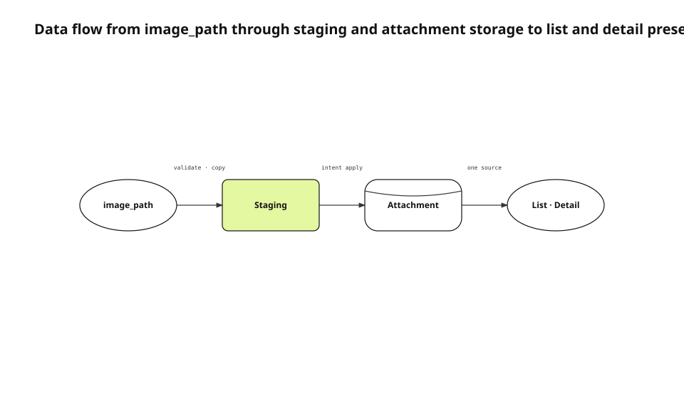

Adding a representative image to an agent work record looked like a small UI feature. In practice, one byte sequence had to survive a caller-owned file, the MCP input schema, helper staging, a sidecar intent, the app attachment repository, a list thumbnail, and a detail hero. A second source of truth at any stage could make the image disappear or render twice.
<!-- evidence: JS-E101 JS-E102 -->

This English edition uses the fresh image implementation record, current `workStart` and `HomeViewModel` source, the MCP tool specification, and the installed-app observation. The labels are localized, while node roles, edge kinds, Evidence IDs, and the selected data-flow type remain identical to the Korean semantic model.
<!-- evidence: JS-E107 -->

## Separate ownership of meaning from ownership of bytes

The caller knows what the picture should explain. The renderer owns size, theme, typography, and export. The MCP server validates the file and preserves it across processes. The app stores it as an attachment and decides where to present it.
<!-- evidence: JS-E101 -->

| Responsibility | Owner |
|---|---|
| What the picture means | Caller with task context |
| File format and export | Renderer and helper validation |
| Cross-process lifetime | Staging and intent row |
| Durable storage | Attachment repository |
| List and detail presentation | App presentation layer |

The MCP specification exposes tools with JSON input schemas. `image_path` is therefore an explicit caller-to-server argument, not an undocumented convention hidden in a prompt.
<!-- evidence: JS-E101 JS-E104 -->

This division prevents a generic renderer from deciding that every task should use the same “before/after” picture. It also prevents the caller from deciding where an untrusted path may be read inside the app.
<!-- evidence: JS-E101 JS-E102 -->

## Move the bytes through four explicit stages



The source file does not become a library attachment immediately. `work_start` validates and atomically copies it into shared staging. The app executor applies the intent and moves the bytes into attachment storage. The list and detail surfaces read that same attachment.
<!-- evidence: JS-E102 JS-E104 -->

The primary relation is movement through transformations and a store, which is why data flow is the accurate type. A component diagram would show the same names but hide the lifetime and cleanup semantics carried by each arrow.
<!-- evidence: JS-E102 JS-E104 -->

### Staging is a process boundary, not a convenient temporary folder

The helper and app are different processes. If the queue stores only a caller's `/tmp` path, the caller can clean it up before the app reads it. Shared staging gives the intent a file lifetime independent of the originating process.
<!-- evidence: JS-E102 -->

The helper stores attachment ID, filename, and staged path with the anchor intent. If queue insertion fails, it deletes the file. If an idempotent retry returns an existing intent, it removes only the newly created duplicate.
<!-- evidence: JS-E102 -->

Queued and retrying intents retain the file because the app still needs it. Permanent failure and successful import can release it. File retention is a state-machine consequence even though the article's primary diagram is data flow.
<!-- evidence: JS-E102 -->

### The executor revalidates the path

Helper validation cannot protect against a row written directly into the sidecar database. The app executor canonicalizes the path, verifies the staging root, resolves symlinks, and rejects paths that escape before reading or deleting anything.
<!-- evidence: JS-E102 -->

This is both a confidentiality and integrity boundary. The same path authorizes reading bytes into a synced record and deleting the source after import.
<!-- evidence: JS-E102 -->

## Use the attachment as the only durable store

The initial implementation saved an attachment and also injected a `jsattach://` Markdown reference at the top of the body. The detail screen already rendered the attachment as a hero, so the same image appeared twice.
<!-- evidence: JS-E103 -->

```markdown
<!-- Do not inject this for a record hero -->
__omp_shell("[](jsattach://attachment-id)")
```

The corrected contract makes the attachment itself authoritative. Inline document images still use a body reference because their position inside the document is user-authored. A record hero is owned by the page layout and needs no duplicate reference.
<!-- evidence: JS-E103 JS-E104 -->

| Image category | Attachment | Body reference | Presentation |
|---|---|---|---|
| Work-record hero | Yes | No | List and detail header |
| Inline document image | Yes | Yes | Authored body position |
| Link-derived image | Derived attachment | No | Card policy |

A dedicated hero column would have duplicated migration, sync, cleanup, and authorization rules already owned by attachments. Presentation policy is cheaper than a second storage model.
<!-- evidence: JS-E104 -->

## Let the list and detail share one sink

`HomeViewModel` selects the first photo or video attachment path as `leadingThumbPath`. A row allocates thumbnail space only when that path exists. Text-only work records do not inherit an empty image column.
<!-- evidence: JS-E105 -->

The detail page reads the same attachment as its hero. There is no independent `heroImageID` that can drift from the list thumbnail. The list and detail are two presentations of one sink rather than two storage destinations.
<!-- evidence: JS-E104 JS-E105 -->

If ordering policy changes later, it must change in one projection contract. The attachment identity and byte lifecycle remain unchanged.
<!-- evidence: JS-E104 -->

## Keep completion content separate from progress history

A hero image does not make a one-line execution log into a useful record. The start body carries objective, scope, and success criteria. Progress notes retain chronological decisions and dead ends. Completion moves the verified outcome into the main body.
<!-- evidence: JS-E101 -->

Title, hero, and main body represent the current conclusion in list and detail views. The note stream remains the historical process. This makes the card readable without deleting the evidence needed by the next agent.
<!-- evidence: JS-E101 -->

The split also avoids creating one card for start, another for completion, and a third for the picture. A work record remains one durable object with evolving content and immutable history notes.
<!-- evidence: JS-E101 JS-E104 -->

## Tie orphan cleanup to intent state

A staged file is not deleted only on success. Failure before queue insertion deletes it immediately. An idempotent replay that returns an existing intent deletes the new duplicate. A permanent failure has no future consumer, so its staged bytes are removed.
<!-- evidence: JS-E102 -->

| Intent state | Staged bytes |
|---|---|
| Queued or retrying | Preserve |
| Applied | Delete after attachment import |
| Permanent failure | Delete |
| Idempotent duplicate | Delete only the duplicate |

Deleting by age alone risks removing a file while an app is suspended and still plans to consume the intent. Cleanup must first confirm terminal state.
<!-- evidence: JS-E102 -->

Monitoring byte count without pending-intent count also hides the cause. The two metrics together distinguish an orphan leak from a legitimate queue backlog.
<!-- evidence: JS-E102 JS-E106 -->

## Verify bytes and surfaces on the installed app

We checked the attachment bytes and item relationship in a signed installed build. The same record showed a thumbnail in the list and one hero at the top of detail. A record without attachments did not reserve blank space.
<!-- evidence: JS-E106 -->

| Observation point | Expected result |
|---|---|
| Sidecar intent | Attachment identity and staged path |
| Library | Item-to-attachment relationship |
| List | One thumbnail or no reserved area |
| Detail | One hero and no injected duplicate |

This observation covers the current Mac. It does not prove that another device downloads the hero before opening the record. Cross-device prefetch remains a separate sync feature.
<!-- evidence: JS-E106 -->

## Repeating data flow is correct when the primary axis repeats

The research-to-Evidence article also uses data flow because its central question is how a source becomes a structured artifact. The two diagrams are not required to use different types. They are required to use the type that best explains their relation.
<!-- evidence: JS-E102 JS-E104 JS-E105 JS-E106 -->

The 0.4.4 audit checks selected type, renderer metadata, node roles, edge kinds, endpoint attachment, and edge-node intersections. A generic horizontal row cannot pass merely by changing its type label.
<!-- evidence: JS-E102 JS-E104 -->

The English diagram was rendered with justsend-blog 0.4.4, which records node bounds and edge route points, uses distinct branch attach points, and fails the audit when an edge crosses a non-endpoint or travels through an endpoint node.
<!-- evidence: JS-E108 -->
