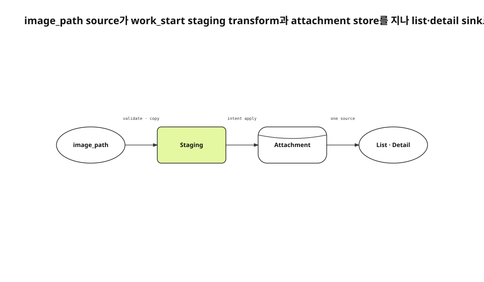

에이전트 work record에 대표 이미지를 넣는 요구는 UI 한 장으로 보였다. 실제로는 caller file, MCP inputSchema, helper staging, sidecar intent, app attachment repository, list thumbnail, detail hero가 한 byte 수명을 공유해야 했다. 어느 단계라도 별도 source를 만들면 이미지가 사라지거나 중복된다.
<!-- evidence: JS-E101 JS-E102 -->

새 run에서는 image_path 구현 기록, current workStart와 HomeViewModel, MCP tool schema, 설치본 관측을 다시 조사했다. 공개 글 5808자는 corpus로만 읽었고 새 문단과 Evidence를 다시 만들었다.
<!-- evidence: JS-E107 -->

## 의미와 byte 수명의 owner를 나눴습니다

무엇을 그릴지는 작업 문맥을 아는 caller가 정한다. renderer는 size·theme·font·export를 맡는다. MCP server는 file을 검증하고 process 사이에서 살아남도록 staging한다. 앱은 attachment로 저장하고 surface에 표시한다.
<!-- evidence: JS-E101 -->

| 책임 | Owner |
|---|---|
| 그림 내용 | caller |
| 파일 형식·size | renderer·helper |
| process 간 수명 | staging·intent |
| 영구 저장 | attachment repository |
| 목록·상세 표시 | presentation layer |

MCP specification에서 tool은 `inputSchema`로 argument를 공개한다. `image_path`는 prompt 관습이 아니라 work_start의 명시적 input이다.
<!-- evidence: JS-E101 JS-E104 -->

## byte는 네 단계로 이동합니다



source file은 work_start에서 바로 library attachment가 되지 않는다. helper가 먼저 검증해 shared staging에 atomic write한다. executor가 intent를 적용하면서 attachment store로 옮긴다. 목록과 상세는 같은 attachment를 presentation source로 읽는다.
<!-- evidence: JS-E102 JS-E104 -->

### staging은 임시 folder가 아니라 process contract입니다

helper와 app은 다른 process다. caller의 `/tmp` path만 queue에 넣으면 caller cleanup이나 reboot 뒤 app이 file을 읽지 못한다. shared staging에 복사하고 attachment id·filename·path를 anchor intent와 함께 저장한다.
<!-- evidence: JS-E102 -->

queue insert가 실패하면 staged file을 지운다. 동일 idempotency key가 기존 intent를 반환하면 방금 만든 orphan도 지운다. queued와 retrying은 app이 나중에 읽어야 하므로 보존한다. file lifecycle은 intent state와 함께 움직인다.
<!-- evidence: JS-E102 -->

### executor는 staging root를 다시 검증합니다

helper validation만 믿으면 sidecar row를 직접 쓴 input이 gate를 우회할 수 있다. executor는 canonical root와 symlink target을 다시 확인한다. file을 읽고 지우는 두 권한이 같은 path에 걸려 있기 때문이다.
<!-- evidence: JS-E102 -->

## Attachment가 단일 store입니다

초기 구현은 attachment를 저장하면서 body 첫 줄에 `jsattach://` reference도 넣었다. detail은 attachment hero를 상단에 이미 그렸으므로 같은 이미지가 두 번 보였다. 저장 source와 presentation reference를 둘 다 대표 이미지 정본으로 만든 실패였다.
<!-- evidence: JS-E103 -->

```markdown
<!-- 대표 이미지는 아래 inline reference를 넣지 않는다 -->
__omp_shell("[](jsattach://attachment-id)")
```

수정 뒤 대표 이미지는 attachment 자체다. inline document image만 body reference를 사용한다. 같은 attachment system을 쓰지만 layout owner가 다른 두 경우를 구분한다.
<!-- evidence: JS-E103 JS-E104 -->

| 종류 | Attachment | Body reference | Surface |
|---|---|---|---|
| Record hero | yes | no | 목록·상세 상단 |
| Inline image | yes | yes | 문서 작성 위치 |
| Link-derived image | derived | no | card policy |

## 목록과 상세는 하나의 sink로 묶였습니다

HomeViewModel은 item attachment 중 첫 photo 또는 video localPath를 `leadingThumbPath`로 선택한다. 목록은 path가 있을 때만 thumbnail 영역을 만든다. 첨부 없는 record에 빈 column을 예약하지 않는다.
<!-- evidence: JS-E105 -->

상세는 같은 attachment를 hero로 읽는다. 별도 `heroImageID` field를 만들지 않았기 때문에 migration·sync·cleanup contract도 복제되지 않는다. presentation policy가 첫 visual attachment를 대표로 해석한다.
<!-- evidence: JS-E104 JS-E105 -->

## 완료 본문과 진행 note는 다른 정보 흐름입니다

대표 이미지가 있어도 body가 실행 log 한 줄이면 사용자 문서가 되지 않는다. 시작 body는 목표·범위·성공 기준을 담고, 진행 note는 시간순 이력을 남긴다. 완료 body는 최종 결과를 앞에 세운다.
<!-- evidence: JS-E101 -->

이 구분은 image data flow와 별개처럼 보이지만 list card가 무엇을 대표하는지 결정한다. title·hero·main body는 현재 결론을, note stream은 과정과 dead end를 맡는다.
<!-- evidence: JS-E101 -->

## Orphan cleanup은 실패 state를 따라갑니다

staged file은 성공 때만 지우는 것이 아니다. queue insert 전에 실패하면 즉시 삭제하고, idempotent replay가 기존 intent를 돌려주면 새로 만든 duplicate file을 걷는다. permanent failure 뒤에는 다시 읽을 consumer가 없으므로 정리한다.
<!-- evidence: JS-E102 -->

반대로 queued와 retrying에서 지우면 app이 깨어났을 때 attachment를 만들 수 없다. file retention을 timer 하나로 관리하지 않고 intent state와 연결한다. 오래된 pending file을 정리하려면 먼저 해당 intent가 terminal인지 확인해야 한다.
<!-- evidence: JS-E102 -->

| Intent state | Staged byte |
|---|---|
| queued·retrying | 보존 |
| applied | attachment import 뒤 삭제 |
| permanent failed | 삭제 |
| idempotent duplicate | 새 duplicate만 삭제 |

이 cleanup contract는 disk leak과 data loss 사이의 경계다. byte count와 pending intent count를 함께 관측하면 어느 쪽이 쌓이는지 알 수 있다.
<!-- evidence: JS-E102 JS-E106 -->

## 설치본에서 source와 surface를 함께 확인했습니다

정식 서명 설치본에서 attachment byte와 item relation을 확인했다. 같은 record가 목록 thumbnail과 상세 hero를 보이는지 확인했다. 첨부 없는 row에 빈 image 영역이 없는지도 함께 관측했다.
<!-- evidence: JS-E106 -->

| 관측 지점 | 기대 결과 |
|---|---|
| Sidecar intent | attachment identity와 staged path |
| Library | item과 attachment relation |
| List | thumbnail 한 장 또는 자리 없음 |
| Detail | hero 한 장, inline 중복 없음 |

교차 기기에서 app open 전에 image byte를 선다운로드하는 문제는 이 관측이 증명하지 않는다. 현재 Mac runtime의 표시 결과까지만 범위로 남겼다.
<!-- evidence: JS-E106 -->

## 왜 Data Flow가 최적 유형인가

이 기능의 질문은 “어떤 component가 존재하나”보다 “한 file이 어느 transform과 store를 지나 두 surface에 도달하나”다. 그래서 architecture보다 data flow가 정확하다. 다른 글의 Research pipeline도 source→transform→store→sink가 핵심이라 같은 type을 선택한다. 같은 유형 반복은 결함이 아니라 primary axis가 같다는 결과다.
<!-- evidence: JS-E102 JS-E104 JS-E105 JS-E106 -->
