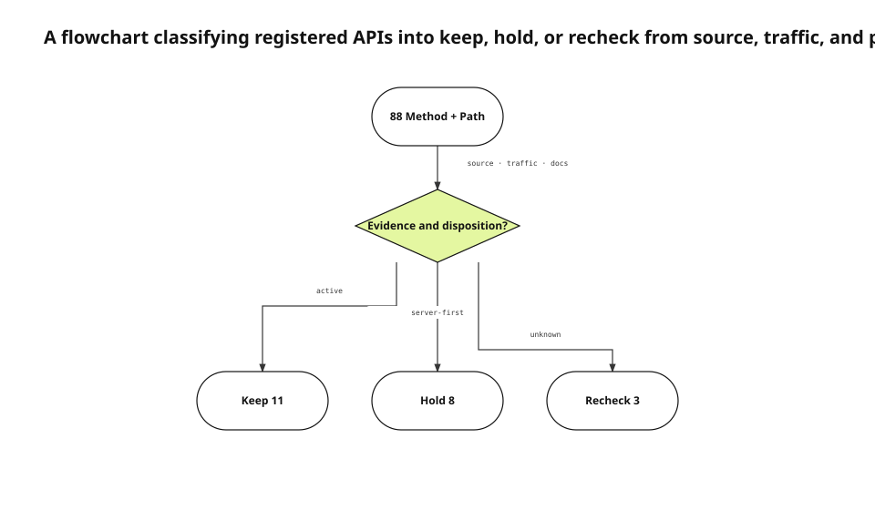

The server registered 88 method-and-path combinations. Comparing client source and production traffic produced evidence for 66 and no observed use for 22 during the selected window. Our first classification called six of those routes orphaned and recommended deletion. Reading the prior disposition document forced us to withdraw that recommendation.
<!-- evidence: JS-E101 JS-E102 JS-E103 -->

This English edition uses the fresh router inventory, backend-surface audit, RFC 9110 semantics, and final runtime disposition. It preserves the same Evidence IDs and flowchart decisions as the Korean source run. There was no previous English article for these slugs to copy.
<!-- evidence: JS-E107 -->

## Count method and path together

The running router registration is the inventory source of truth. Documentation and OpenAPI can drift. The same path under GET, PATCH, and DELETE represents different contracts, owners, and failure consequences.
<!-- evidence: JS-E101 JS-E106 -->

```go
GET    /api/shares/{id}
PATCH  /api/shares/{id}/policy
DELETE /api/shares/{id}
```

RFC 9110 defines semantics through the method and target resource together. Collapsing these examples into a single `/api/shares/{id}` row would merge retrieval, policy mutation, and deletion.
<!-- evidence: JS-E106 -->

The inventory also records authorization middleware, consent gates, and plan gates. A route that exists but is intentionally inaccessible under the current account state still has a contract.
<!-- evidence: JS-E101 JS-E106 -->

## Turn evidence into a decision, not a boolean



Every registered route is evaluated against source consumers, runtime traffic, and retained product decisions. Evidence does not produce only “used” or “dead.” A route can be kept because it is active, held because the server shipped before the client, or sent to recheck because ownership or expiry remains unknown.
<!-- evidence: JS-E102 JS-E103 JS-E104 -->

The flowchart is the accurate type because the important relation is a decision with three outcomes. A process diagram would emphasize step order while hiding the branch conditions that changed the deletion recommendation.
<!-- evidence: JS-E103 JS-E105 -->

### Source and traffic answer different questions

Source code shows that a client can call a route. Traffic shows that a deployed caller did call it during an observation window. A route behind a feature flag can exist in source and have zero traffic. A webhook or dynamically assembled URL can have traffic without a literal client string.
<!-- evidence: JS-E102 -->

We therefore store source caller and runtime caller as separate fields. One can corroborate the other, but neither is silently substituted for it.
<!-- evidence: JS-E102 -->

### Zero traffic is an observation, not a deletion proof

A zero needs a time range, log coverage, and deployment version. Incident-recovery endpoints are expected to be quiet during healthy periods. Server-first endpoints are expected to be quiet before the corresponding client release.
<!-- evidence: JS-E102 JS-E103 -->

Calling all 22 routes “dead” would erase exactly the distinctions the audit is meant to preserve.
<!-- evidence: JS-E103 -->

## Understand why the first delete list was wrong

The initial orphan candidates mixed browser-consumed verification routes, future-client contracts, rare operations paths, and compatibility surfaces. They shared an absence of observed calls but not a lifecycle.
<!-- evidence: JS-E103 -->

The error was not that code search returned false results. The audit failed to attach prior product decisions to those results. “No caller found” became “no intent exists,” which is a much stronger and unsupported claim.
<!-- evidence: JS-E103 JS-E104 -->

A newer source revision does not automatically invalidate a prior disposition. The audit asks whether the assumptions behind that disposition changed.
<!-- evidence: JS-E104 -->

## Use the existing disposition as a branch input

The backend-surface audit had already classified `sync/state`, `state/docs`, `feed/catalog`, and share-management routes as server-first holds. Profile and avatar endpoints were retained because the client was expected to attach to server storage. Consent writes had been consolidated while read behavior remained.
<!-- evidence: JS-E104 -->

| Outcome | Condition | Count |
|---|---|---:|
| Keep | Active or confirmed product contract | 11 |
| Hold | Server-first or waiting for a release | 8 |
| Recheck | Owner, producer, or expiry unclear | 3 |

The final delete recommendation is zero. This is not an audit that “found nothing.” It is an audit that prevented six destructive actions based on incomplete evidence.
<!-- evidence: JS-E105 -->

The outcome labels carry next conditions. A held route names the client release or decision that will reactivate review. A recheck route names an owner and date. Without those fields, hold becomes permanent ambiguity.
<!-- evidence: JS-E104 JS-E105 -->

## Require four absence proofs before proposing deletion

No source consumer is only one condition. We also need no external producer, no retained product decision, and no incident-recovery or compatibility value. An unknown in any one dimension routes the endpoint to recheck.
<!-- evidence: JS-E103 JS-E105 -->

```text
no source consumer
AND no external producer
AND no retained product decision
AND no recovery or compatibility value
→ propose a separate deletion change
```

Even then, the audit report is not the deletion commit. Client release order, deprecation windows, 404 or 410 behavior, metrics, and rollback belong to a separate migration.
<!-- evidence: JS-E104 JS-E105 -->

A rare administrator or cron caller still has an owner even when frequency is low. The audit records ownership rather than treating low volume as nonexistence.
<!-- evidence: JS-E102 JS-E104 -->

## Keep audit and deletion in separate changes

Combining classification and code removal means a mistaken classification becomes a destructive mutation before anyone reviews its assumptions. The audit freezes inventory, consumers, traffic, prior disposition, conflicts, and unknowns. A later change removes a route under its own verification contract.
<!-- evidence: JS-E103 JS-E105 -->

Intentionally removed OCR routes and server-first state routes can both show zero traffic, yet their correct actions are opposite. Lifecycle evidence determines the branch.
<!-- evidence: JS-E104 JS-E105 -->

The separate change also gives consumers a chance to prove absence. A deprecated client can be measured during a window before the server route is removed.
<!-- evidence: JS-E102 JS-E105 -->

## Preserve conflicts among docs, source, and runtime

| Conflict | Resolution path |
|---|---|
| Docs say keep; no source caller | Verify activation condition |
| Source caller exists; traffic is zero | Verify feature and release state |
| Traffic exists; no literal caller | Identify producer |
| Docs say removed; router still registers | Treat running code as current, then fix docs |

We do not choose the newest timestamp and discard the rest. Source describes executable possibility, docs preserve intent, and runtime records observation. They answer different questions.
<!-- evidence: JS-E102 JS-E104 -->

A conflict becomes a follow-up item with owner and evidence, not a hidden tie-break inside a spreadsheet formula.
<!-- evidence: JS-E103 JS-E104 -->

## Scope the 88, 66, and 22 counts

Eighty-eight is the application route count at a specific revision. Sixty-six had source or runtime consumer evidence. Twenty-two lacked that evidence in the defined observation scope. None is a permanent product constant.
<!-- evidence: JS-E101 JS-E102 -->

The report stores extraction rules, repository revision, excluded surfaces, and traffic window. Otherwise a future reader may treat “22” as a current dead-API count after the client landscape has changed.
<!-- evidence: JS-E101 -->

A new client release triggers another pass. Old zero-traffic evidence is not reused as deletion proof for the new release.
<!-- evidence: JS-E102 -->

## Reorder the next audit around prior decisions

The next audit order is router inventory, prior disposition, source consumers, runtime traffic, conflicts and unknowns, then deletion candidates. Code search remains essential, but it no longer overwrites product intent simply because it ran later.
<!-- evidence: JS-E103 JS-E104 JS-E105 -->

The 0.4.4 flowchart renderer now fans decision branches out from distinct bottom attach points. The audit also checks route points against both intermediate and endpoint nodes, so a branch can no longer hide inside the decision diamond or pass through an outcome node.
<!-- evidence: JS-E104 JS-E105 JS-E106 -->

The English diagram was rendered with justsend-blog 0.4.4, which records node bounds and edge route points, uses distinct branch attach points, and fails the audit when an edge crosses a non-endpoint or travels through an endpoint node.
<!-- evidence: JS-E108 -->
