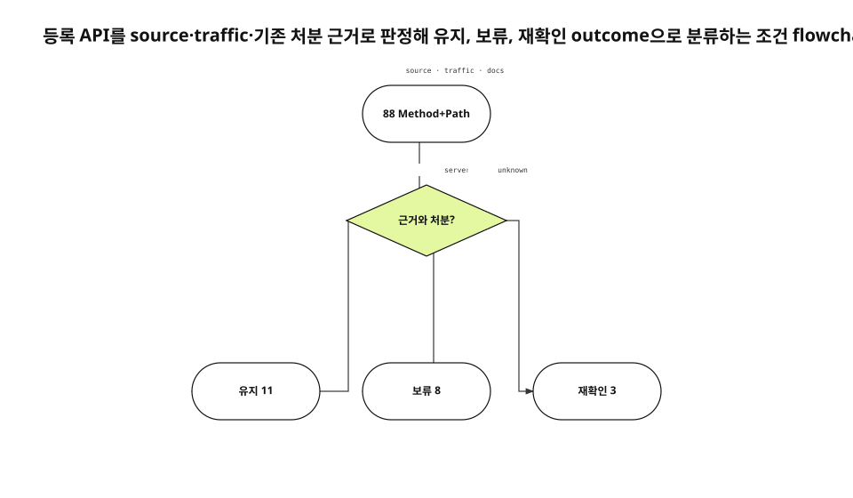

서버 router에 등록된 method와 path 조합은 88개였다. client source와 traffic을 대조하자 66개는 사용 근거가 있었고 22개는 관측 기간에 호출되지 않았다. 처음에는 6개를 고아로 분류해 삭제하려 했다. 기존 처분표를 다시 읽자 그 판단은 철회됐다.
<!-- evidence: JS-E101 JS-E102 JS-E103 -->

새 run에서는 현재 router 등록, backend surface audit, RFC 9110, 최종 감사 관측을 다시 읽었다. 기존 공개 final을 복사하지 않고 각 route가 어떤 outcome으로 가는지 decision flow로 새로 구성했다.
<!-- evidence: JS-E107 -->

## Inventory는 method와 path를 함께 셉니다

OpenAPI나 문서 목록보다 실제 register code를 정본으로 삼았다. 같은 path라도 GET, PATCH, DELETE는 서로 다른 semantics를 가진다. RFC 9110도 method와 target resource를 함께 contract로 정의한다.
<!-- evidence: JS-E101 JS-E106 -->

```go
GET    /api/shares/{id}
PATCH  /api/shares/{id}/policy
DELETE /api/shares/{id}
```

path 문자열만 정규화하면 조회·정책 변경·삭제를 하나로 오판한다. middleware와 consent·plan gate도 route row에 함께 기록했다.
<!-- evidence: JS-E106 -->

## “사용 근거가 있는가”를 decision으로 만들었습니다



등록 route는 source consumer, runtime traffic, 기존 product decision 세 근거를 지난다. 근거가 있다고 바로 유지로 보내지 않는다. server-first 계획이면 보류, owner나 expiry가 불명확하면 재확인으로 보낸다.
<!-- evidence: JS-E102 JS-E103 JS-E104 -->

### Source와 traffic은 다른 질문에 답합니다

source는 client가 호출할 수 있음을 보여 준다. traffic은 관측 기간에 실제 호출됐음을 보여 준다. feature flag 뒤 route는 source에 있지만 traffic이 0일 수 있다. webhook이나 동적 URL은 client literal이 없어도 traffic이 있다.
<!-- evidence: JS-E102 -->

### 0건은 삭제 증거가 아닙니다

traffic 0에는 기간, log coverage, deployment version이 붙어야 한다. incident recovery endpoint는 평소 0건이 정상이다. 아직 client가 붙지 않은 server-first contract도 0건이 정상이다. 그래서 “unused in window”와 “dead”를 구분했다.
<!-- evidence: JS-E102 JS-E103 -->

## 초기 삭제 분류가 놓친 것

처음 만든 고아 목록에는 auth verify, consent marketing, feed catalog, sync state 같은 route가 섞였다. browser mail link가 producer인 route, 다음 client release를 기다리는 route, 운영자가 드물게 쓰는 route는 제거 조건이 다르다.
<!-- evidence: JS-E103 -->

이 실패는 code search가 틀렸기 때문이 아니다. search 결과에 prior decision을 연결하지 않아 “caller 없음”을 “의도 없음”으로 확대했다.
<!-- evidence: JS-E103 JS-E104 -->

## 기존 처분표가 세 outcome을 정했습니다

backend surface audit은 `sync/state`, `state/docs`, `feed/catalog`, 공유 관리 route를 server-first 보류로 적었다. profile·avatar는 server 저장을 유지하고 client가 붙기로 결정했다. account consent는 조회만 유지하고 write contract를 단일화했다.
<!-- evidence: JS-E104 -->

| Outcome | 조건 | 개수 |
|---|---|---:|
| 유지 | active 또는 확정된 product contract | 11 |
| 보류 | server-first·후속 release | 8 |
| 재확인 | owner·producer·expiry 불명확 | 3 |

최종 삭제 권고는 0건이다. “아무것도 하지 않았다”가 아니라 잘못된 destructive decision을 evidence로 되돌린 결과다.
<!-- evidence: JS-E105 -->

## 삭제는 audit 다음의 별도 change입니다

감사와 code deletion을 한 commit에 넣으면 잘못된 분류가 곧바로 파괴적 변경이 된다. audit은 inventory, consumer, traffic, prior decision을 고정한다. delete change는 client release, migration, observability, rollback을 별도 검증한다.
<!-- evidence: JS-E103 JS-E105 -->

의도적으로 제거된 OCR route는 router에서 사라지고 live 404를 확인했다. server-first route는 contract test와 authorization gate를 유지한다. 둘 다 traffic 0일 수 있지만 lifecycle은 반대다.
<!-- evidence: JS-E104 JS-E105 -->

## 문서·source·runtime 충돌을 그대로 남깁니다

| 충돌 | 처리 |
|---|---|
| 문서 유지, source caller 없음 | activation 조건 확인 |
| source caller 있음, traffic 0 | feature state 확인 |
| traffic 있음, source literal 없음 | producer 식별 |
| 문서 제거, router 등록 있음 | 실행 code 우선 후 문서 수정 |

최신 timestamp 하나로 자동 해결하지 않는다. source는 실행 가능성, docs는 decision, runtime은 관측을 말한다. 서로 다른 질문을 한 boolean에 접지 않는다.
<!-- evidence: JS-E102 JS-E104 -->

## 숫자의 scope를 고정했습니다

88은 특정 revision의 application route 수다. 66은 source 또는 runtime consumer 근거가 있던 route다. 22는 정의한 관측 범위에서 근거가 없던 route다. client가 붙거나 route가 추가되면 숫자는 바뀐다.
<!-- evidence: JS-E101 JS-E102 -->

report에는 extraction rule, repository revision, excluded surface를 함께 적는다. headline 숫자만 남기면 다음 독자가 22개를 영구적인 dead API로 오해한다.

관측 window가 바뀌면 같은 route도 다른 evidence를 가질 수 있다. 새 client release 뒤에는 source consumer와 traffic을 다시 읽고 상태표의 decision date를 갱신한다. 과거 0건을 새 release의 deletion proof로 재사용하지 않는다.
<!-- evidence: JS-E101 -->

## Delete candidate에는 네 개의 부재 증거가 필요합니다

삭제하려면 source caller가 없다는 사실 하나로 부족하다. producer, runtime traffic, product decision, incident recovery value가 모두 사라졌는지 확인한다. 하나라도 unknown이면 재확인 outcome에 둔다.
<!-- evidence: JS-E103 JS-E105 -->

```text
no source consumer
AND no external producer
AND no retained product decision
AND no recovery/compatibility value
→ delete change를 별도로 제안
```

이 조건을 만족한 뒤에도 client release와 server removal을 같은 순간에 하지 않을 수 있다. deprecation window, metrics, 404/410 contract, rollback을 별도 migration plan으로 만든다. audit report는 deletion commit이 아니다.
<!-- evidence: JS-E104 JS-E105 -->

route가 private admin tool이나 cron에만 쓰이면 frequency가 낮아도 owner가 있다. owner 이름과 재확인 날짜를 상태표에 넣어 “영구 보류”가 되는 것을 막는다.
<!-- evidence: JS-E102 JS-E104 -->

## 다음 감사는 prior decision을 먼저 연결합니다

순서는 router inventory, 기존 disposition, source consumer, runtime traffic, conflict·unknown, delete candidate다. code search를 줄이는 것이 아니라 search 결과가 과거 product decision을 덮어쓰지 않게 한다.
<!-- evidence: JS-E103 JS-E104 JS-E105 -->

이 글의 핵심은 단계의 순서보다 한 decision에서 세 outcome으로 갈리는 조건이다. 그래서 process가 아니라 flowchart가 최적이다. 유지·보류·재확인이라는 실제 branch가 renderer invariant에도 남는다.
<!-- evidence: JS-E104 JS-E105 JS-E106 -->
