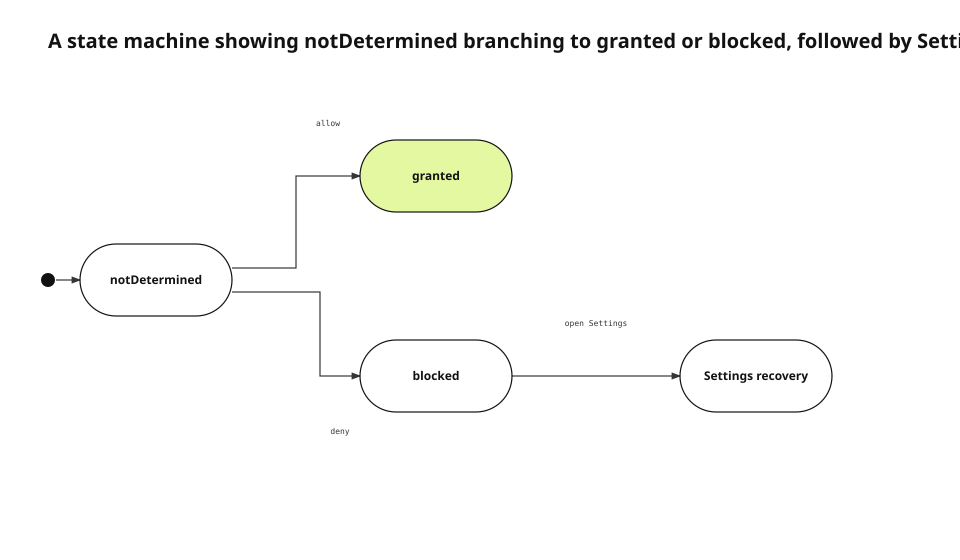

The App Store 5.1.1(iv) rejection was not asking whether our first-run permission copy sounded friendly. The custom screen could finish without always reaching the corresponding iOS permission prompt. A person could therefore leave the setup flow after reading our explanation but before giving the operating system an actual decision. The app-owned explanation and the system-owned consent had separate lifecycles, while the interface presented them as one operation.
<!-- evidence: JS-E101 -->

This English edition uses the fresh 0.4.3 Research Pack and JS-E101+ Evidence from the new run. We re-read the rejection record, the current `SetupScreen` and `SetupPermission`, Apple's UIKit privacy guidance, and the installed-app observation. The previous public article is only an English localization reference boundary; no earlier final or Evidence artifact is being copied into this edition.
<!-- evidence: JS-E107 -->

## Start with ownership, not with the rejected screen

A permission flow has four different owners. A feature surface explains why the data is needed now. iOS records consent. The app reads the current authorization state and chooses a presentation. The Settings app is where a person can revise a previous denial. A first-run screen should not impersonate all four.
<!-- evidence: JS-E101 JS-E102 -->

| Owner | Source of truth | Permitted responsibility |
|---|---|---|
| Feature surface | The action the person just chose | Start a request when the data is required |
| iOS | Protected-resource authorization database | Record allow or deny |
| App state model | Current authorization status | Choose the next UI branch |
| Settings | User-controlled system configuration | Recover after a blocked state |

Apple's UIKit privacy guidance says to request sensitive data when the app needs it, provide a purpose string, and offer reasonable fallback behavior when access is not granted. That guidance favors a request attached to a concrete feature over a batch of speculative requests at launch.
<!-- evidence: JS-E102 JS-E104 -->

The distinction also makes review evidence reproducible. A reviewer can follow one feature action to one system prompt, then observe the state that iOS stores. There is no app-local switch that needs to be interpreted as a second consent database.
<!-- evidence: JS-E102 -->

## Three states outlive every screen

`SetupPermission` normalizes each protected resource into `notDetermined`, `granted`, or `blocked`. These values are not labels for three button styles. They constrain which action is valid next. Only `notDetermined` can initiate the first system request. `granted` proceeds to the feature. `blocked` avoids another prompt and offers Settings or cancellation.
<!-- evidence: JS-E103 JS-E104 -->

```swift
switch SetupPermission.microphone() {
case .notDetermined:
  requestWhenRecordingStarts()
case .granted:
  startRecording()
case .blocked:
  presentSettingsRecovery()
}
```



### `notDetermined` does not mean “the app has not explained it yet”

It means iOS has not stored a decision for this resource. Completing an app-owned explanation cannot turn this state into `granted`. The transition happens only after the system prompt returns. This is why persisting a first-run toggle as a product preference created a second, misleading state axis.
<!-- evidence: JS-E102 JS-E103 -->

A pre-prompt can still be useful in another product, but only when it cannot be mistaken for consent and cannot become a gate that ends before the system request. In our case, the setup toggle did both, so deleting the state was safer than trying to synchronize it.
<!-- evidence: JS-E101 JS-E102 -->

### `blocked` is a stored choice, not an exception to retry

A denial or restriction is the person's current decision. The app can describe the consequence neutrally, let the person cancel, or open the app's Settings page. It must not loop the same request, fabricate an allowed state, or imply that opening Settings will always fix a device restriction.
<!-- evidence: JS-E104 -->

When the app returns from Settings, it reads the authorization status again. The screen does not assume the value changed merely because the user left the app. This keeps the UI aligned with the system database even when the person cancels Settings without changing anything.
<!-- evidence: JS-E103 JS-E104 -->

## Remove permissions from the first-run gate

The current `SetupScreen` explicitly does not request calendar, microphone, or camera access in advance. Its footer completes the screen; it does not mutate authorization. Each feature owns the request at the point where it is about to use the protected resource.
<!-- evidence: JS-E102 -->

This separates “entered the product” from “allowed a resource.” A person can understand the app before making three unrelated decisions. Later, recording, capture, and calendar recall each provide a concrete reason immediately before iOS asks the question.
<!-- evidence: JS-E102 JS-E104 -->

The separation also narrows the blast radius of a new permission. Adding a protected resource no longer means adding another setup switch and another migration for its saved value. The feature adds its own `notDetermined`, `granted`, and `blocked` branches and review instructions.
<!-- evidence: JS-E102 JS-E103 -->

## Audit every request owner, not just the rejected rows

The source audit found four app-owned request families: microphone, camera, calendar, and biometric authentication. System pickers such as `PhotosPicker` and `fileImporter` were listed separately. A system picker can grant scoped access without becoming the same kind of app-owned permission prompt.
<!-- evidence: JS-E105 -->

| Feature | Request point | Blocked behavior |
|---|---|---|
| Voice recording | Start recording | Settings or cancel |
| Camera capture | Enter capture | Settings or leave capture |
| Calendar recall | Enable calendar recall | Settings or continue without calendar |
| App lock | Unlock | Alternate authentication or cancel |

The inventory is useful because it asks the same three state questions of every owner. It is not a claim that all protected data on the device fits into four APIs. File security scopes, paste permissions, notifications, and other system-mediated surfaces have different contracts and need their own classification.
<!-- evidence: JS-E103 JS-E105 -->

## Make Review Notes describe the same transitions

Review Notes should not tell the reviewer to configure permissions during first run. They should describe the exact feature action that reaches the system prompt on a fresh installation. They should also explain what appears after a denial and how to cancel or open Settings.
<!-- evidence: JS-E101 JS-E102 JS-E104 -->

Purpose strings must follow the same rule. A reassuring sentence such as “processed only on device” is incorrect if the current storage or sync path says otherwise. We compare what is read, which feature uses it, where it is stored, and when it can leave the device.
<!-- evidence: JS-E101 -->

The metadata check belongs to the release gate because it can become stale independently of source code. A code fix does not update an old Review Notes path, and a copy edit does not change a misplaced request call.
<!-- evidence: JS-E101 JS-E102 -->

## Test state and input together

A unit test that checks only the enum can miss the wrong control on the real screen. For each feature, we record the initial state, the real input, the expected system UI or fallback, and the state observed after re-entry.
<!-- evidence: JS-E103 JS-E106 -->

| Initial state | Real input | Expected surface | Re-entry observation |
|---|---|---|---|
| `notDetermined` | Start the feature | System prompt | `granted` or `blocked` |
| `granted` | Start the feature | Immediate execution | Remains `granted` |
| `blocked` | Start the feature | Settings and cancel paths | Re-read after Settings |

Simulator permission reset is useful for repeating first-request behavior, but it does not represent every restricted-device state. Camera unavailability, parental restrictions, and biometric fallback remain explicit boundary cases.
<!-- evidence: JS-E103 JS-E104 -->

The same matrix drives Review Notes verification. If a visible button label changes, the review document changes with it even when the accessibility identifier remains stable. Code, metadata, and runtime input are tied to one release revision.
<!-- evidence: JS-E101 JS-E106 -->

## Verify the post-fix path on an installed app

Before the fix, the setup screen contained calendar, microphone, and camera rows. After the fix, setup completed without a permission section. We installed and launched the app on a real device and confirmed that first run no longer owned authorization state.
<!-- evidence: JS-E106 -->

That observation proves a limited result: the first-run gate is decoupled from permission requests. It does not prove every allow, deny, restriction, and unavailable-device combination for all four request families. Those remain feature-level verification cases.
<!-- evidence: JS-E103 JS-E106 -->

## Prevent regression with a transition contract

A new permission must answer five questions:

1. Which feature owns the request?
2. Does it request only from `notDetermined`?
3. Does `granted` execute without another prompt?
4. Does `blocked` expose Settings and cancellation?
5. Do Review Notes and the purpose string describe the same transitions?

This contract survives a redesign of the setup screen because it is attached to state and input rather than layout. The diagram type follows the same principle. The dominant relation is state transition, so a state machine is the accurate choice. We do not choose a different diagram merely to make a collection look more varied.
<!-- evidence: JS-E102 JS-E103 JS-E104 JS-E106 -->

The English diagram was rendered with justsend-blog 0.4.4, which records node bounds and edge route points, uses distinct branch attach points, and fails the audit when an edge crosses a non-endpoint or travels through an endpoint node.
<!-- evidence: JS-E108 -->
