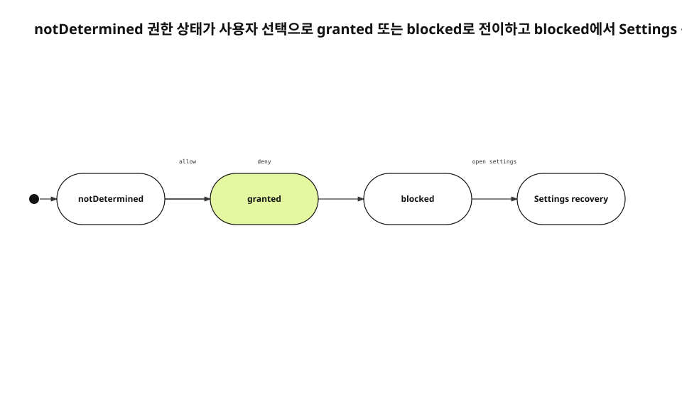

App Store 5.1.1(iv) 반려는 첫 실행 화면의 권한 설명이 친절한지 묻지 않았다. 앱이 만든 안내를 본 뒤에도 iOS 시스템 프롬프트로 항상 이어지지 않았고, 사용자는 실제 동의를 하지 않은 채 흐름을 빠져나갈 수 있었다. 설명 화면과 시스템 동의가 서로 다른 상태를 가졌는데 UI는 둘을 하나처럼 보이게 했다. 이 실패를 문구 수정으로 처리하면 다음 권한에서 같은 구조가 돌아온다.
<!-- evidence: JS-E101 -->

새 run에서는 이전 final을 복사하지 않았다. JustSend 반려 기록, 현재 SetupScreen과 SetupPermission, Apple UIKit privacy 문서, 실제 설치 관측을 다시 읽고 권한 흐름을 상태 머신으로 재구성했다. 기존 공개 글은 4736자의 corpus로만 사용했다.
<!-- evidence: JS-E107 -->

## 반려 화면보다 먼저 상태를 나눴습니다

권한 UX에는 네 소유자가 있다. 기능 화면은 지금 왜 데이터가 필요한지 보여 준다. iOS는 동의를 받는다. 앱의 상태 모델은 시스템 응답을 읽는다. Settings 앱은 거부 뒤 사용자가 결정을 바꾸는 곳이다. 첫 실행 화면이 네 역할을 모두 맡으면 앱 내부 토글이 시스템 권한처럼 보이기 시작한다.
<!-- evidence: JS-E101 JS-E102 -->

| 소유자 | 정본 | 가능한 행동 |
|---|---|---|
| 기능 화면 | 사용자가 누른 동작 | 필요 시 요청 시작 |
| iOS | 시스템 권한 DB | 허용·거부 기록 |
| 앱 상태 모델 | 현재 authorization status | UI 분기 |
| Settings | 사용자의 사후 변경 | blocked 복구 |

Apple은 민감 데이터가 실제로 필요한 시점에 요청하고, purpose string과 거부 시 fallback을 제공하라고 안내한다. “앱 시작과 동시에 모두 받는다”는 편의보다 현재 기능과 요청을 붙이는 쪽이 이 계약에 맞다.
<!-- evidence: JS-E102 JS-E104 -->

## 세 상태가 화면보다 오래 삽니다

`SetupPermission`은 권한을 `notDetermined`, `granted`, `blocked`로 접는다. 이 세 값은 버튼 모양이 아니라 가능한 다음 동작을 제한한다. `notDetermined`에서만 첫 시스템 요청을 시작할 수 있다. `granted`는 기능 실행으로 간다. `blocked`는 같은 요청을 반복하지 않고 Settings로 나간다.
<!-- evidence: JS-E103 JS-E104 -->

```swift
switch SetupPermission.microphone() {
case .notDetermined:
  requestWhenRecordingStarts()
case .granted:
  startRecording()
case .blocked:
  presentSettingsRecovery()
}
```



### `notDetermined`는 “아직 설명하지 않음”이 아닙니다

이 상태는 시스템이 아직 사용자의 결정을 저장하지 않았다는 뜻이다. 앱의 별도 안내를 완료했다고 `granted`로 올릴 수 없다. 시스템 프롬프트 응답을 받은 뒤에만 다음 상태가 결정된다. 그래서 first-run toggle을 제품 설정값으로 저장하는 설계를 제거했다.
<!-- evidence: JS-E102 JS-E103 -->

### `blocked`는 오류가 아니라 저장된 선택입니다

거부 또는 제한은 사용자의 현재 결정이다. 앱은 중립적인 설명, 취소, Settings 열기를 제공한다. 기능을 다시 눌렀다는 이유로 같은 프롬프트를 반복하거나 앱 내부에서 허용된 것처럼 보이는 상태를 만들지 않는다.
<!-- evidence: JS-E104 -->

## 첫 실행은 권한 관문에서 빠졌습니다

현재 SetupScreen은 권한을 미리 요청하지 않는다고 source에 명시한다. footer의 완료 동작은 화면을 닫을 뿐 권한 상태를 바꾸지 않는다. 캘린더·마이크·카메라는 각 기능이 실제로 데이터를 쓰려는 순간에 iOS 요청을 소유한다.
<!-- evidence: JS-E102 -->

이 분리로 첫 실행을 끝낸 사실과 권한을 허용한 사실이 더 이상 섞이지 않는다. 사용자는 제품에 들어온 뒤 녹음·촬영·회상이라는 구체적인 맥락에서 한 권한씩 판단한다. 앱도 아직 쓰지 않은 권한을 한꺼번에 요구하지 않는다.
<!-- evidence: JS-E102 JS-E104 -->

## 전수 조사는 네 종류를 확인했습니다

반려 화면 하나만 보면 microphone·camera·calendar가 전부처럼 보인다. source 전수 조사에는 생체 인증까지 네 종류의 앱 소유 요청이 있었다. PhotosPicker와 fileImporter 같은 시스템 선택기는 같은 목록에서 분리했다. 시스템 선택기가 주는 제한된 접근과 앱이 직접 요청하는 보호 자원 권한은 다른 계약이다.
<!-- evidence: JS-E105 -->

| 기능 | 요청 시점 | blocked 뒤 행동 |
|---|---|---|
| 녹음 | 녹음 시작 | Settings 또는 취소 |
| 촬영 | 카메라 진입 | Settings 또는 기능 종료 |
| 캘린더 | 회상 연결 | Settings 또는 연결 안 함 |
| 앱 잠금 | 잠금 해제 | 대체 인증 또는 취소 |

이 표는 permission API 이름을 나열하려는 것이 아니다. 각 기능이 요청·허용·거부의 세 갈래를 모두 소유하는지 review하는 표다.
<!-- evidence: JS-E103 JS-E105 -->

## Review Notes도 같은 상태 전이를 설명합니다

심사관에게는 첫 실행에서 권한을 설정하라고 안내하지 않는다. 새 설치에서 먼저 제품 진입을 완료하고, 녹음이나 카메라 기능을 처음 실행할 때 시스템 프롬프트가 나타난다고 적는다. 이미 거부된 상태에서는 Settings 복구 문이 보인다고 설명한다. 코드에 없는 옛 화면 이름은 제거한다.
<!-- evidence: JS-E101 JS-E102 JS-E104 -->

purpose string도 추상적인 안심 문구보다 실제 사용을 말해야 한다. 무엇을 읽는지, 어떤 기능이 쓰는지, 저장과 동기화 경계가 어디인지 현재 source와 대조한다. metadata는 코드와 다른 시점에 낡을 수 있으므로 release audit의 별도 항목으로 둔다.
<!-- evidence: JS-E101 -->

## 수정 뒤 실제 입력 순서를 확인했습니다

수정 전에는 첫 실행에 calendar·microphone·camera 행이 있었다. 수정 뒤에는 권한 섹션 없이 완료 동작으로 제품에 진입했다. 실제 기기에 설치하고 실행해 first-run gate가 권한 상태를 소유하지 않는 결과까지 확인했다.
<!-- evidence: JS-E106 -->

이 관측은 네 권한의 모든 조합을 검증했다는 뜻이 아니다. 첫 실행과 권한 요청의 결합이 사라졌다는 결과만 증명한다. 기능별로 notDetermined·granted·blocked를 다시 만들어 시스템 프롬프트와 fallback을 확인하는 검증은 계속 필요하다.
<!-- evidence: JS-E103 JS-E106 -->

## 기능별 테스트는 상태와 입력을 함께 고정합니다

permission test가 status enum만 확인하면 실제 화면에서 잘못된 button이 나와도 놓친다. 각 기능에 대해 initial status, 사용자가 누른 input, 예상 시스템 UI 또는 fallback, app 재진입 뒤 status를 한 행으로 기록한다.
<!-- evidence: JS-E103 JS-E106 -->

| Initial | Input | Expected | Re-entry |
|---|---|---|---|
| notDetermined | 기능 시작 | 시스템 prompt | granted 또는 blocked |
| granted | 기능 시작 | 즉시 실행 | granted 유지 |
| blocked | 기능 시작 | Settings·취소 | Settings 변경 뒤 재조회 |

simulator permission reset은 첫 요청을 반복하는 데 유용하지만 제한 기기와 parental control을 모두 대체하지 않는다. camera unavailable, calendar restricted, biometric fallback은 별도 boundary case로 남긴다.
<!-- evidence: JS-E103 JS-E104 -->

Review Notes 검증도 같은 matrix의 실제 button label과 순서를 사용한다. 자동화 identifier가 남아 있어도 사용자가 보는 label이 바뀌면 심사 문서를 갱신한다. code, metadata, runtime input을 한 revision에서 묶는 이유다.
<!-- evidence: JS-E101 JS-E106 -->

## 재발 방지는 화면 checklist가 아니라 전이 계약입니다

새 권한을 추가할 때 다음 다섯 질문에 답한다.

1. 어느 기능이 요청을 소유하는가.
2. `notDetermined`에서만 요청하는가.
3. `granted`에서 요청 없이 실행하는가.
4. `blocked`에서 Settings와 취소를 제공하는가.
5. Review Notes와 purpose string이 같은 전이를 설명하는가.

이 계약을 state machine test와 실제 입력 검증에 남기면 pre-prompt 화면의 모양이 바뀌어도 회귀를 잡을 수 있다. 핵심은 모든 글의 diagram을 다르게 만드는 것이 아니라, 이 문제의 주된 축이 상태와 전이라는 사실을 정확히 고르는 데 있다.
<!-- evidence: JS-E102 JS-E103 JS-E104 JS-E106 -->
