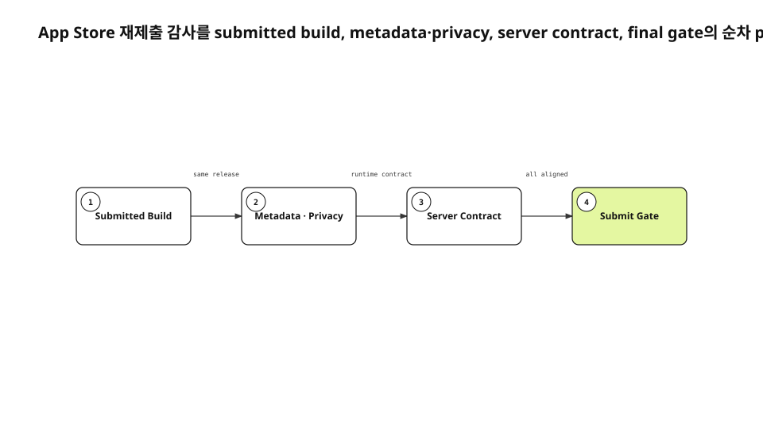

심사 반려를 고친 binary가 생겨도 App Store 재제출은 준비되지 않을 수 있다. 심사관이 받는 제품은 build만이 아니라 Notes for Review, privacy disclosure, purpose string, 구독 상품, 공개 공유의 서버 동작을 합친 결과다. 이 표면들이 서로 다른 release 시점을 설명하면 심사관은 고친 코드에 도달하지 못한다.
<!-- evidence: JS-E101 -->

새 run은 현재 배포 설정과 공개 공유 test, Apple guideline, build 178 관측을 다시 읽었다. 기존 공개 글 5503자는 독자가 이미 본 범위를 확인하는 corpus일 뿐, 문단이나 Evidence를 새 artifact로 복사하지 않았다.
<!-- evidence: JS-E107 -->

## 재제출을 네 단계로 고정했습니다

감사는 병렬 checklist보다 순차 process로 읽는 편이 정확했다. 제출 build를 먼저 고정하지 않으면 뒤에서 읽는 metadata가 어느 binary를 설명하는지 알 수 없다. build가 고정된 뒤 privacy와 purpose string을 대조하고, server contract를 확인한 뒤 최종 gate를 판정한다.
<!-- evidence: JS-E101 JS-E105 -->



| 단계 | 정본 | 통과 조건 |
|---|---|---|
| 제출 Build | App Store Connect version | source revision·build 번호 일치 |
| Metadata·Privacy | Review Notes·App Privacy·purpose string | 실제 화면·데이터 흐름과 일치 |
| Server Contract | 구독·공개 공유 endpoint | 실행 test와 상품 상태 확인 |
| Submit Gate | 위 세 단계 Evidence | unknown 0건 |

### 다음 단계는 앞 단계의 결과를 전제로 합니다

Review Notes를 먼저 쓰고 마지막에 build를 바꾸면 버튼 이름과 입력 순서가 다시 낡는다. server contract를 문서로만 확인하면 공개 공유 신고나 구독 상품이 실제 제출에 포함됐는지 알 수 없다. 각 단계의 artifact를 다음 단계 input으로 삼아야 한다.
<!-- evidence: JS-E101 JS-E105 -->

### gate는 “대체로 맞음”을 허용하지 않습니다

unknown이 남으면 제출을 멈춘다. build 번호를 추정하거나 App Privacy가 제출을 막지 않았다는 이유로 정확하다고 간주하지 않는다. 상위 단계의 성공을 하위 계약 전체의 증거로 확대하지 않는 것이 원칙이다.
<!-- evidence: JS-E103 JS-E106 -->

## Build는 로컬 archive 이름이 아닙니다

감사 기준은 App Store Connect version에 실제로 연결된 build다. 같은 source라고 해도 export 설정과 embedded metadata가 다를 수 있다. 새 simulator에서 그 build와 같은 Release source를 설치하고 Notes for Review의 입력을 그대로 수행한다.
<!-- evidence: JS-E101 JS-E106 -->

```text
1.0.0 / Build 178
  → 새 설치
  → 심사 계정 입력
  → 기능 경로 접근
  → 권한·구독·공유 확인
```

자동화가 실패하면 binary만 의심하지 않는다. build 176 검증에서 HID key event를 여러 번 보낸 경우와 paste 한 번을 보낸 경우의 crash 결과가 달랐다. 입력 방식 A/B로 harness가 만든 실패를 제품 failure와 분리했다.
<!-- evidence: JS-E106 -->

## Purpose string은 실행 코드 밖의 계약입니다

카메라·마이크·캘린더·생체 인증 purpose string은 project.yml의 배포 설정에 있다. 호출부만 review하면 제출 binary에 들어가는 문장을 놓칠 수 있다. “기기 안에서만 처리”나 “전송하지 않는다”는 표현은 실제 local store와 sync path가 한 글자라도 다르면 inaccurate metadata가 된다.
<!-- evidence: JS-E102 -->

권한 문구마다 다음을 함께 적는다.

| 질문 | source |
|---|---|
| 어떤 API가 읽는가 | 기능 호출부 |
| 무엇을 저장하는가 | repository·attachment |
| 언제 동기화하는가 | queue·endpoint |
| 거부 뒤 무엇을 하는가 | UI state·Settings |

Apple은 metadata와 privacy information이 현재 app experience를 정확히 반영하도록 요구한다. 더 안심되는 표현을 찾는 작업이 아니라 현재 제품을 사실대로 설명하는 작업이다.
<!-- evidence: JS-E102 JS-E103 -->

## 공개 공유 policy는 endpoint test로 확인했습니다

사용자 생성 콘텐츠에는 report mechanism과 대응 경로가 필요하다. 서버의 share report test는 같은 신고가 반복돼도 결과가 뒤집히지 않는지, 신고된 public link가 retire되는지를 함께 본다. 버튼이 존재한다는 사실과 정책이 실제로 집행된다는 사실을 구분한다.
<!-- evidence: JS-E104 -->

```go
report(publicToken)
report(publicToken) // idempotent
assertLinkRetired(publicToken)
```

이 test는 정책 문서보다 범위가 좁지만 더 결정적이다. 어떤 request가 어떤 state change를 만드는지 확인한다. 운영자의 후속 처리 시간이나 account sanction은 별도 evidence가 필요하므로 이 결과에 포함하지 않는다.
<!-- evidence: JS-E104 -->

## 구독은 Build와 따로 제출 상태를 가집니다

앱이 product identifier를 읽는 것과 monthly·yearly 상품이 같은 review에 묶이는 것은 다른 조건이다. build 178에는 두 구독과 subscription group을 함께 제출했다. StoreKit code, server entitlement, App Store Connect 상품 상태를 한 줄로 묶어 확인했다.
<!-- evidence: JS-E105 JS-E106 -->

| 표면 | 실패 예 |
|---|---|
| App | identifier는 있으나 상품을 못 읽음 |
| Server | 결제 뒤 entitlement 반영 안 됨 |
| Store | 상품이 제출에서 빠짐 |

build green만으로 결제 표면을 증명할 수 없다. 상품 state와 실제 purchase path를 별도 단계로 남긴 이유다.
<!-- evidence: JS-E105 -->

## App Privacy는 화면을 직접 읽었습니다

제출 API가 성공했다는 사실은 privacy disclosure가 맞다는 뜻이 아니다. App Store Connect에 게시된 데이터 유형과 privacy policy URL을 직접 읽고, source의 저장·동기화 경로와 대조했다. 앞선 “제출됐으니 완료”라는 추론은 철회했다.
<!-- evidence: JS-E101 JS-E106 -->

이 정정은 감사 process의 중요한 성질을 보여 준다. Evidence가 약하면 단계 상태를 다시 열 수 있어야 한다. green을 지키려고 추론을 유지하는 것보다 잘못된 판정을 취소하는 편이 release를 안전하게 만든다.
<!-- evidence: JS-E106 -->

## 감사 artifact는 다음 release가 다시 실행할 수 있어야 합니다

audit table에는 판정만 쓰지 않고 source locator와 실행 command를 함께 둔다. App Store Connect screen은 capture 시각을, purpose string은 build artifact path를, server contract는 test 이름과 endpoint를 가진다. “확인함”만 적으면 다음 release에서 같은 검증을 반복할 수 없다.
<!-- evidence: JS-E102 JS-E104 JS-E106 -->

| Artifact | 재실행 단서 |
|---|---|
| Build | version·build·source revision |
| Review Notes | 새 설치 input sequence |
| App Privacy | 게시 상태·policy URL·data type |
| IAP | product ID·group·review state |
| Public share | report request·retire assertion |

각 owner가 다른 도구를 쓰더라도 gate output은 한 format으로 모은다. 문서가 실행 결과를 대체하지 않고, 실행 결과가 product decision을 지우지 않게 한다.
<!-- evidence: JS-E101 JS-E104 JS-E105 -->

## 최종 gate가 증명하는 범위를 제한했습니다

build 178과 구독 두 종을 제출한 결과는 `WAITING_FOR_REVIEW`였다. audit PASS는 Apple 승인 완료가 아니다. 제출되는 제품의 binary·metadata·privacy·server contract가 서로 모순되지 않는다는 내부 조건만 증명한다.
<!-- evidence: JS-E105 JS-E106 -->

다음 release에서도 네 단계를 같은 순서로 실행한다. 각 단계는 owner, source locator, runtime observation을 가진다. 어느 글의 diagram이든 다양해 보이게 고르는 것이 아니라, 이 글에서는 단계 간 선후 관계가 핵심이므로 process가 최적 유형이다.
<!-- evidence: JS-E101 JS-E103 JS-E104 JS-E105 -->
