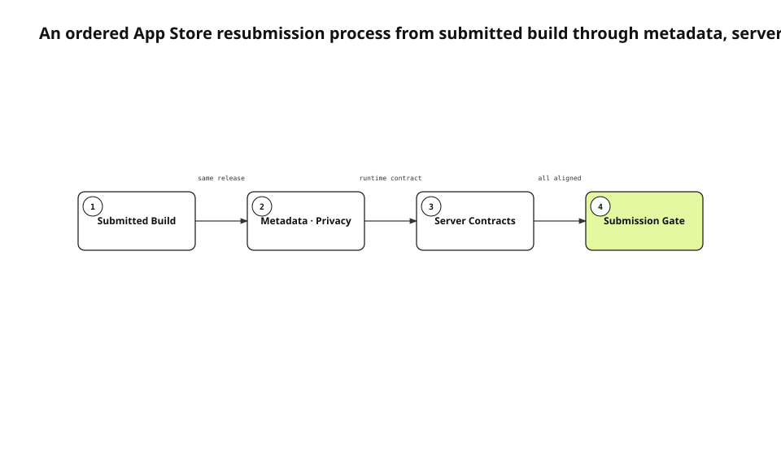

A corrected binary does not by itself make an App Store resubmission ready. The product a reviewer receives is the combination of a build, Notes for Review, privacy disclosure, purpose strings, subscription products, and server behavior. If those surfaces describe different release moments, the reviewer may never reach the code we fixed.
<!-- evidence: JS-E101 -->

This English edition is localized from the fresh 0.4.3 Evidence set, not from the previously published prose. We re-read the current distribution settings, the public-share report test, Apple's App Review Guidelines, and the build 178 observation. The English text preserves the same claims and the same process type as the accepted Korean source run.
<!-- evidence: JS-E107 -->

## Define resubmission as four ordered stages

A parallel checklist hides dependencies. Review Notes cannot be verified until the submitted build is fixed. Privacy language cannot be evaluated without knowing the storage and sync behavior in that build. Server contracts and subscription state must be checked before the final submission gate can make a decision.
<!-- evidence: JS-E101 JS-E105 -->



| Stage | Source of truth | Exit condition |
|---|---|---|
| Submitted build | Version and build attached in App Store Connect | Source revision and embedded metadata match |
| Metadata and privacy | Review Notes, App Privacy, purpose strings | Describe the real screens and data flow |
| Server contract | Subscription and public-share endpoints | Runtime behavior and product state confirmed |
| Submission gate | Evidence from the previous stages | No unresolved unknowns |

### A later stage depends on the earlier artifact

Writing Review Notes first and changing the build later creates stale button names and navigation steps. Reading server documentation without executing the report endpoint does not prove that a public link is retired. Every stage produces an artifact that the next stage consumes.
<!-- evidence: JS-E101 JS-E105 -->

The dependency is why this topic is best represented as a process. The main question is not where components are deployed or which condition produces several outcomes. It is which verification stage must complete before the next one is meaningful.
<!-- evidence: JS-E101 JS-E105 -->

### The final gate does not accept “probably aligned”

An unknown stops the release. We do not infer the connected build from a local archive name. We do not infer correct App Privacy answers from a successful submission API call. A successful higher-level action is not evidence that every lower-level contract is correct.
<!-- evidence: JS-E103 JS-E106 -->

This rule also keeps audit corrections legitimate. If stronger evidence contradicts an earlier green result, the stage is reopened. Preserving an old status is less important than preserving the truth of what the reviewer will receive.
<!-- evidence: JS-E106 -->

## Lock the actual submitted build

The audit starts with the build attached to the App Store Connect version, not the newest archive on a developer machine. Export settings and embedded metadata can differ even when source revisions appear similar. We reproduce the review path from a clean installation that corresponds to the submitted Release source.
<!-- evidence: JS-E101 JS-E106 -->

```text
Version 1.0.0 / Build 178
  → clean installation
  → reviewer account input
  → documented feature path
  → permission, subscription, and sharing checks
```

The build identifier is carried into every screenshot, runtime note, and report row. Otherwise an observation from build 176 can silently be used to approve build 178.
<!-- evidence: JS-E101 -->

## Treat the verification harness as an experimental variable

During build 176 verification, repeated HID key events triggered a UIKit input-view crash. Pasting the same content in a single operation did not reproduce it. Holding the binary, device, OS, and flow constant while changing only the input method separated a harness-induced failure from a product failure.
<!-- evidence: JS-E106 -->

A red result is not automatically more trustworthy than a green one. The audit records the input mechanism, attempt count, clean-install procedure, and expected user interaction. Automation is a measurement instrument, and the instrument can introduce the event it reports.
<!-- evidence: JS-E106 -->

This distinction prevents two opposite mistakes: shipping a real crash because automation missed it, and blocking a valid submission because automation generated a non-user input sequence.
<!-- evidence: JS-E106 -->

## Purpose strings live outside the feature call site

Camera, microphone, calendar, biometric, and local-network purpose strings are distribution settings in `project.yml`. A review limited to feature code can miss the exact sentence embedded in the archive.
<!-- evidence: JS-E102 -->

A phrase such as “never stored or transmitted” is not safe copy if the current repository or sync queue says otherwise. For every purpose string, we compare four facts.

| Question | Evidence location |
|---|---|
| What API reads the resource? | Feature request owner |
| What is stored? | Repository and attachment path |
| When can data leave the device? | Queue and endpoint |
| How can the person revoke access? | App state and Settings |

Apple requires metadata and privacy information to reflect the current app experience. The goal is not to find the most reassuring sentence. It is to publish a sentence that remains true when compared with the current build.
<!-- evidence: JS-E102 JS-E103 -->

## Verify public-sharing policy as an executable contract

User-generated content requires a reporting mechanism and an operational response path. The public-share report test checks that repeated reports are idempotent and that the public link is retired. The presence of a Report button is weaker evidence than the state transition caused by the request.
<!-- evidence: JS-E104 -->

```go
report(publicToken)
report(publicToken) // remains idempotent
assertLinkRetired(publicToken)
```

The test has a deliberately narrow scope. It proves request and retirement behavior. It does not prove moderation response time, account sanctions, or every abuse category. Those claims need separate operational evidence.
<!-- evidence: JS-E104 -->

This boundary keeps policy language from expanding beyond implementation. A document can promise a process that the server does not execute; a test can prove one transition without proving the entire moderation program.
<!-- evidence: JS-E104 -->

## Audit subscriptions across three surfaces

A product identifier in app code does not prove that the monthly and yearly subscriptions are included in the same review. Build 178 was submitted with both products and the subscription group. We checked the StoreKit identifiers, server entitlement behavior, and App Store Connect product state as separate rows.
<!-- evidence: JS-E105 JS-E106 -->

| Surface | Failure mode |
|---|---|
| App | Identifier exists but product cannot be loaded |
| Server | Purchase succeeds but entitlement is not projected |
| Store | Product is absent from the submission |

A build can pass every local test and still present an incomplete purchase experience if the product state in App Store Connect is wrong. The store surface therefore remains a distinct stage artifact.
<!-- evidence: JS-E105 -->

## Read App Privacy directly instead of inferring it

A submission request that was not blocked does not prove the App Privacy disclosure is accurate. We read the published data types and policy URL in App Store Connect and compared them with the build's storage and sync paths. An earlier inference—“submission succeeded, so privacy must be complete”—was withdrawn.
<!-- evidence: JS-E101 JS-E106 -->

This correction demonstrates why the process must allow a stage to move backward. Stronger evidence can invalidate an earlier status. The audit trail records both the failed inference and the direct observation that replaced it.
<!-- evidence: JS-E106 -->

## Make every audit artifact reproducible

An audit table stores more than PASS or FAIL. A build row carries version, build number, and source revision. A Review Notes row carries the clean-install input sequence. App Privacy carries capture time and policy URL. Server contracts carry test names and endpoints.
<!-- evidence: JS-E102 JS-E104 JS-E106 -->

| Artifact | Reproduction handle |
|---|---|
| Build | Version, build, source revision |
| Review Notes | Exact fresh-install navigation |
| App Privacy | Published state, data types, policy URL |
| In-app purchases | Product IDs, group, review status |
| Public sharing | Report request and retirement assertion |

Different owners can use different tools, but their outputs must converge on the same release identity. Documentation does not replace execution, and execution does not erase product decisions.
<!-- evidence: JS-E101 JS-E104 JS-E105 -->

## Limit what the final gate proves

Build 178 and the two subscriptions reached `WAITING_FOR_REVIEW`. An internal audit PASS is not App Store approval. It proves only that the submitted binary, metadata, privacy answers, and server contracts are internally consistent enough to hand to review.
<!-- evidence: JS-E105 JS-E106 -->

The same four stages run for the next release. Each stage has an owner, a source locator, and a runtime observation. We keep the process diagram because stage order is the dominant relationship; we do not swap it for a different type merely to create visual variety across the article set.
<!-- evidence: JS-E101 JS-E103 JS-E104 JS-E105 -->

The English diagram was rendered with justsend-blog 0.4.4, which records node bounds and edge route points, uses distinct branch attach points, and fails the audit when an edge crosses a non-endpoint or travels through an endpoint node.
<!-- evidence: JS-E108 -->
