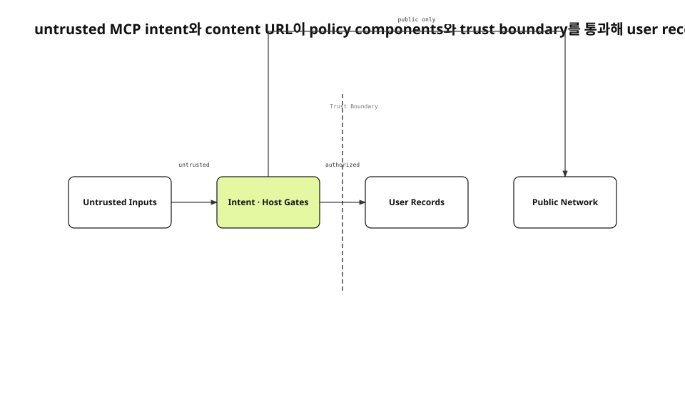

공개 DMG는 공격자도 내려받을 수 있다. binary, framework, resource, entitlement, 문자열과 MCP tool schema를 모두 읽을 수 있다. 따라서 안전성은 구현을 숨기는 데서 나오면 안 된다. protocol을 알아도 사용자 기록을 바꿀 권한이 생기지 않고, content URL을 넣어도 피해자 Mac의 private network에 요청을 보내지 못해야 한다.
<!-- evidence: JS-E101 -->

새 run은 보안 검수 기록, AgentIntentTrustTests, ContentFetchHostPolicy patch, MCP security guidance와 build 178 재감사 결과를 다시 읽었다. 기존 final이나 visual을 복사하지 않고 두 입력이 어느 gate를 지나 어떤 자산에 닿는지 architecture로 다시 모델링했다.
<!-- evidence: JS-E107 -->

## 위협 모델은 공개 구현에서 시작합니다

감사자는 공격자가 sidecar schema와 staging path, URL consumer 목록까지 안다고 가정했다. code signing은 binary를 비밀로 만들지 않는다. 어떤 signer가 만들었고 이후 바뀌었는지만 판정한다. 실제 보호 경계는 account owner, append permission, canonical path, host policy, server authorization에 있다.
<!-- evidence: JS-E101 JS-E102 -->



그림의 중앙 경계는 장식이 아니다. 왼쪽의 untrusted input이 오른쪽의 user records 또는 public network에 닿기 전에 policy gate를 통과해야 한다. intent row와 URL은 서로 다른 입력이지만 “권한 있는 component가 대신 행동한다”는 같은 confused-deputy 위험을 가진다.
<!-- evidence: JS-E101 JS-E102 JS-E104 -->

## 첫 번째 경계는 Intent Trust Gate입니다

sidecar는 local SQLite지만 cache가 아니다. executor가 row를 읽어 item repository의 create·note·status·retract를 호출한다. 위조 row가 들어오면 앱의 정상 delete path를 통해 사용자 기록이 실제로 삭제되고 sync로 다른 기기에 전달될 수 있다.
<!-- evidence: JS-E102 -->

### image path는 읽기와 삭제 권한입니다

`attachmentStagedPath`를 적용하면 executor는 file을 읽어 attachment로 가져오고 완료 뒤 원본을 지운다. helper에서만 path를 검사하면 sidecar DB를 직접 수정한 row는 gate를 건너뛴다. executor가 canonical staging root와 symlink target을 다시 확인해야 한다.
<!-- evidence: JS-E103 -->

```swift
assertOutsideStagingIsRejected()
assertSymlinkEscapeIsRejected()
assertNoItemWasCreated()
assertOutsideFileStillExists()
```

test는 PNG magic byte를 가진 외부 file을 사용한다. file type 검사를 통과해도 권한 없는 path라는 이유로 거절돼야 한다. content validation과 authorization을 구분하는 장치다.
<!-- evidence: JS-E103 -->

### owner와 operation도 적용 직전에 봅니다

queue writer가 task_key와 actor label을 적었다고 owner가 되지 않는다. anchor가 agent record인지, current account와 맞는지, intent kind가 append permission 안에 있는지, idempotency key가 replay됐는지를 executor가 확인한다.
<!-- evidence: JS-E102 JS-E103 -->

## 두 번째 경계는 Content Host Policy입니다

공유받은 record, 붙여 넣은 HTML, public share에는 사용자가 직접 쓰지 않은 URL이 들어올 수 있다. link HTML, hero image, favicon, JavaScript render, Markdown image가 URL을 열면 victim Mac이 loopback이나 private network에 request를 보낼 수 있다.
<!-- evidence: JS-E104 -->

ContentFetchHostPolicy는 content가 정한 주소와 사용자가 설정한 self-hosted backend를 분리한다. 전자는 public http/https host만 허용한다. 후자는 제품 기능상 local network를 사용할 수 있으므로 같은 규칙으로 막지 않는다.
<!-- evidence: JS-E104 -->

| Consumer | Gate 위치 |
|---|---|
| Link HTML | fetch 직전 |
| Hero image | image download 직전 |
| Favicon | candidate URL 생성 뒤 |
| JS renderer | page load 전 |
| Markdown image | provider 선택 전 |

모든 consumer가 같은 policy를 지나야 한다. 하나라도 별도 parser를 쓰면 그 경로가 우회가 된다.
<!-- evidence: JS-E104 -->

## 주소 parser가 다르면 나쁜 해석을 선택합니다

`0177.0.0.1`은 `Network.IPv4Address`에서 public처럼 읽히지만 `inet_aton`에서는 `127.0.0.1` loopback이 된다. 검사 parser와 실제 연결 parser가 다르면 public 판정 뒤 loopback으로 갈 수 있다.
<!-- evidence: JS-E105 -->

```text
input        Network       inet_aton     result
0177.0.0.1   177.0.0.1     127.0.0.1     BLOCK
127.0.0.1    127.0.0.1     127.0.0.1     BLOCK
8.8.8.8      8.8.8.8       8.8.8.8       ALLOW
```

policy는 가능한 해석을 모아 하나라도 loopback, link-local, private, CGNAT, unspecified, reserved면 거절한다. 가장 관대한 parser가 아니라 실제 연결이 취할 수 있는 가장 위험한 해석을 기준으로 삼는다.
<!-- evidence: JS-E104 JS-E105 -->

### DNS rebinding은 열린 위험입니다

hostname이 처음 public IP로 resolve된 뒤 connection 시 private IP로 바뀌는 경우는 URL 문자열만 보고 막기 어렵다. 실제 peer address를 확인할 수 있는 transport layer가 필요하다. 현재 policy가 막는 범위를 literal과 직접 지목된 private host로 제한해 기록했다.
<!-- evidence: JS-E104 -->

## 두 gate는 같은 boundary 원칙을 공유합니다

Intent Gate는 “이 요청자가 이 record를 바꿀 수 있는가”를 묻는다. Host Policy는 “이 content가 이 network destination을 선택할 수 있는가”를 묻는다. 둘 다 입력 형식이 올바른지보다 authority가 어디서 왔는지를 먼저 본다.
<!-- evidence: JS-E102 JS-E104 -->

MCP security guidance의 confused deputy 문제도 같다. component가 가진 권한을 caller가 가진 권한처럼 사용하면 protocol possession이 authority로 승격된다. 명시적 consent와 least privilege를 각 trust hop에 남겨야 한다.
<!-- evidence: JS-E101 JS-E102 -->

## 수정된 source를 새 DMG에 다시 담았습니다

source branch에서 test가 green이어도 이미 공개된 DMG는 바뀌지 않는다. Intent Trust와 Host Policy가 들어간 build를 다시 signing·notarization·stapling하고 새 hash를 감사 대상으로 삼았다.
<!-- evidence: JS-E106 -->

검증 순서는 failing input 재현, policy 적용, unit test green, 새 DMG package, Gatekeeper와 helper runtime 확인, 같은 threat model 재감사였다. 옛 binary에 새 audit 결과를 붙이지 않았다.
<!-- evidence: JS-E106 -->

## 새 입력이 생길 때 architecture를 다시 봅니다

새 MCP write tool, 새 sidecar field, 새 URL consumer는 각각 trust edge를 하나 늘린다. 그림에 node를 추가하기 전에 어느 gate를 통과하는지 확인한다. gate가 없다면 기능을 먼저 ship하지 않는다.
<!-- evidence: JS-E102 JS-E104 -->

이 글은 두 흐름의 순서보다 component와 boundary가 핵심이다. 그래서 process나 data flow보다 architecture가 최적이다. 같은 generic box row에 “security”라는 label만 붙이는 대신 boundary line과 policy component를 실제 renderer invariant로 요구했다.
<!-- evidence: JS-E101 JS-E103 JS-E104 JS-E106 -->
