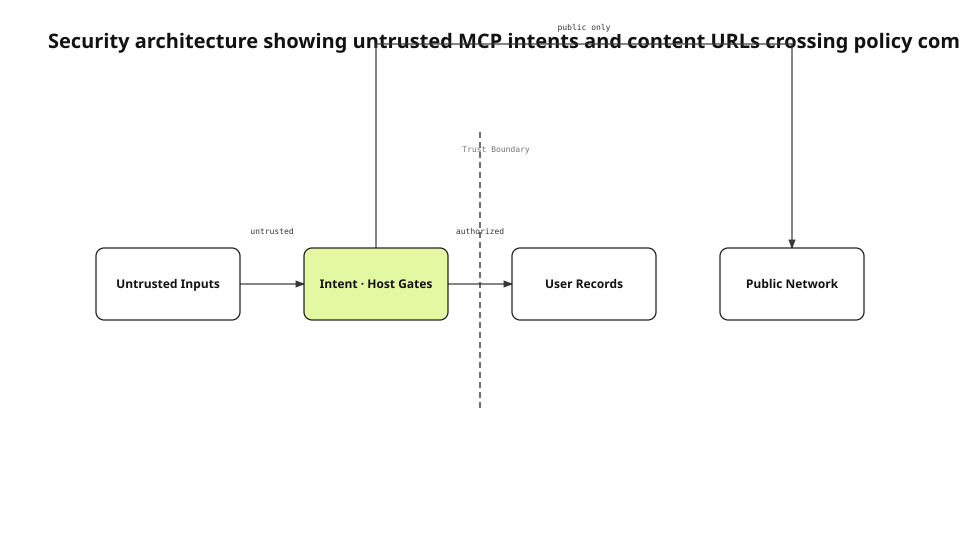

Anyone can download and inspect a public DMG. They can read binaries, frameworks, resources, entitlements, strings, sidecar tables, and MCP tool schemas. Security therefore cannot depend on keeping the implementation secret. Knowing the protocol must not grant authority to modify user records, and supplying a URL must not make a victim's Mac contact a private network.
<!-- evidence: JS-E101 -->

This English edition is grounded in the fresh security record, `AgentIntentTrustTests`, the `ContentFetchHostPolicy` source, MCP security guidance, and the notarized-build re-audit. The trust-boundary diagram is localized from the same semantic spec rather than redrawn as a generic English box row.
<!-- evidence: JS-E107 -->

## Begin with a public-implementation threat model

The audit assumes an attacker knows the sidecar schema, staging convention, URL consumers, and tool inputs. Code signing does not make those details secret. It proves who signed the code and whether bytes changed. Protection comes from account ownership, append permission, canonical paths, host policy, encryption, and server authorization.
<!-- evidence: JS-E101 JS-E102 -->



The boundary in the center is not decoration. Untrusted input on the left must pass a policy component before it can reach user records or a public network destination on the right. MCP intents and content URLs are different inputs, but both can trigger a privileged component to act on behalf of an untrusted source.
<!-- evidence: JS-E101 JS-E102 JS-E104 -->

This is the confused-deputy shape described in MCP security guidance: possession of a protocol or input format is mistaken for possession of the authority held by the component that processes it.
<!-- evidence: JS-E101 JS-E102 -->

## Treat the sidecar as a write interface

The intent sidecar is a local SQLite database, but it is not a harmless cache. The app executor reads rows and calls the real item repository operations for create, note, status, and retract. A forged row can therefore reach the normal delete path and propagate a real deletion through sync.
<!-- evidence: JS-E102 -->

Validation at the helper boundary is not enough. An attacker who writes directly to the sidecar can bypass helper argument checks. Authorization must be repeated where the app promotes the intent into a user-library operation.
<!-- evidence: JS-E102 JS-E103 -->

### A staged path carries read and delete authority

Applying `attachmentStagedPath` means reading bytes into an attachment and deleting the staged file afterward. The executor must canonicalize the path, require it to remain under the staging root, and resolve symlinks before either operation.
<!-- evidence: JS-E103 -->

```swift
assertOutsideStagingIsRejected()
assertSymlinkEscapeIsRejected()
assertNoItemWasCreated()
assertOutsideFileStillExists()
```

The test deliberately uses bytes with a valid PNG signature. A file-type check can succeed while authorization must still fail. This separates content validation from path authority.
<!-- evidence: JS-E103 -->

### Ownership and operation are checked at apply time

A row that contains a task key and actor label does not become owned by that actor. The executor verifies that the anchor belongs to an agent-created record, that the account scope matches, that the intent kind is allowed by append permission, and that the idempotency key is not an unauthorized replay.
<!-- evidence: JS-E102 JS-E103 -->

The sidecar can preserve an intent while an account is unresolved, but preservation is not execution. The trust decision occurs when the library write is about to happen.
<!-- evidence: JS-E102 -->

## Treat content URLs as network authority

Shared records, pasted HTML, and public content may contain URLs the local user did not choose. Link HTML, hero images, favicons, JavaScript rendering, and Markdown images can cause the victim's Mac to make requests. A loopback or private address can have a state-changing effect even if the attacker never reads the response.
<!-- evidence: JS-E104 -->

`ContentFetchHostPolicy` applies to addresses chosen by content. It does not apply the same rule to a backend URL the user explicitly configured for self-hosting, because local-network access is a product feature in that path.
<!-- evidence: JS-E104 -->

| Consumer | Policy placement |
|---|---|
| Link HTML | Immediately before fetch |
| Hero image | Before image download |
| Favicon | After candidate URL construction |
| JavaScript renderer | Before page load |
| Markdown image | Before provider selection |

Every consumer must use the same decision. A forgotten fetch path is a bypass even when the central policy is otherwise correct.
<!-- evidence: JS-E104 -->

## Prefer the most dangerous valid address interpretation

`0177.0.0.1` is interpreted differently by two accepted parsers. `Network.IPv4Address` can read it like public `177.0.0.1`, while `inet_aton` reads it as loopback `127.0.0.1`. If validation and connection use different parsers, a public decision can lead to a loopback connection.
<!-- evidence: JS-E105 -->

```text
input        Network       inet_aton     decision
0177.0.0.1   177.0.0.1     127.0.0.1     BLOCK
127.0.0.1    127.0.0.1     127.0.0.1     BLOCK
8.8.8.8      8.8.8.8       8.8.8.8       ALLOW
```

The policy collects every interpretation the connection stack may accept. If any one is loopback, link-local, private, CGNAT, unspecified, or reserved, the request is rejected.
<!-- evidence: JS-E104 JS-E105 -->

The rule is intentionally conservative. It would be unsafe to choose the most permissive interpretation and hope the networking stack chooses the same one.
<!-- evidence: JS-E105 -->

### DNS rebinding remains a separate boundary

A hostname can resolve to a public address during validation and a private address when the socket connects. A URL-string policy cannot fully solve that case without observing the actual peer address in the transport layer. We record the current scope as literal and directly resolved private-address protection, not complete rebinding defense.
<!-- evidence: JS-E104 -->

Stating the limit matters because “SSRF fixed” can otherwise be read as a claim about every resolution and redirect behavior. The residual risk remains attached to the architecture.
<!-- evidence: JS-E104 -->

## Apply the same authority principle to both gates

The Intent Trust Gate asks whether this caller may mutate this record. The Content Host Policy asks whether this content may choose this destination. Both questions are about authority, not merely whether the input is well formed.
<!-- evidence: JS-E102 JS-E104 -->

MCP security guidance reaches the same conclusion through confused-deputy and token-handling examples. A component must not lend its broader privilege to a caller that only knows how to invoke it.
<!-- evidence: JS-E101 JS-E102 -->

The shared principle lets us review new features consistently. A new tool, sidecar field, redirect handler, or media provider adds a trust edge. That edge must terminate at an existing policy gate or introduce a new, testable one.
<!-- evidence: JS-E102 JS-E104 -->

## Rebuild the artifact after fixing the source

A source branch with green tests does not change the DMG already available to users. We built a new signed and notarized artifact containing the Intent Trust and Host Policy changes, then repeated the same threat-model audit against the new digest.
<!-- evidence: JS-E106 -->

The verification sequence was: reproduce the failing input, apply the policy, pass the focused tests, package a new DMG, verify Gatekeeper and helper runtime, and repeat the audit. We did not attach new results to the old binary.
<!-- evidence: JS-E106 -->

| Layer | Failing input | Passing observation |
|---|---|---|
| Intent trust | Forged owner or staged path | No item, no external read or delete |
| Host policy | Loopback, private, octal literal | Request rejected before consumer |
| Artifact | Old DMG digest | New signed, notarized digest |
| Runtime | Source-only assumption | Installed helper and app checks |

## Audit new inputs as architecture changes

A new MCP write tool, sidecar column, or URL consumer creates another trust edge. Before shipping, we identify which component receives the input, what authority it has, and which gate constrains that authority.
<!-- evidence: JS-E102 JS-E104 -->

The dominant question is component and boundary placement, so architecture is the accurate diagram type. The 0.4.4 renderer now also routes non-adjacent component edges around intervening nodes, and the audit checks endpoint attachment and edge-node intersections rather than trusting labels alone.
<!-- evidence: JS-E101 JS-E103 JS-E104 JS-E106 -->

The English diagram was rendered with justsend-blog 0.4.4, which records node bounds and edge route points, uses distinct branch attach points, and fails the audit when an edge crosses a non-endpoint or travels through an endpoint node.
<!-- evidence: JS-E108 -->
