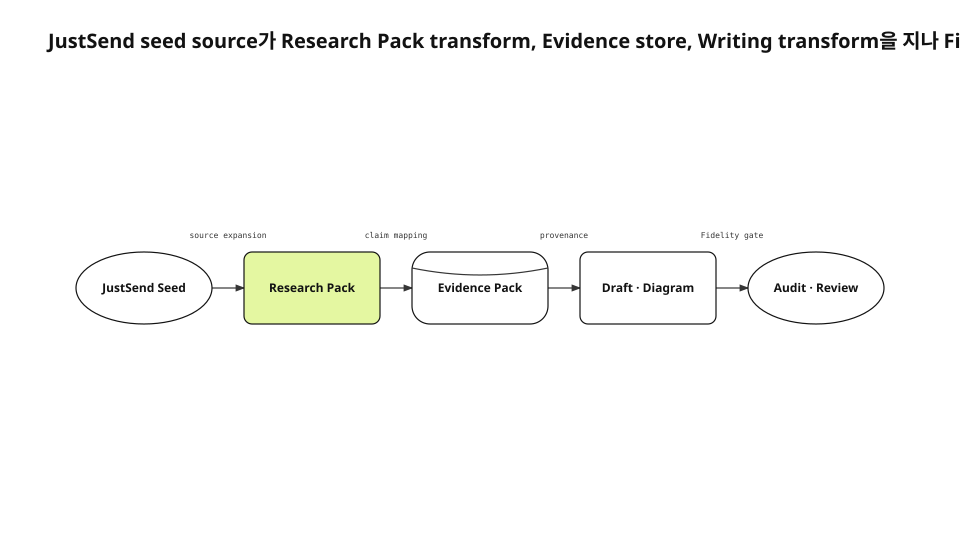

작업 기록에는 결정과 실패와 시간축이 남는다. 하지만 record만 요약하면 현재 code, official platform contract, runtime result가 빠진다. 사건 memo는 만들 수 있어도 독자가 구현과 trade-off를 재구성할 만큼 깊은 기술 글은 만들기 어렵다.
<!-- evidence: JS-E101 -->

새 run은 justsend-blog 초기 기록, 0.4.3 visual contract와 audit wiring, Git worktree 문서, 31개 test 결과를 다시 읽었다. 현재 공개 글은 corpus로만 사용하고 Research·Evidence·Draft·Visual을 새 artifact로 생성했다.
<!-- evidence: JS-E107 -->

## JustSend는 source가 아니라 seed입니다

record가 잘하는 일은 “언제 무슨 결정이 있었나”를 찾는 것이다. implementation claim은 repository, 외부 API claim은 official docs, result claim은 runtime observation으로 확장해야 한다. 한 provider가 다른 질문까지 답한다고 확대하지 않는다.
<!-- evidence: JS-E101 JS-E102 -->

| Provider | 답하는 질문 |
|---|---|
| JustSend | 사건·결정·실패 시점 |
| Repository | 현재 구현·test·config |
| Official docs | 외부 platform 보장 |
| Runtime | 특정 build와 input의 결과 |
| Corpus | 독자가 이미 본 범위와 깊이 |

## Source는 두 번 구조화됩니다



첫 transform은 Research Pack이다. locator, excerpt, claim key, hash, sensitivity를 source마다 기록한다. 두 번째는 Evidence Pack이다. 공개 가능한 fact·decision·failure 단위로 statement를 만들고 어떤 Research Source가 지지하는지 연결한다.
<!-- evidence: JS-E102 JS-E103 -->

### Research Pack은 “읽었다”를 증명합니다

URL만 붙인 source는 선택할 수 없다. 20자 이상 excerpt, 정확한 path·line 또는 URL locator, retrieval time, claim key가 필요하다. secret은 pack에 쓰기 전에 redaction한다.
<!-- evidence: JS-E102 -->

### Evidence Pack은 “어디까지 말할 수 있는가”를 제한합니다

직접 source가 말한 범위만 direct다. independent source 둘이 같은 값을 지지할 때 corroborated다. 해석은 inference, 충돌은 conflict, 확인하지 못한 값은 unknown으로 분리한다.
<!-- evidence: JS-E102 -->

```json
{
  "id": "JS-E103",
  "claim_keys": ["visual-type-v42"],
  "sources": ["RS-002", "RS-005"],
  "confidence": "corroborated"
}
```

## Writing은 Evidence store만 읽습니다

outline은 section purpose, Evidence IDs, visual candidate를 가진다. draft는 record 순서가 아니라 문제→실패→source artifact→외부 contract→결정→검증→제약 순서로 정보를 배치한다. Evidence 없는 효과와 인과는 문장을 매끄럽게 만드는 대신 삭제한다.
<!-- evidence: JS-E102 -->

production gate는 글자 수만 보지 않는다. source 5개, kind 3개, repository 2개, official 1개, runtime 1개, claim key 5개를 실제 사용 Evidence에서 센다. pack에 넣고 본문에서 쓰지 않은 source는 coverage가 아니다.
<!-- evidence: JS-E104 -->

## Visual type도 같은 source 흐름을 탑니다

0.4.3는 section title·purpose와 연결 Evidence의 신호를 점수화해 primary axis를 고른다. state 값이 있으면 state machine, deployment zone과 artifact가 핵심이면 deployment, condition branch가 핵심이면 flowchart, source→transform→store→sink가 핵심이면 data flow를 선택한다.
<!-- evidence: JS-E103 -->

같은 type이 두 글에서 선택돼도 그것이 최적이면 허용한다. 대표 이미지와 이 pipeline은 모두 file/source가 transform과 store를 지나 sink로 이동하므로 data flow가 맞다. 다양해 보이게 하려고 한쪽을 architecture나 process로 바꾸지 않는다.
<!-- evidence: JS-E104 -->

| Audit field | 차단 대상 |
|---|---|
| `incorrect_type_selection` | 의미상 최적 type과 plan 불일치 |
| `renderer_contract_mismatch` | plan renderer와 SVG metadata 불일치 |
| `type_invariant_violations` | state·zone·decision·role 구조 누락 |

SVG root에는 selected type, primary axis, renderer id·version이 들어간다. node role과 edge kind도 plan과 rendered artifact에서 대조한다. generic box row에 다른 type label만 붙이는 우회를 막는다.
<!-- evidence: JS-E103 JS-E104 -->

## Humanize는 구조 뒤에 옵니다

Draft와 diagram을 고정한 뒤 한국어 prose를 다듬는다. 숫자, 날짜, URL, path, API name, direct quote, 부정과 인과를 protected token으로 대조한다. change rate 50% 이상이거나 의미가 달라지면 결과를 버린다.
<!-- evidence: JS-E104 -->

Research가 빈 초안을 윤문해도 깊이는 생기지 않는다. Humanize는 번역투와 메타 담화를 줄일 뿐 source나 실패 이력을 새로 만들지 않는다.
<!-- evidence: JS-E101 -->

## Worktree는 artifact와 사용자 WIP를 분리합니다

Git worktree는 한 repository에 여러 working tree를 연결한다. pipeline은 새 branch와 run path를 만들고 원 workspace를 stash·reset·clean하지 않는다. run path만 stage한다.
<!-- evidence: JS-E105 -->

이번 0.4.3 run도 accepted 0.3.1 artifact를 덮어쓰지 않았다. 새 run ID와 branch에서 source를 다시 읽고 Evidence ID를 JS-E101부터 새로 발급했다. Git history가 두 세대의 결과를 각각 보존한다.
<!-- evidence: JS-E105 -->

## Run provenance는 같은 주제의 재작성을 구분합니다

새 Skill version이 visual contract를 바꾸면 accepted run의 파일을 제자리에서 덮지 않는다. 새 run ID, branch, created_at, plugin version을 발급하고 source retrieval부터 다시 기록한다. Git history만으로 차이를 추론하게 두지 않는다.
<!-- evidence: JS-E105 -->

이번 run은 Evidence ID를 JS-E101부터 새로 만들었다. 이전 공개 글은 corpus source ID만 가지고, previous final paragraph나 visual plan을 input으로 사용하지 않는다. 이렇게 해야 audit PASS가 어느 contract와 source pack에 속하는지 명확하다.
<!-- evidence: JS-E101 JS-E105 -->

| Provenance | 새 run 값 |
|---|---|
| Skill | 0.4.3 |
| Research | 새 retrieval time·hash |
| Evidence | 새 JS-E101+ IDs |
| Visual | semantic spec·selected type·renderer |
| Git | 새 branch·commit |

## Fidelity Audit가 publish candidate를 결정합니다

최종 audit는 protected token, factual claim provenance, research coverage, content depth, visual candidate, diagram type·renderer·invariant를 함께 본다. 하나라도 blocker면 final과 READY_FOR_REVIEW를 만들지 않는다.
<!-- evidence: JS-E104 -->

0.4.3의 unit·integration·E2E 31개가 통과했다. 그 안에는 8개 production topic의 최적 type fixture와 generic SVG bypass 실패가 포함된다. test는 글을 대신 쓰지 않지만 잘못된 유형을 올바른 label로 위장하는 경로를 닫는다.
<!-- evidence: JS-E106 -->

## 데이터 흐름의 끝은 자동 publish가 아닙니다

Audit PASS는 review 가능한 artifact가 생겼다는 뜻이다. 사용자 승인 뒤에만 merge·web push·Kubernetes rollout을 수행한다. source expansion과 approval을 같은 자동 단계로 묶지 않는다.
<!-- evidence: JS-E102 JS-E105 -->

이 pipeline의 변화는 agent를 더 많이 붙인 것이 아니다. seed를 source로 확장하고 claim을 store에 넣은 뒤 type-correct visual과 prose를 같은 Evidence에 묶었다. 풍부함은 긴 prompt가 아니라 각 transform의 입력·출력 계약에서 나온다.
<!-- evidence: JS-E101 JS-E102 JS-E103 JS-E104 JS-E106 -->
