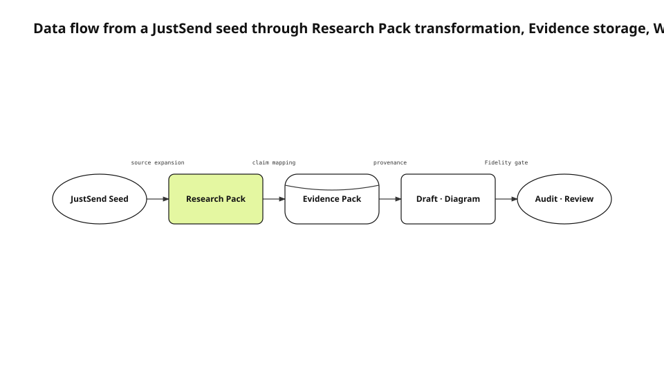

A work record preserves decisions, failures, and chronology. It does not automatically preserve the current implementation, an external platform contract, or a runtime result. Summarizing records directly can produce an accurate incident memo while still leaving a technical reader unable to reconstruct the cause, trade-off, and verification.
<!-- evidence: JS-E101 -->

This English edition uses the fresh justsend-blog implementation record, the 0.4.4 visual contract and audit wiring, Git worktree documentation, and the current test results. It is a localization of the fresh Evidence-backed run, not a translation of the previously published article artifact.
<!-- evidence: JS-E107 -->

## Treat JustSend as a seed, not as the source of truth

A record is good at answering “what happened, when, and why did the team make a decision?” An implementation claim needs repository source. An external API claim needs official documentation. A result claim needs a runtime observation. One provider is not promoted into authority over every question.
<!-- evidence: JS-E101 JS-E102 -->

| Provider | Question it can answer |
|---|---|
| JustSend | Event, decision, failure, chronology |
| Repository | Current implementation, test, configuration |
| Official documentation | External platform guarantee |
| Runtime | Result for a build and input |
| Corpus | What readers have already seen and how deep it was |

The separation makes conflicts visible. A record can describe an intermediate decision while the current repository contains the later design. The article must identify the time boundary instead of choosing one silently.
<!-- evidence: JS-E101 JS-E102 -->

## Structure the source twice before writing



The first transformation is the Research Pack. Every source carries a locator, excerpt, claim key, retrieval time, content hash, and sensitivity. The second transformation is the Evidence Pack. It converts public-safe source statements into facts, decisions, failures, results, and measurements linked back to Research Source IDs.
<!-- evidence: JS-E102 JS-E103 -->

The dominant relation is movement from an unstructured seed through transformations and a store into a review sink. Data flow is therefore the accurate diagram type.
<!-- evidence: JS-E102 JS-E103 -->

### Research Pack proves that a source was actually inspected

A URL alone is not a selected source. A selected source needs a meaningful excerpt, exact file and symbol or URL locator, retrieval time, claim keys, and sensitivity. Secrets are removed before the pack is written.
<!-- evidence: JS-E102 -->

Two repository files can support independent implementation details. Two excerpts from the same record are not independent corroboration. Independence is evaluated by provider and source identity.
<!-- evidence: JS-E102 -->

### Evidence Pack limits what the article may claim

A statement is direct only within the scope of a selected source excerpt. Independent sources can corroborate a value. Interpretation remains inference. Conflicting values remain conflicts. Missing values remain unknowns with the investigated scope.
<!-- evidence: JS-E102 -->

```json
{
  "id": "JS-E103",
  "claim_keys": ["visual-type-v42"],
  "sources": ["RS-002", "RS-005"],
  "confidence": "corroborated"
}
```

The Evidence ID appears next to factual paragraphs and on diagram nodes and edges. A citation at the end of a section is not allowed to support unrelated claims merely because it exists nearby.
<!-- evidence: JS-E102 JS-E103 -->

## Let Writing consume Evidence, not raw records

Each outline section has one purpose, a list of Evidence IDs, and a visual-candidate decision. Draft structure follows problem, failed approach, source artifact, external contract, decision, verification, and remaining boundary rather than the chronological order in which notes were written.
<!-- evidence: JS-E102 -->

A useful effect or causal sentence without Evidence is removed or marked as an open question. Humanization cannot add a success claim that Research did not establish.
<!-- evidence: JS-E101 JS-E102 -->

Production quality also counts the Research Sources actually linked through Evidence used in the article. Sources inserted only to increase a number do not contribute to coverage.
<!-- evidence: JS-E104 -->

| Production minimum | Value |
|---|---:|
| Selected sources | 5 |
| Source kinds | 3 |
| Repository sources | 2 |
| Official primary sources | 1 |
| Runtime observations | 1 |
| Claim keys | 5 |

## Select a diagram type from the primary semantic axis

The 0.4.4 visual contract scores section title, section purpose, and linked Evidence. Explicit state values select a state machine. Deployment zones and artifacts select deployment. Conditional dispositions select a flowchart. Source-to-transform-to-store-to-sink movement selects data flow.
<!-- evidence: JS-E103 -->

The goal is not to maximize type diversity. The representative-image article and this pipeline article both use data flow because both ask how an input becomes a stored artifact and reaches a presentation or review sink.
<!-- evidence: JS-E104 -->

| Audit field | What it blocks |
|---|---|
| `incorrect_type_selection` | Plan type differs from the semantic optimum |
| `renderer_contract_mismatch` | Plan renderer and SVG metadata disagree |
| `type_invariant_violations` | Required state, zone, decision, or role structure is missing |
| `edge_node_intersections` | An edge crosses a non-endpoint or travels through an endpoint node |
| `branch_endpoint_violations` | Branches share an attach point or miss a node boundary |

SVG roots carry selected type, primary axis, renderer ID, and renderer version. Nodes carry role and bounds. Edges carry kind and route points. The audit can therefore inspect geometry instead of trusting a type label.
<!-- evidence: JS-E103 JS-E104 -->

The state-machine and flowchart fixes in 0.4.4 demonstrate why geometry is part of fidelity. A line hidden behind a state can change the perceived source of a transition even when every label is correct.
<!-- evidence: JS-E103 JS-E104 -->

## Humanize after the technical structure is fixed

Korean prose is refined after Research, Evidence, outline, and diagram integration. Numbers, dates, URLs, paths, API names, code, direct quotations, negation, and causality are protected. A large change rate or a meaning change rejects the humanized result.
<!-- evidence: JS-E104 -->

English localization follows the same sequencing principle. It translates the accepted fresh final and preserves Evidence IDs, protected tokens, code blocks, numbers, and diagram semantics. It does not use English fluency as permission to add a claim.
<!-- evidence: JS-E103 JS-E104 -->

A polished sentence cannot compensate for an absent repository source or runtime observation. Style is the last transform, not the source-expansion stage.
<!-- evidence: JS-E101 -->

## Isolate each run with Git worktrees

Git worktree allows one repository to have multiple working trees. The pipeline creates a new branch and run path instead of stashing, resetting, or cleaning the user's original workspace. Only the run path is staged.
<!-- evidence: JS-E105 -->

The fresh 0.4.3 run did not overwrite the accepted 0.3.1 run. It re-read sources, issued JS-E101+ Evidence IDs, wrote fresh drafts and visual specs, and committed a new run identity. The 0.4.4 localization adds English artifacts without mutating the earlier run generation history.
<!-- evidence: JS-E105 -->

| Provenance field | Fresh run value |
|---|---|
| Skill | 0.4.4 renderer and audit |
| Research | New retrieval time and hashes |
| Evidence | JS-E101+ |
| Visual | Semantic spec, selected type, registered renderer |
| Git | New branch and commits |
| Localization | English source hash and matching Evidence IDs |

## Make Fidelity Audit the publish-candidate gate

The final audit combines protected-token changes, factual-claim provenance, Research coverage, content depth, visual candidates, diagram type, renderer metadata, role and edge invariants, and route geometry. Any blocker prevents the final candidate from advancing.
<!-- evidence: JS-E104 -->

The test suite includes eight production-topic routing fixtures, a generic-SVG bypass failure, a wrong-type failure, and branch paths that previously crossed intermediate states. Tests cannot write a good article, but they can refuse a misleading artifact.
<!-- evidence: JS-E106 -->

## Keep publication outside the automatic data flow

An audit PASS means a reviewable artifact exists. It does not automatically merge, publish, or restart production. External publication and Kubernetes rollout require explicit user approval and post-deployment verification.
<!-- evidence: JS-E102 JS-E105 -->

The pipeline became richer by making each transformation explicit: seed to Research, Research to Evidence, Evidence to prose and diagrams, then Fidelity Audit. Richness comes from source density and preserved failure context, not from a longer prompt or a larger number of agents.
<!-- evidence: JS-E101 JS-E102 JS-E103 JS-E104 JS-E106 -->

The English diagram was rendered with justsend-blog 0.4.4, which records node bounds and edge route points, uses distinct branch attach points, and fails the audit when an edge crosses a non-endpoint or travels through an endpoint node.
<!-- evidence: JS-E108 -->
