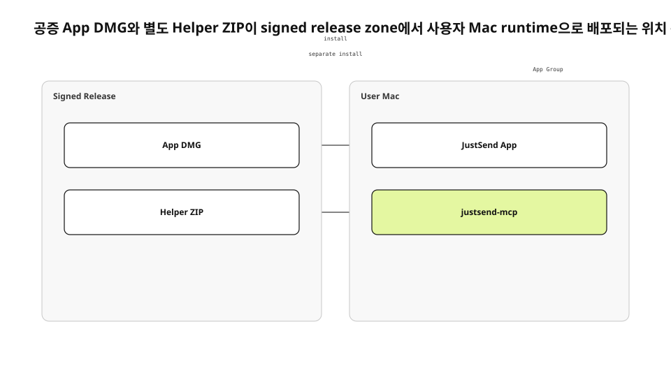

Mac 앱에는 외부 agent가 사용하는 MCP helper가 필요했다. 처음에는 helper를 app bundle에 포함한 채 App Store와 직접 배포를 함께 만족시키려 했다. 실제 signing과 upload에서는 bare executable의 자격과 TestFlight profile이 충돌했다. 기능을 유지하려면 배포 단위를 다시 나눠야 했다.
<!-- evidence: JS-E101 -->

새 run은 현재 `PLAN-DIRECT-DISTRIBUTION.md`, package script, Apple notarization 문서, DMG·helper runtime 관측을 다시 읽었다. 중간 시도의 “bundle helper” 결론을 현재형으로 복사하지 않고 현재 정본인 App DMG와 helper ZIP 분리를 기준으로 썼다.
<!-- evidence: JS-E107 -->

## 배포 채널보다 artifact 위치가 먼저였습니다

App Store와 Developer ID를 장단점 표로만 비교하면 실제 설치 구조가 보이지 않는다. 무엇이 어느 zone에서 서명되고, 사용자의 Mac 어디에서 실행되는지가 핵심이다. App과 helper를 같은 file처럼 말하면 update·notarization·permission boundary도 하나로 오해한다.
<!-- evidence: JS-E101 JS-E102 -->



| Artifact | Release zone | User runtime |
|---|---|---|
| App DMG | Developer ID 서명·공증 | `/Applications/JustSend.app` |
| Helper ZIP | universal binary 서명·공증 | 별도 `justsend-mcp` executable |

같은 type을 억지로 피하려고 flowchart로 그리지 않았다. 이 글의 질문은 “어떤 조건에서 분기하나”가 아니라 “어떤 artifact가 어디에 배포되고 어디서 실행되나”다. 따라서 deployment가 최적 유형이다.
<!-- evidence: JS-E102 -->

## App과 helper는 서로 다른 공증 단위입니다

현재 배포 계약은 app을 공증 DMG로, helper를 별도 universal ZIP으로 제공한다. App bundle은 사용자 UI와 library runtime을 담는다. helper는 외부 client가 stdio로 실행하며 App Group sidecar를 통해 intent를 전달한다.
<!-- evidence: JS-E102 -->

두 artifact를 분리하면 설치 단계가 늘지만 signing failure를 서로 격리할 수 있다. helper update 때문에 App DMG 전체를 다시 설치하거나 App release 때문에 helper path가 바뀌지 않는다. 반대로 version compatibility를 문서와 runtime check로 관리해야 하는 비용이 생긴다.
<!-- evidence: JS-E102 JS-E106 -->

### bundle에서 뺀다고 기능을 제거한 것은 아닙니다

helper를 optional feature로 삭제하면 배포는 쉬워지지만 MCP work record 계약이 사라진다. 별도 ZIP은 기능을 유지하고 Apple signing boundary만 분리한 결정이다. App과 helper가 같은 account scope를 보는지는 App Group과 protocol test로 검증한다.
<!-- evidence: JS-E102 JS-E106 -->

### 별도 artifact는 별도 update 정본을 가집니다

App DMG와 helper ZIP은 각각 version, URL, checksum을 가진다. helper metadata를 `latest.json`으로 제공할 수 있지만 자동 설치는 별도 trust problem이다. 직접 배포 전환이 update 문제를 자동으로 해결하지 않는다.
<!-- evidence: JS-E102 -->

## Developer ID는 Apple login 위치도 바꿨습니다

Developer ID profile에는 native Sign in with Apple entitlement가 없었다. 개발 profile에서 동작한 native button을 그대로 export하면 provisioning 단계가 실패한다. Apple account를 포기하는 대신 Services ID web OAuth로 credential acquisition을 옮겼다.
<!-- evidence: JS-E103 -->

```text
JustSend App
  → browser OAuth
  → Apple Services ID
  → api-v2 callback
  → existing account verification
```

이 경로는 app runtime 안에서 시작하지만 native authorization entitlement에 기대지 않는다. callback 뒤의 account lookup과 token verification은 기존 server contract를 재사용한다.
<!-- evidence: JS-E103 -->

## package script가 release zone의 순서를 고정합니다

`scripts/package-dmg.sh`는 archive, export, app notarization, app staple, identity check, DMG 생성, DMG signing, DMG notarization, DMG staple, checksum을 순서대로 실행한다. 한 단계가 실패하면 다음 artifact를 publish하지 않는다.
<!-- evidence: JS-E104 -->

```bash
verify_app_identity
notarize_and_staple_app
create_dmg
notarize_and_staple_dmg
write_sha256_sidecar
```

공증됐다는 판정만으로 우리 app인지 알 수 없다. TeamIdentifier, bundle identifier, hardened runtime, build number를 따로 확인한다. 이미 만든 app을 input으로 넣는 경로가 있기 때문에 identity gate가 없으면 공증된 다른 app을 잘못 포장할 수 있다.
<!-- evidence: JS-E104 -->

## Notarization과 runtime 검증은 다른 질문입니다

Apple notarization은 malware와 code-signing 문제를 자동 검사하고 ticket을 만든다. ticket을 App과 DMG에 staple하면 Gatekeeper가 first launch에서 확인할 수 있다. 그러나 accepted ticket은 login이나 MCP response를 증명하지 않는다.
<!-- evidence: JS-E105 -->

| Gate | 증명 범위 |
|---|---|
| codesign | signer와 변경 여부 |
| notarization | Apple 자동 검사 |
| stapler | ticket 부착 |
| spctl | Gatekeeper 수용 |
| app launch | UI runtime 시작 |
| helper initialize | MCP runtime 응답 |

그래서 실제 DMG를 mount하고 `/Applications`에 설치해 app launch를 확인했다. 별도 helper는 `initialize`를 호출해 stdio protocol이 살아 있는지 확인했다.
<!-- evidence: JS-E106 -->

## Rollback도 artifact별로 분리합니다

App release에 문제가 생기면 이전 DMG와 checksum을 다시 제공할 수 있다. helper protocol 문제가 생기면 이전 universal ZIP과 metadata를 되돌린다. 두 artifact를 한 `latest` pointer로 묶으면 한쪽 rollback이 다른 runtime까지 되돌린다.
<!-- evidence: JS-E102 JS-E106 -->

| 장애 | Rollback unit | 재검증 |
|---|---|---|
| App launch | App DMG | Gatekeeper·launch·login |
| MCP initialize | Helper ZIP | signature·initialize |
| Protocol compatibility | App + helper pair | work_start·note smoke |

rollback file도 signing·notarization·checksum이 끝난 immutable artifact여야 한다. local build를 급히 다시 압축해 이전 version 이름으로 올리지 않는다. release zone이 content-addressed history를 보존해야 user zone의 installed version을 설명할 수 있다.
<!-- evidence: JS-E104 JS-E105 JS-E106 -->

## 직접 배포의 비용을 위치별로 남겼습니다

Release zone에서는 certificate·notary credential·checksum 관리가 필요하다. Web zone에서는 DMG와 helper ZIP, metadata를 제공해야 한다. User zone에서는 두 artifact의 install과 update가 갈린다. App Store가 대신하던 책임이 사라진 자리를 운영 절차가 맡는다.
<!-- evidence: JS-E102 JS-E104 JS-E106 -->

이 선택은 “App Store를 포기했다”는 선언이 아니다. product가 요구한 App runtime과 helper runtime을 Apple이 허용하는 별도 trust unit으로 배치한 결정이다. deployment diagram은 그 배치와 연결만 보여 주고 OAuth message sequence나 package 내부 단계는 본문에 남겼다.
<!-- evidence: JS-E101 JS-E102 JS-E103 JS-E106 -->
