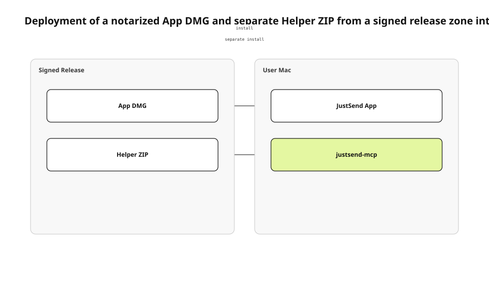

The Mac product needed an MCP helper that external agents could execute. Our first approach tried to embed that helper in the app bundle while satisfying both App Store and direct-distribution requirements. Real signing and upload attempts exposed a conflict between the helper's execution requirements and the TestFlight provisioning contract. Preserving the feature required us to separate the deployment units.
<!-- evidence: JS-E101 -->

This English edition is grounded in the fresh direct-distribution plan, packaging script, Apple notarization documentation, and runtime observations. It uses the same JS-E101+ Evidence as the Korean source run. It does not preserve an intermediate “bundled helper” decision as if it were the current architecture.
<!-- evidence: JS-E107 -->

## Ask where each artifact runs before comparing channels

A simple App Store versus Developer ID table hides the actual installation topology. The important questions are where an artifact is signed and notarized, where it is downloaded, and where it executes on the user's Mac. Treating the app and helper as one file also hides their independent update and rollback boundaries.
<!-- evidence: JS-E101 JS-E102 -->



| Artifact | Signed release zone | User runtime |
|---|---|---|
| App DMG | Developer ID signing and notarization | `/Applications/JustSend.app` |
| Helper ZIP | Universal-binary signing and notarization | Separate `justsend-mcp` executable |

This is a deployment question, not a decision-tree question. The diagram needs to show which artifact moves between which zones and what runs after installation. We do not choose a flowchart merely to make this article look different from the others.
<!-- evidence: JS-E102 -->

## Keep the app and helper as separate notarization units

The current contract ships the app as a notarized DMG and the helper as a separate notarized universal ZIP. The app owns the user interface and library runtime. External clients launch the helper over stdio, and the helper communicates with the app through the App Group sidecar contract.
<!-- evidence: JS-E102 -->

Separation adds an installation step, but it also isolates release failures. A helper update does not require repackaging the full app DMG. An app release does not silently replace the helper path. The cost is an explicit compatibility contract between two installed versions.
<!-- evidence: JS-E102 JS-E106 -->

The two artifacts must still agree on the sidecar schema and MCP result vocabulary. Independent distribution is not permission to evolve them independently without a compatibility check.
<!-- evidence: JS-E102 JS-E106 -->

### Removing the helper from the bundle did not remove the feature

Deleting the helper would have made distribution easier by deleting MCP work-record functionality. A separate ZIP preserves the feature while moving the executable into a signing unit Apple accepts for direct distribution.
<!-- evidence: JS-E101 JS-E102 -->

The helper does not gain unrestricted access merely because it is outside the app bundle. It writes intents to a constrained sidecar, and the app validates authorization before turning those intents into user-library operations.
<!-- evidence: JS-E102 -->

### Separate artifacts need separate update authorities

The app DMG and helper ZIP each need a version, URL, checksum, and immutable history. A helper `latest.json` can describe the current ZIP, but automatic installation remains a separate trust problem. Direct distribution does not solve update authorization by itself.
<!-- evidence: JS-E102 -->

A visible download page also needs to explain which helper version works with which app range. Otherwise a correct signature can still install an incompatible protocol pair.
<!-- evidence: JS-E102 JS-E106 -->

## Move Apple sign-in to a supported credential path

Developer ID profiles did not contain the native Sign in with Apple entitlement. A button that worked with a development or App Store profile could therefore fail at direct-distribution export. We retained Apple accounts by moving credential acquisition to Services ID web OAuth.
<!-- evidence: JS-E103 -->

```text
JustSend App
  → browser-based authorization
  → Apple Services ID
  → api-v2 callback
  → existing account verification
```

The browser flow does not require the native authorization entitlement. After the callback, the server still verifies identity and maps the account through the existing authentication boundary.
<!-- evidence: JS-E103 -->

The change affects where credentials are acquired, not who owns the account. Creating a second Mac-only account identity would have broken cross-device access and recovery.
<!-- evidence: JS-E103 -->

## Turn packaging into an executable release contract

`scripts/package-dmg.sh` orders archive, export, app notarization, app stapling, identity verification, DMG creation, DMG signing, DMG notarization, DMG stapling, and checksum generation. A failed gate stops publication of the next artifact.
<!-- evidence: JS-E104 -->

```bash
verify_app_identity
notarize_and_staple_app
create_dmg
notarize_and_staple_dmg
write_sha256_sidecar
```

A `Notarized Developer ID` verdict alone does not prove that the input is our app. The script separately checks TeamIdentifier, bundle identifier, hardened runtime, and build number. This matters because the packaging path can accept an already-built app as input.
<!-- evidence: JS-E104 -->

The script also avoids treating a Finder-created DMG as a source of truth. The same ordered commands recreate the artifact and expose the exact step that failed.
<!-- evidence: JS-E104 -->

## Distinguish notarization from product runtime

Apple notarization automatically scans for malicious content and code-signing issues. A successful submission produces a ticket that can be stapled so Gatekeeper can verify the software at first launch. It does not prove that login, database opening, or MCP initialization works.
<!-- evidence: JS-E105 -->

| Gate | What it proves |
|---|---|
| `codesign --verify` | Signer and integrity |
| Notarization | Apple automated checks |
| Stapling | Ticket is attached |
| `spctl` | Gatekeeper accepts the artifact |
| App launch | UI runtime starts |
| Helper `initialize` | MCP runtime responds |

We mounted the actual DMG, installed the app in `/Applications`, and observed launch behavior. We also launched the separately installed helper and sent `initialize`. The two runtime checks correspond to the two deployment artifacts.
<!-- evidence: JS-E106 -->

## Give rollback the same artifact boundaries

If an app release fails, the previous DMG and checksum can be restored. If the helper protocol fails, the previous universal ZIP and metadata can be restored. One shared latest pointer would couple two rollback units that were intentionally separated.
<!-- evidence: JS-E102 JS-E106 -->

| Incident | Rollback unit | Verification after rollback |
|---|---|---|
| App launch regression | App DMG | Gatekeeper, launch, login |
| MCP initialization regression | Helper ZIP | Signature, `initialize` |
| Protocol incompatibility | Known app-helper pair | `work_start` and note smoke |

A rollback artifact must already be signed, notarized, and checksummed. Rebuilding source and uploading it under an old version name does not recreate the same artifact.
<!-- evidence: JS-E104 JS-E105 JS-E106 -->

Immutable release history also explains an installed report. A user can provide app and helper versions, and operations can locate the exact digests that produced that pair.
<!-- evidence: JS-E102 JS-E106 -->

## Record the operational cost by zone

The signed release zone owns certificates, notary credentials, artifact history, and checksums. The web distribution zone owns stable URLs and version metadata. The user zone owns installation and the compatibility of two runtimes. Responsibilities once hidden behind the App Store become explicit operations.
<!-- evidence: JS-E102 JS-E104 JS-E106 -->

This decision is more precise than saying “we left the App Store.” We placed an app runtime and an MCP runtime into separate trust and rollback units supported by Developer ID. The deployment diagram shows placement and movement; OAuth messages and packaging substeps remain in prose where their own sequence is easier to read.
<!-- evidence: JS-E101 JS-E102 JS-E103 JS-E106 -->

The English diagram was rendered with justsend-blog 0.4.4, which records node bounds and edge route points, uses distinct branch attach points, and fails the audit when an edge crosses a non-endpoint or travels through an endpoint node.
<!-- evidence: JS-E108 -->
