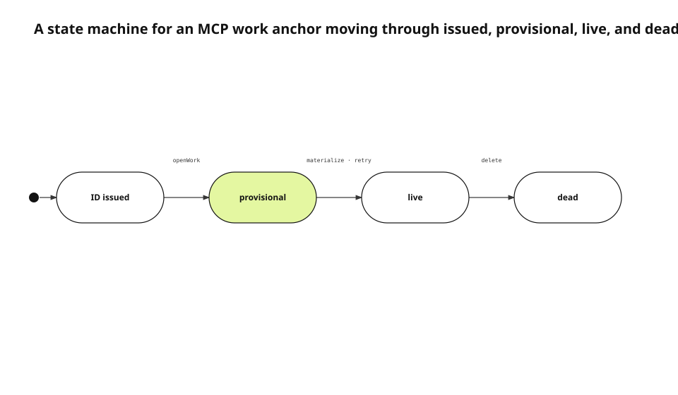

A note disappeared immediately after `work_start` reported success. The helper had accepted the start intent, but the app executor created the library item later. At the moment the note arrived, no destination identifier existed, so 67 notes were rejected before they could even enter the retry queue. Queue throughput was not the root problem. Identifier lifetime was.
<!-- evidence: JS-E101 -->

This English edition is based on the fresh MCP redesign record, current `workStart` and `AgentSidecarStore` source, the MCP Tools specification, and the login-before-runtime observation. It preserves the JS-E101+ evidence map from the source run and does not translate the previously published article as an authority.
<!-- evidence: JS-E107 -->

## Separate a successful response from materialization

An MCP tool returns a synchronous response while the app may apply the write asynchronously. Treating both events as “record created” gives the caller a stronger guarantee than the system can satisfy. The minimum useful guarantee is smaller: a stable item ID and anchor must exist before any follow-up command can arrive.
<!-- evidence: JS-E101 JS-E102 -->

```json
{
  "item_id": "issued-before-executor",
  "state": "queued",
  "materialized": false
}
```

`queued` is not failure. It means the destination and intent are durable while the library item is not visible yet. A permanent failure has a different state and a readable reason. The client does not parse message prose to decide whether it should wait or stop.
<!-- evidence: JS-E102 JS-E105 -->

The distinction matters because `work_note`, `work_status`, and `work_complete` may follow in the same agent turn. They need an identifier immediately, even though the user-facing card can appear later.
<!-- evidence: JS-E101 JS-E102 -->

## Model the anchor lifecycle explicitly



The helper first issues an ID. `openWork` creates a `provisional` anchor and start intent. The executor materializes the item and advances the anchor to `live`. If the person deletes the item, the anchor becomes `dead`. Account restoration is a guard on the provisional-to-live transition rather than a reason to destroy the intent.
<!-- evidence: JS-E102 JS-E103 JS-E104 -->

### `provisional` means pending application, not failed creation

When a provisional anchor still has its start intent, the executor should continue processing it. When the item already exists but the state remains provisional, the state write may have been interrupted or an older executor may have applied the item without the newer state update. The actual item is evidence that the anchor can be repaired to live.
<!-- evidence: JS-E103 -->

The repair path prevents a task key from remaining permanently locked. Without it, every later `work_start` sees an anchor and returns queued, while no start intent remains to create the card.
<!-- evidence: JS-E103 -->

### `dead` means a new record is required

A live anchor whose item no longer exists must not be returned as success. Marking it dead preserves the reason later notes fail and allows a new `work_start` under the same task key to issue a new item ID.
<!-- evidence: JS-E102 -->

Silently deleting the anchor would turn subsequent failures back into “anchor missing,” which hides the difference between a record that was never created and one the user intentionally removed.
<!-- evidence: JS-E102 JS-E104 -->

## Create the ID and start intent in one transaction

Issuing the ID first is insufficient if the process can die between storing the anchor and inserting the start intent. That window leaves a provisional anchor that nothing can materialize. `openWork` writes both rows in one SQLite transaction.
<!-- evidence: JS-E103 -->

```swift
sidecar.openWork(
  anchor: provisionalAnchor(itemID),
  intent: startIntent(itemID)
)
```

The same transaction also interacts with idempotency. A repeated idempotency key returns the existing intent rather than inserting a second start. A caller retry therefore does not create duplicate cards or duplicate first notes.
<!-- evidence: JS-E103 JS-E104 -->

The transaction protects the sidecar invariant, not the entire library write. Materialization remains asynchronous and can still fail. That is why the state machine and failure class remain necessary after atomic insertion.
<!-- evidence: JS-E103 -->

## Treat account restoration as a transition guard

The helper can start before the app restores its login session. Looking up an account-owned anchor with an empty owner can misclassify a real record as missing. The initial implementation converted that uncertainty into a permanent failure.
<!-- evidence: JS-E104 -->

The corrected path preserves the intent and classifies owner mismatch as transient while account state is unresolved. Once the account is ready, the executor evaluates the same transition again. Malformed input and a deleted target remain permanent.
<!-- evidence: JS-E104 -->

| Condition | State | Next action |
|---|---|---|
| Account not restored | Retrying | Preserve and retry |
| Anchor materializing | Queued | Preserve order |
| Invalid schema | Failed | Return readable error |
| Target deleted | Dead | Require a new start |

The guard prevents login timing from changing data durability. It also keeps an empty session from claiming ownership of a record that belongs to another account.
<!-- evidence: JS-E104 -->

## Classify failure before choosing a retry count

The same error text can represent opposite next steps. A busy database and an unresolved owner may succeed later. An unknown enum or a staged path outside the allowed root will not become valid after ten attempts. A retry counter without a failure class either drops transient work too early or repeats permanent work forever.
<!-- evidence: JS-E104 JS-E105 -->

```text
transient  → pending/retrying → same intent
permanent  → failed           → readable reason
blocked    → pending          → explicit user action
applied    → terminal         → idempotent replay
```

The sidecar stores both the error and `failure_class`. Observability can then separate readiness failures from caller-schema failures. A rising retrying count points toward app startup or account restoration; a rising permanent count points toward a deployed helper or client contract mismatch.
<!-- evidence: JS-E103 JS-E104 JS-E106 -->

## Share the same vocabulary with the MCP schema

MCP servers expose tools through `tools/list` and receive invocations through `tools/call`. The input schema and result shape are protocol, not prompt decoration. `work_start` returns `item_id`, `state`, and `materialized`; follow-up tools accept the same identifier.
<!-- evidence: JS-E105 -->

`ToolSpec` validates required parameters, enums, and access annotations before dispatch. Quietly dropping an unknown status while reporting success would split the caller's state machine from the executor's state machine.
<!-- evidence: JS-E105 -->

Schema validation also keeps older clients visible. When an app and helper disagree on a field or state, the result should name a versioned contract failure rather than leave a provisional anchor indefinitely.
<!-- evidence: JS-E103 JS-E105 -->

## Apply intents through the library's normal write path

The sidecar is not the user's library. If the executor updates library tables directly, it can bypass sync envelopes, encryption boundaries, and UI refresh. The executor calls the same item repository operations used by the app.
<!-- evidence: JS-E103 JS-E104 -->

The sidecar owns intent lifetime. The library owns user records. This separation lets the helper remain independent of the encrypted library schema while still requiring authorization at the moment an intent is promoted into a real write.
<!-- evidence: JS-E104 -->

Status changes follow the same rule. The app removes the old status tag and writes exactly one new status through the repository instead of editing a sidecar projection and hoping the change propagates.
<!-- evidence: JS-E103 -->

## Verify the complete path with a work record

We sent a note before login restoration. It remained queued. After the account was restored, the same item ID became live and the note appeared on that record. The work record itself was the runtime artifact that traversed helper, sidecar, executor, and library.
<!-- evidence: JS-E106 -->

Unit tests protect transaction and transition invariants. Runtime verification protects the installed helper and app version combination. A green unit test cannot detect an older executor that materializes an item without understanding a newer anchor state.
<!-- evidence: JS-E103 JS-E106 -->

## Use this pattern only when follow-up commands need the ID immediately

Not every asynchronous job needs a preallocated object ID. A job that has no immediate object-scoped follow-up can return a job identifier and materialize its output later. Work records are different because notes, status changes, completion, and cancellation can arrive immediately after start.
<!-- evidence: JS-E101 JS-E102 -->

The dominant relation in this problem is the transition among issued, provisional, live, and dead with account restoration as a guard. A state machine is therefore more accurate than a generic architecture row. The 0.4.4 renderer also routes each branch through its own attach point and lane, so the denied path can no longer appear to originate from the granted state.
<!-- evidence: JS-E102 JS-E103 JS-E104 JS-E106 -->

The English diagram was rendered with justsend-blog 0.4.4, which records node bounds and edge route points, uses distinct branch attach points, and fails the audit when an edge crosses a non-endpoint or travels through an endpoint node.
<!-- evidence: JS-E108 -->
