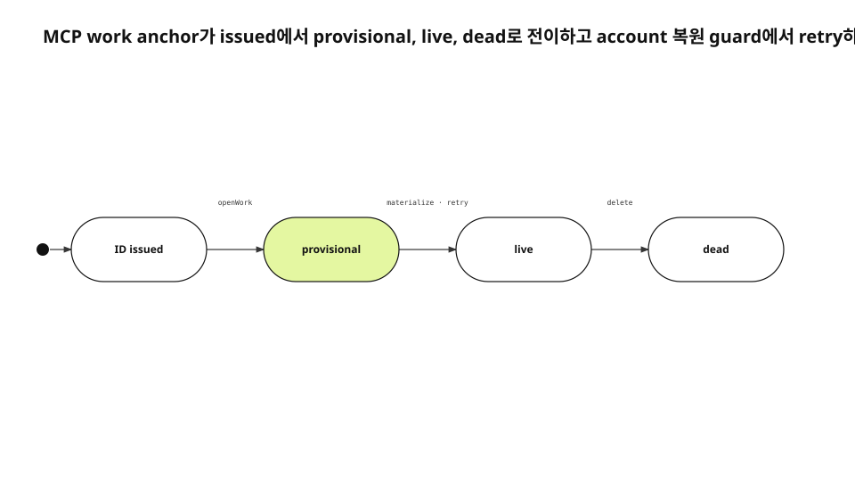

`work_start`가 성공한 직후 보낸 note가 사라졌다. helper는 시작 intent를 받았지만 library item은 앱 executor가 나중에 만들었다. note가 도착한 순간에는 destination ID가 없었고, 67건은 retry queue에도 들어가지 못했다. queue 속도가 아니라 identifier가 존재하는 시점이 문제였다.
<!-- evidence: JS-E101 -->

새 run에서는 MCP 재설계 기록, 현재 workStart와 AgentSidecarStore, MCP Tools specification, 로그인 전 runtime 관측을 다시 읽었다. 기존 공개 글은 corpus로만 사용하고 새 Evidence는 JS-E101부터 다시 만들었다.
<!-- evidence: JS-E107 -->

## 성공 응답과 materialization을 분리했습니다

외부 tool은 동기 응답을 돌려주지만 내부 쓰기는 비동기다. 성공이라는 한 단어로 둘을 묶으면 caller는 화면에 record가 생겼다고 믿는다. 실제로 필요한 약속은 더 작다. 후속 note가 잃어버리지 않을 stable item ID와 anchor가 먼저 존재해야 한다.
<!-- evidence: JS-E101 JS-E102 -->

```json
{
  "item_id": "issued-before-executor",
  "state": "queued",
  "materialized": false
}
```

`queued`는 실패가 아니다. 시작 intent와 destination이 보존됐지만 library item은 아직 보이지 않는다는 뜻이다. 이 distinction을 result schema에 넣어 caller가 permanent failure와 기다림을 구분하게 했다.
<!-- evidence: JS-E102 JS-E105 -->

## Anchor는 네 상태를 거칩니다



선발급된 ID는 `provisional` anchor와 함께 시작한다. executor가 item을 만들면 `live`가 된다. 사용자가 item을 지우면 anchor는 `dead`로 전이한다. ID 발급 자체를 초기 state로 표시하면 external response와 sidecar state를 한 그림에서 읽을 수 있다.
<!-- evidence: JS-E102 JS-E103 -->

### provisional은 실패가 아니라 적용 대기입니다

provisional anchor가 시작 intent를 가지고 있으면 executor를 기다린다. 그런데 item은 이미 존재하고 state만 provisional이면 이전 executor가 상태 갱신 전에 종료됐거나 version이 어긋난 경우다. 실제 item 존재를 확인해 live로 복구한다.
<!-- evidence: JS-E103 -->

### dead는 새 record가 필요한 상태입니다

live anchor가 가리키는 item이 사라졌다면 성공으로 돌려주지 않는다. dead로 표시한 뒤 같은 task_key에 새 item ID를 발급한다. 그렇지 않으면 caller는 살아 있다고 믿는 ID로 note를 보내고 foreign key failure를 만난다.
<!-- evidence: JS-E102 -->

## ID와 시작 intent를 한 transaction에 세웠습니다

ID를 먼저 만드는 것만으로는 부족하다. anchor row를 저장한 뒤 시작 intent를 넣기 전에 process가 죽으면 영원히 적용되지 않는 provisional anchor가 남는다. `openWork`는 둘을 같은 SQLite transaction에서 생성한다.
<!-- evidence: JS-E103 -->

```swift
sidecar.openWork(
  anchor: provisionalAnchor(itemID),
  intent: startIntent(itemID)
)
```

동일 idempotency key가 다시 오면 새 intent 대신 기존 row를 돌려준다. caller retry가 같은 note나 record를 두 번 만들지 않는 근거다.
<!-- evidence: JS-E103 JS-E104 -->

## 계정 복원은 transition guard입니다

helper는 앱보다 먼저 시작할 수 있다. login session이 아직 복원되지 않았을 때 empty owner로 anchor를 조회하면 실제 account item을 “없음”으로 오판한다. 초기 구현은 이 상태를 permanent error로 닫았다.
<!-- evidence: JS-E104 -->

수정 뒤 owner mismatch는 잘못된 input이 아니라 아직 평가할 수 없는 guard로 분류한다. note를 queue에 보존하고 account가 준비된 뒤 provisional→live 적용을 다시 시도한다. malformed payload나 삭제된 target만 permanent로 남긴다.
<!-- evidence: JS-E104 -->

| 실패 종류 | 상태 | 처리 |
|---|---|---|
| account 미복원 | transient | 보존 후 retry |
| anchor materializing | queued | 순서대로 대기 |
| payload schema 오류 | permanent | readable error |
| target 삭제 | dead | 새 start 필요 |

## Tool schema도 상태 어휘를 공유합니다

MCP server는 `tools/list`의 inputSchema와 `tools/call` result로 contract를 공개한다. `work_start`가 `item_id`, `state`, `materialized`를 반환하고 note·status·complete가 같은 ID를 받는다. prompt 설명만으로 상태를 약속하지 않는다.
<!-- evidence: JS-E105 -->

ToolSpec은 required parameter, enum, access annotation을 dispatch 전에 검사한다. 모르는 status를 조용히 버리고 성공을 보고하면 caller와 executor의 상태 머신이 갈라진다. schema drift test가 이 실패를 막는다.
<!-- evidence: JS-E105 -->

## Executor는 library의 정상 쓰기를 사용합니다

sidecar DB가 user library를 직접 SQL update하면 sync envelope와 UI refresh를 우회한다. executor는 item repository의 create·update·delete path를 사용한다. sidecar는 intent 수명, library는 사용자 record를 소유한다.
<!-- evidence: JS-E103 JS-E104 -->

이 경계 덕분에 helper는 encrypted library schema를 모두 알 필요가 없다. 반대로 sidecar가 있다는 이유로 authorization을 생략할 수도 없다. intent가 실제 user write로 승격되는 순간에 owner와 access를 다시 검사한다.
<!-- evidence: JS-E104 -->

## Failure class가 retry 횟수보다 먼저입니다

같은 error text라도 원인에 따라 다음 transition이 다르다. account 미복원과 busy database는 retry할 수 있지만 unknown enum과 staging 밖 path는 다시 실행해도 성공하지 않는다. 횟수 제한만 두면 permanent input을 반복하거나 transient state를 너무 일찍 버린다.
<!-- evidence: JS-E104 JS-E105 -->

```text
transient  → pending/retrying → same intent
permanent  → failed          → readable reason
blocked    → pending         → user action
applied    → terminal        → idempotent replay
```

state row에는 error와 `failure_class`를 함께 저장한다. caller는 message 문자열을 parsing하지 않고 result state를 읽는다. executor가 새 failure를 추가할 때 ToolSpec result와 migration을 같이 review한다.
<!-- evidence: JS-E103 JS-E105 -->

이 분류는 observability에도 필요하다. retrying count가 늘면 app readiness나 account restore를 보고, permanent count가 늘면 caller schema와 deployed helper version을 본다. 두 지표를 합치면 원인이 반대인 실패를 한 queue depth로 오해한다.
<!-- evidence: JS-E104 JS-E106 -->

## 실제 작업 기록으로 end-to-end를 닫았습니다

로그인 전에 보낸 note가 queue에 남았다. account 복원 뒤 같은 item ID가 live가 되고 note가 그 record에 붙었다. 이 작업 기록 자체가 helper→sidecar→executor→library 경로를 통과한 runtime artifact였다.
<!-- evidence: JS-E106 -->

unit test는 transaction과 state transition을 지키고, runtime test는 설치된 helper와 실행 중 앱의 version 조합을 확인한다. 둘 중 하나만으로는 provisional이 영구히 남는 version mismatch를 잡기 어렵다.
<!-- evidence: JS-E103 JS-E106 -->

## 적용 기준은 “후속 명령이 ID를 즉시 필요로 하는가”입니다

모든 비동기 작업에 선발급 ID가 필요한 것은 아니다. 후속 command가 같은 object를 바로 참조하지 않는 job은 job ID만 있으면 된다. work record는 start 다음에 note·status·complete가 즉시 이어지므로 stable destination이 먼저 필요하다.
<!-- evidence: JS-E101 JS-E102 -->

이 문제의 핵심 축은 component topology가 아니라 provisional·live·dead의 상태와 transition guard다. 그래서 새 visual router는 architecture라는 글 제목보다 Evidence에 나타난 실제 상태 값을 더 강하게 읽어 state machine을 선택했다.
<!-- evidence: JS-E102 JS-E103 JS-E104 JS-E106 -->
